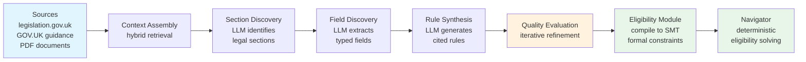
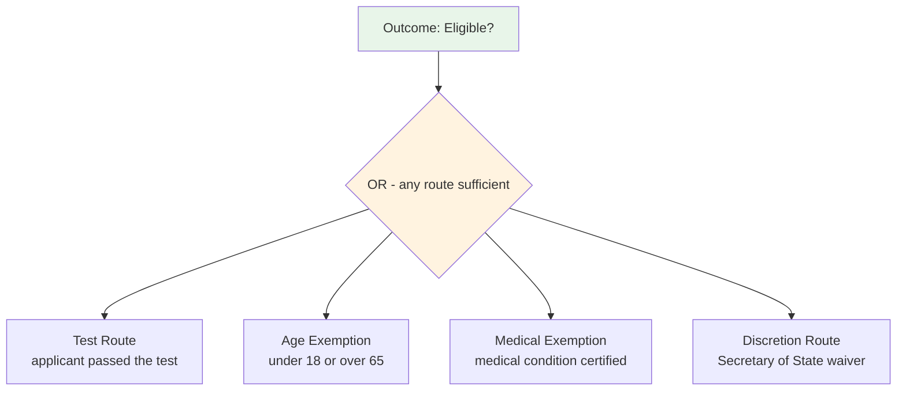
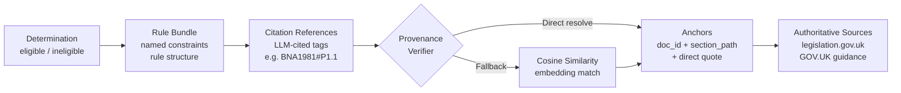

---

# 1. Introduction

In 1986, Sergot, Sadri, Kowalski, and colleagues published a landmark paper in *Communications of the ACM*: they had formalised the British Nationality Act 1981 as a Prolog logic program [@sergot1986bna]. The paper demonstrated that statutory legislation - with its characteristic structure of routes, exemptions, and override provisions - could be faithfully encoded as Horn clauses with negation as failure, and evaluated with provable correctness. It was a foundational result in computational law: legislation is logic, and logic can be executed.

Forty years on, large language models can read the same Act, explain it in plain English, and answer broad legal questions with fluency that would have seemed extraordinary even five years ago. It is tempting to conclude that the formal encoding project is no longer necessary. Our benchmark tests this assumption directly on the same legislation Sergot et al. encoded, extended to three further domains, and finds it does not hold - at least not for the specific class of task where exception chains are nested three levels deep.

The failure is specific. On straightforward multi-route eligibility logic, frontier models perform well, achieving 100% accuracy on 43 English-language scenarios (95% Wilson CI [91.8%, 100%]). But when legislation introduces nested exception chains, accuracy degrades sharply and in a way that is insensitive to temperature, sample count, and prompt engineering. Claude Opus 4.6 scores 61/68 (89.7%, CI [80.2%, 94.9%]) on the spacecraft section. With 10 runs on each of the 7 failing scenarios — 70 trials in total — it produces zero correct answers. The Clopper–Pearson 95% one-sided upper bound on per-trial success probability is 4.19%: the failures are systematic, not stochastic. Attempts to close the gap via enhanced prompting trade false negatives for false positives: the enhanced prompt reduces net accuracy to 64.7% (CI [52.8%, 75.0%]) while introducing 20 false positives for the first time.

We make three contributions:

1. **A failure pattern taxonomy.** We identify and characterise two systematic failure patterns in nested exception-chain evaluation: *exemption anchoring* (failure to evaluate alternative routes independently when the primary route fails) and *exception chain collapse* (failure to correctly nest multi-level UNLESS logic). We demonstrate both are systematic across six models (three frontier, three production-tier) and two providers on this benchmarked class of task.

2. **A multi-domain benchmark.** We present 225 scenarios across four sections spanning two UK immigration requirements (life-in-the-UK knowledge and English language proficiency), a synthetic spacecraft certification statute, and a synthetic construction insurance wording modelled on London market DE3/DE5 clause structure - designed to isolate exception chain evaluation as the test variable. Benchmark scenarios are released as a public dataset. The specific accuracy figures reported here will evolve as models improve; the task structure and failure pattern constitute the durable contribution.

3. **The Aethis Eligibility Module.** We describe a neuro-symbolic architecture that uses LLMs for rule authoring and an SMT-based constraint evaluation engine for rule execution, achieving complete consistency with the benchmark's formal rule fixtures across all 225 scenarios, with <1ms evaluation latency and near-zero marginal cost after compilation.

The paper is structured as follows. Section 2 summarises key findings. Section 3 reviews related work. Section 4 characterises the failure pattern. Section 5 describes the architecture. Section 6 presents the benchmark. Section 7 discusses challenges in LLM-guided rule synthesis. Sections 8, 9, and 10 address generalisation, compliance, and limitations.

---

# 2. Summary of Contributions

Artificial intelligence is entering high-stakes decision-making: immigration eligibility, safety certification, insurance underwriting, benefits entitlement, financial compliance. These are domains where errors have material consequences, where false negatives deny people their rights, and where explainability is mandatory.

We present the **Aethis Eligibility Module** (hereafter: the Eligibility Module), a neuro-symbolic engine that separates what LLMs do well from what requires formal guarantees. LLMs read authoritative sources and generate rules as structured code. The Eligibility Module compiles and evaluates those rules using an SMT-based deterministic evaluation layer, providing constraint evaluation with mathematically defined semantics and full auditability.

Our benchmark of 225 scenarios across four sections tests six LLMs (three frontier, three production-tier) against the Eligibility Module on the specific task of nested exception-chain evaluation. The Eligibility Module achieves complete consistency with the benchmark's formal rule fixtures across all domains - a consequence of deterministic execution over the authored specification, not empirical tuning. On adversarial exception-chain scenarios, frontier models produce systematic false negatives: Claude Opus 4.6 returns the wrong answer on 10% of spacecraft scenarios, and all observed failures are false negatives - eligible applicants incorrectly rejected, valid claims incorrectly denied. Attempting to improve LLM accuracy via enhanced prompting trades false negatives for false positives: the enhanced prompt fixes 5 of 7 original failures but introduces 20 new false positives, reducing net accuracy from 90% to 65%.

On the benchmarked class of nested exception-chain tasks, LLM errors are systematic enough that deterministic formal execution is the safer architecture for high-stakes decisions where 100% accuracy matters. This is not a claim that LLMs are unreliable in general; it is a specific finding about a specific class of rule evaluation.[^1]

[^1]: The system described in this paper is deployed commercially by Aethis (aethis.ai) for UK immigration and naturalisation workflows. The immigration benchmark sections cover selected requirements from this domain; the full determination involves additional sections not included in this publication.

---

# 3. Related Work

This work sits at the intersection of four research traditions: formal and computational approaches to legal reasoning; empirical evaluation of LLM logical reasoning; the limits of prompt engineering as a reliability strategy; and neuro-symbolic architectures that combine LLM fluency with formal execution guarantees.

## 3.1 Formal and Computational Approaches to Legal Reasoning

The challenge of encoding legislation as executable logic has a forty-year history. Sergot et al. [@sergot1986bna] formalised the British Nationality Act 1981 as a Prolog logic program, demonstrating that statutory rules could be faithfully represented as Horn clauses with negation as failure. Published in *Communications of the ACM* in 1986, this work identified the same legislation evaluated in our benchmark and showed that OR-branching eligibility logic can be captured in a formal system with provable properties. The Eligibility Module revisits the same statutory text with a different technical foundation - formal constraints compiled from LLM-authored rules rather than hand-coded Prolog - and extends evaluation to adversarial exception chain scenarios not part of the original formalism.

McCarty's TAXMAN system [@mccarty1977taxman] demonstrated as early as 1977 that AI systems could reason over tax code with explicit logical representations. Bench-Capon and colleagues developed value-based argumentation frameworks for legal reasoning over multiple decades [@benchcapon2010argument], establishing that legislation's exception structure requires more than propositional logic to represent faithfully.

The formal treatment for exception chains specifically is defeasible logic, introduced by Reiter [@reiter1980default] and developed by Nute [@nute1994defeasible] and Governatori et al. [@governatori2010changing]. Defeasible logic provides formal semantics for "A holds UNLESS B applies, UNLESS C overrides B" - precisely the pattern our benchmark identifies as a failure pattern for LLMs. The Eligibility Module does not use defeasible logic directly, instead compiling exception chains to formal material implication constraints evaluated by an SMT solver, but operates in the same tradition: the failure pattern we document is exactly the problem defeasible logic was designed to solve, now re-emerging in systems that replaced formal encoding with statistical inference over legislative text.

## 3.2 LLM Benchmarks for Legal and Logical Reasoning

LegalBench [@guha2023legalbench] provides the most comprehensive evaluation of LLM performance on legal tasks, testing 162 tasks across six categories. Where LegalBench tests breadth of legal reasoning, our benchmark isolates a single failure pattern - nested exception chain evaluation - with structured inputs holding all other variables constant. The two benchmarks are complementary: LegalBench demonstrates what LLMs can do across the breadth of legal tasks; our benchmark identifies a systematic failure on a class of decisions where 100% accuracy matters.

FOLIO [@han2022folio] tests natural language inference grounded in first-order logic, demonstrating that LLMs struggle with tasks requiring explicit formal logical structure even when relevant premises are provided. Our findings are consistent: the failures we observe are not information retrieval failures (the legislation is provided in full) but reasoning failures arising from the compositional structure of the task.

## 3.3 Systematic Limits of LLM Reasoning

Dziri et al. [@dziri2023faith] demonstrate fundamental limits of transformer architectures on compositional tasks, showing that performance degrades systematically as task depth increases even when each individual step is within the model's capability. Exception chain evaluation is compositional in precisely this sense: each individual rule is simple, but the nested application of three independent exception conditions requires compositional reasoning over the rule structure. Our finding that failures concentrate on three-level exception chains and are absent on two-level OR-branching is consistent with the compositional depth hypothesis.

Shi et al. [@shi2023distracted] show that LLMs are systematically distracted by irrelevant context. The related phenomenon of *exemption anchoring* - where attention on the failed primary route suppresses evaluation of valid alternative routes - may be a manifestation of the same attentional bias in a rule-following context.

Valmeekam et al. [@valmeekam2022planning] demonstrate that LLMs fail reliably on planning tasks requiring state tracking and logical consistency, not through random error but through systematic misapplication of learned heuristics. Our finding that Claude Opus 4.6 produces 0/10 correct responses across ten independent runs on veteran exemption scenarios reflects the same pattern: consistent, confident, and wrong.

Valmeekam, Stechly and Kambhampati [@valmeekam2024lrms] extend this work to reasoning-optimised language models, reporting that OpenAI's o1 degrades sharply on harder Mystery Blocksworld variants and obfuscated planning tasks — the failure mode is not eliminated by inference-time reasoning compute, merely shifted to deeper compositional depth. Our Finding 5 on reasoning-effort dependence (Section 6.5) is consistent with this: reduced reasoning compute surfaces the same exception-chain failure pattern in a frontier model that succeeds at full reasoning effort.

Mirzadeh et al. [@mirzadeh2024gsmsymbolic] show that LLM mathematical reasoning is brittle to surface-form changes: renaming entities or adding irrelevant clauses to GSM8K problems systematically degrades accuracy, even on frontier models. This is evidence that what looks like symbolic reasoning is substantially pattern matching over learned surface forms. The exception-chain failure pattern we observe is in the same family — LLMs produce fluent legal-sounding justifications that do not track the actual logical structure of the rule.

## 3.4 Prompt Engineering and Its Limits

Chain-of-thought prompting [@wei2022cot] and zero-shot reasoning elicitation [@kojima2022zeroshot] have substantially improved LLM performance on arithmetic and multi-step problems. Wang et al. [@wang2023selfconsistency] show that self-consistency (majority voting) improves performance on reasoning tasks. Our robustness analysis (Section 6.7) explicitly tests whether enhanced prompting closes the accuracy gap on exception chain evaluation, and finds a trade-off rather than a fix: an enhanced prompt that correctly identifies and targets the failure pattern (independent exemption evaluation) fixes 5 of 7 false negatives but introduces 20 false positives, reducing net accuracy from 90% to 65%. The result demonstrates that prompt-based repair on this class of task is fragile - instructions that correct under-application of exemptions simultaneously cause over-application elsewhere.

## 3.5 Neuro-Symbolic Architectures and LLM + Formal Method Hybrids

The neuro-symbolic research programme [@garcez2009neural] argues that robust AI systems require integration of neural pattern recognition with symbolic reasoning. Marcus [@marcus2020nextdecade] argues that the reliability limitations of purely statistical systems necessitate a return to hybrid approaches combining learned representations with structured reasoning. Kambhampati et al. [@kambhampati2024llmmodulo] advance this position with the *LLM-Modulo* framework, arguing that LLMs are most robustly deployed as approximate generators paired with formal verifiers and critics that provide external correctness guarantees. The Eligibility Module is a specific instantiation of the LLM-Modulo pattern applied to statutory rule evaluation: LLMs perform pattern-recognition tasks they excel at (reading legislation, extracting structure, generating code), while a constraint evaluation engine handles the evaluation task requiring mathematical guarantees.

Most directly related is Logic-LM [@pan2023logiclm], which uses LLMs to translate natural language problems into formal logical representations, then invokes symbolic solvers for evaluation. LINC [@olausson2023linc] similarly uses LLMs to generate first-order logic programs from natural language for theorem prover evaluation. These systems demonstrate the feasibility of the authoring-execution separation that underlies the Eligibility Module. The present system differs in three respects relevant to high-stakes deployment: it operates on *persistently stored* rule bundles rather than ephemeral per-query translations; it maintains a provenance chain linking each rule to specific source citations; and it is designed for production deployment where audit trails and version control are compliance requirements.

Program-aided language models (PAL [@gao2023pal]) demonstrate the broader pattern of using LLMs to generate code that is then executed deterministically. The Eligibility Module applies this separation to statutory rule encoding with additional quality engineering (Section 7) to ensure generated rules meet a quality threshold before entering the persistent rule store.

## 3.6 SMT-Based Constraint Evaluation

Satisfiability Modulo Theories (SMT) solving has seen extensive application in software verification, symbolic execution, hardware design, and safety-critical systems. The Eligibility Module applies SMT-based constraint evaluation to regulatory rule execution - rules compiled from LLM-authored code into formal constraint representations. The near-zero marginal evaluation cost after compilation makes formal constraint evaluation practical for production deployment at scale, a property that distinguishes constraint compilation from per-query LLM inference.

---

# 4. The Problem: LLMs and Nested Exception-Chain Evaluation

## 4.1 What Makes a Decision "High-Stakes"

High-stakes decisions share three properties that distinguish them from general AI tasks:

1. **Material consequence.** An incorrect determination can deny someone a right (citizenship, a benefit, a licence), expose an organisation to regulatory action, or cause financial harm.
2. **Auditability requirement.** A regulator, court, or oversight body may require an explanation of how the determination was reached, traceable to specific rules or statutory provisions.
3. **OR-branching logic.** Rules typically provide multiple independent pathways to satisfaction (primary routes, exemptions, waivers, overrides), each of which is independently sufficient.

Immigration law illustrates this structure. The British Nationality Act 1981 sets out multiple requirements for naturalisation, some of which include alternative pathways to satisfaction — such as age-based exemptions, medical exemptions, and discretionary waivers — which operate as independent routes within those requirements (disjunctive branches), not as standalone routes to overall eligibility (which requires conjunction across requirements).

## 4.2 Two Failure Patterns

When a large language model is asked to determine eligibility, it processes legislation and applicant data as a single reasoning task. Our benchmark reveals two systematic failure patterns on nested exception-chain tasks in this benchmarked setting. We make no claim that these patterns generalise to all legal reasoning; they are specific to the class of task where exception chains are nested three levels deep:

**Failure Pattern 1: Exemption anchoring.** LLMs treat exemption and waiver routes as secondary to the primary pathway rather than as independently sufficient alternatives. When the primary route fails, the LLM anchors on that failure and discounts exemptions.

**Failure Pattern 2: Exception chain collapse.** When rules contain multi-level exception chains ("A is required UNLESS B applies, UNLESS C overrides B"), LLMs fail to correctly evaluate the nested logic.

**Table 1: Multi-Level Exception Chain (Spacecraft Benchmark)**

The Spacecraft Crew Certification Act (a synthetic statute modelled on UK legislative structure) contains a three-level exception chain for flight readiness:

| Level | Rule | Plain English |
|:-----:|------|--------------|
| **Base** | Flight readiness required (500hrs + licence) | Must have 500+ hours AND a pilot licence |
| **Exception A** | Age >= 60 exempts from flight readiness | Over-60s don't need flight readiness... |
| **Exception B** | ...UNLESS mission is orbital | ...but orbital missions revoke the age exemption |
| **Override C** | 1000+ flight hours overrides everything | Veteran pilots (1000+ hrs) are always exempt |

**Table 2: Failures on Exception Chain Scenarios (spacecraft, adversarial suite)**

| Scenario | Expected | Opus 4.6 | Sonnet 4.6 | GPT-5.4 | GPT-5-mini |
|:---------------------------------|:----:|:----:|:----:|:----:|:----:|
| Age 25, 1500hrs, no licence, suborbital | Eligible | 1/3 | 0/3 | 3/3 | 1/3 |
| Age 59, 1000hrs, no licence | Eligible | 0/3 | 0/3 | 3/3 | 1/3 |
| Age 60, orbital, 999hrs, WITH licence | Eligible | 0/3 | 3/3 | 3/3 | 1/3 |
| Age 22, 1001hrs, no licence, orbital + rad cert | Eligible | 0/3 | 3/3 | 3/3 | 1/3 |
| Dolphin*, 1200hrs veteran, orbital, provider medical | Eligible | 0/3 | 3/3 | 3/3 | 1/3 |

*\*Dolphin is a valid species under the synthetic statute (s.3 excludes only Vogons). This scenario tests whether the model correctly applies the veteran exemption to a non-human applicant with otherwise valid credentials.*

The veteran exemption (Override C) is the hardest concept for LLMs in this benchmark. It operates independently of age: a 25-year-old with 1500 flight hours is exempt from flight readiness requirements, just as a 60-year-old would be. LLMs consistently treat the veteran exemption as age-dependent, producing false negatives with high confidence (0/3 across all runs). The Eligibility Module evaluates these correctly by construction.

## 4.3 Why False Negatives Matter

In high-stakes decision-making, a false negative means wrongly telling someone they do not qualify. Exemptions exist specifically for edge cases - the people who cannot satisfy the standard route but qualify through an alternative path. These are precisely the applicants most likely to be wrongly denied. On the benchmarked exception-chain scenarios, the failures are systematic: Claude Opus 4.6 returns "ineligible" across all runs on veteran exemption scenarios. Majority voting would not catch this.

Our construction insurance benchmark (Section 6.4) demonstrates the same failure pattern in a different domain: a CAR policy defect exclusion clause with a five-level exception chain. GPT-5.4, which achieves 100% on the spacecraft scenarios, drops to 96.6% on the insurance scenarios. The pattern is not specific to a single model, provider, or domain.

---

# 5. The Neuro-Symbolic Architecture

## 5.1 Design Principle

The architecture is built on a simple observation: LLMs and formal constraint evaluation excel at different tasks. LLMs are exceptional at reading legislation, understanding context, and generating structured representations. SMT constraint solvers are exceptional at evaluating logical expressions with mathematical guarantees.

The **Aethis Eligibility Module** separates these concerns:

- **Phase 1: Rule Authoring (LLM).** Read authoritative legal sources, discover sections and fields, generate rules as structured code, evaluate quality iteratively.
- **Phase 2: Rule Execution (Eligibility Module).** Parse generated code, compile to formal SMT constraints, evaluate against applicant data with deterministic execution.

## 5.2 Phase 1: Automated Rule Authoring

The rule authoring pipeline transforms authoritative legal text into executable compliance rules:

**Figure 1: End-to-End Pipeline**



Every generated rule carries provenance linking it to specific source material. Source items are tagged with structured references (e.g., `[BNA1981#Schedule1/P1.1]`) in the LLM's context, and the LLM is instructed to cite these tags on each generated criterion and field. A verification step then resolves these citations against the source material, creating anchors with document IDs, section paths, and direct quotes:

**Table 3: Source Provenance Chain**

| Source Type | Endpoint | Format | Citation Example | Verification |
|:----------|:------------|:---------------|:-----------------------------|:-------------------------|
| Primary legislation | legislation.gov.uk/api | Structured markup | `BNA1981#Schedule1/P1.1` | Direct resolution from LLM-cited references |
| Policy guidance | GOV.UK Content API | Structured API | `GOVUK#english-lang/part-2` | Direct resolution from LLM-cited references |
| Form guidance | PDF parser | Structured text | `form-an#section-4/para-3` | Direct resolution from LLM-cited references |

When the LLM fails to cite a source (or cites an invalid reference), the system falls back to embedding-based semantic similarity matching as a secondary mechanism. This multi-stage citation verification with semantic fallback provides higher fidelity than post-hoc similarity matching alone, because the LLM that generated the rule knows which source material it used.

This provenance chain is the foundation of auditability: any determination can be traced through the rule that produced it to the specific source clause that authorises it.

## 5.3 Phase 2: The Eligibility Module

The authoring model emits rules in a constrained DSL that is parsed and compiled to formal constraints using an SMT-based constraint evaluation engine. The DSL is never executed directly.

The critical property of the compilation is how alternative legal routes are represented. Each eligibility route becomes a formally independent branch:

**Figure 2: Route Independence in the Eligibility Module**



Each branch is a boolean expression evaluated independently. If `medical_exemption` evaluates to `True`, the OR is satisfied regardless of `test_route`. This is guaranteed by the execution semantics: it is not a statistical property and not dependent on model version or sampling parameters.

## 5.4 Why the Eligibility Module Cannot Make These Errors

The LLM failures in our benchmark fall into two categories, both of which are excluded by the execution semantics of the Eligibility Module. To make this precise, we state the compilation formally.

Let $\mathcal{F} = \{f_1, \ldots, f_m\}$ be the set of typed applicant fields, and let $\sigma : \mathcal{F} \to \mathcal{V}$ be an applicant assignment (each field mapped to a typed value). A **rule** is a quantifier-free formula $\phi$ in the theory of bitvectors, linear integer/real arithmetic, and uninterpreted functions over $\mathcal{F}$. A **rule bundle** is a tuple $\mathcal{R} = \langle \mathcal{G}, \mathcal{O} \rangle$ where $\mathcal{G} = \{G_1, \ldots, G_k\}$ is a set of rule groups, each $G_i = \{\phi_{i,1}, \ldots, \phi_{i,n_i}\}$ representing independent legal routes within a requirement, and $\mathcal{O}$ is an outcome combinator.

**Category 1 — Exemption anchoring (formally excluded).** Within a rule group $G_i$, routes are combined disjunctively:

$$
[\![ G_i ]\!]_\sigma \;=\; \bigvee_{j=1}^{n_i} [\![ \phi_{i,j} ]\!]_\sigma
$$

The semantics are: $[\![ G_i ]\!]_\sigma = \top$ iff *any* route satisfies the applicant assignment. There is no weighting, no ordering, and no context-dependent attenuation of later disjuncts by earlier ones. An LLM's learned approximation of this disjunction is not guaranteed to exhibit this property; the SMT-evaluated formula is, by the soundness of the decision procedure.

**Category 2 — Exception chain collapse (formally excluded).** A multi-level exception chain of the form

> *A is required, UNLESS B applies, UNLESS C revokes B, UNLESS D overrides everything*

compiles to the material implication

$$
\underbrace{
  \neg\Big[\,
    \underbrace{(B \land \neg C)}_{\text{exemption, not revoked}}
    \;\lor\;
    \underbrace{D}_{\text{override}}
  \,\Big]
}_{\text{no exemption or override active}}
\;\Rightarrow\;
A
$$

or equivalently $(B \land \neg C) \lor D \lor A$. This is a closed-form Boolean expression over the applicant fields. Evaluation is a standard SMT decision problem in $O(\text{poly}(|\phi|))$ for the quantifier-free fragment used; the result is a Boolean truth value with no variance over re-evaluation, temperature, or model version.

**Contrast with LLM inference.** An LLM computes

$$
p_\theta(\text{eligible} \mid \text{legislation},\, \sigma) \;\approx\; \mathbb{1}[\phi_{\text{gt}}(\sigma) = \top]
$$

where $\phi_{\text{gt}}$ is the ground-truth formula. The left-hand side is a learned distribution over tokens; the approximation is empirically good on shallow compositional tasks and empirically poor on three-level exception chains (Section 6). The right-hand side — what the Eligibility Module computes — is the indicator function itself. The failure patterns in Section 4 are failures of the approximation, and they are excluded by construction whenever the evaluator operates directly on $\phi_{\text{gt}}$. The guarantee covers Level 3 (execution) only; whether the authored $\phi$ faithfully represents $\phi_{\text{gt}}$ is the Level 2 problem (Section 5.5, Section 7).

## 5.5 What the Eligibility Module Guarantees - and What It Does Not

The system provides deterministic guarantees at one level only: **correct execution of formalised rules**. It makes no claim about two upstream steps:

**Level 1 - Source text retrieval.** The system retrieves authoritative source material using source connectors and retrieval pipelines. Errors here - missing sections, retrieval gaps - will produce incorrectly grounded rules. The system does not guarantee that all relevant source text was found and correctly parsed.

**Level 2 - Rule formalisation.** LLMs generate rules from source material. An incorrectly formalised rule produces incorrect determinations, even if the execution is formally correct. This is the "garbage in, garbage out" property stated precisely: deterministic execution of incorrectly formalised rules produces incorrect but deterministic results. The system addresses this through test-driven validation: subject matter experts define test cases covering golden paths, edge cases, and corner cases, and authored rules must pass these test suites before deployment (Section 7.3). Rules can also be reviewed by human experts, but the primary quality gate is automated test-case validation, not manual review.

**Level 3 - Rule execution.** Once rules are correctly formalised, the Eligibility Module guarantees correct execution with mathematically defined semantics. The failure patterns documented in Section 4 - exemption anchoring and exception chain collapse - are excluded by the execution semantics at this level.

This distinction matters for regulatory defensibility. The provenance chain (Section 9.1) supports audit of Levels 1 and 2; Level 3 is guaranteed by the execution semantics. Execution correctness is a necessary precondition for trust in the overall system: if the execution layer itself could introduce errors, no amount of rule quality engineering would produce reliable determinations. By solving Level 3 first, the system reduces the trust problem to a single surface — rule formalisation quality — which is addressed through iterative synthesis refinement (Section 7.1) and test-driven validation against SME-defined test suites (Section 7.3).

---

# 6. Accuracy Benchmark: Eligibility Module vs Six LLMs

## 6.1 Methodology

Both systems receive identical inputs: the same legislation text (markdown-formatted) and the same structured applicant data (field key-value pairs). The comparison isolates the reasoning engine. Everything else is held constant.

- **System A (Eligibility Module):** Gold-standard rule fixtures compiled to formal SMT constraints. The navigator evaluates constraints against structured applicant data and returns a deterministic eligible/ineligible determination.
- **System B (LLM baseline):** The same source legislation is provided to each LLM along with the same structured applicant data. The LLM determines eligibility and responds with `{"eligible": true/false, "reasoning": "..."}`.

**Models tested:**

| Model | Provider | Class | Cost Tier |
|-------|----------|-------|-----------|
| Claude Opus 4.6 | Anthropic | Frontier | Premium |
| Claude Sonnet 4.6 | Anthropic | Frontier | Mid |
| GPT-5.4 | OpenAI | Frontier | Premium |
| GPT-5.3 | OpenAI | Production | Mid |
| GPT-5-mini | OpenAI | Production | Low |
| GPT-5-nano | OpenAI | Production | Lowest |

**Evaluation coverage.** Not all models were evaluated on all domains. The following matrix shows the scope of each model's evaluation:

| Model | life_uk (56) | english_language (43) | spacecraft (68) | construction_car (58) | Notes |
|-------|:---:|:---:|:---:|:---:|-------|
| Claude Opus 4.6 | ✓ | ✓ | ✓ | — | + robustness (N=10) |
| Claude Sonnet 4.6 | ✓ | ✓ | ✓ | — | |
| GPT-5.4 | ✓ | ✓ | ✓ | ✓ | + enhanced prompt |
| GPT-5.3 | — | — | — | 11-scenario subset | production reference |
| GPT-5-mini | ✓ | ✓ | ✓ | — | |
| GPT-5-nano | — | ✓ | 48-scenario baseline | — | cost reference |

Results reported below should be read against this matrix. Aggregate claims refer only to evaluations actually conducted.

**Model selection.** The six models span three attributes: (i) frontier versus production tier, (ii) the two providers our organisation had API access to during the evaluation window (Anthropic and OpenAI), and (iii) a range of cost tiers representing realistic deployment choices. Models from other providers (Google Gemini, DeepSeek, Meta Llama, Mistral) were not included in this pass due to access and budget constraints; broader provider coverage is pre-registered for replication at N=66 (Section 6.9). The selection was fixed before any results were computed and was not adjusted based on intermediate findings.

**LLM configuration:** Temperature 0 where supported (Claude models; GPT-5 family does not expose this parameter — sampling is controlled internally by the model's reasoning pipeline). Runs per scenario: 3 (majority vote; robustness analysis tests N=10). Prompt: generic legal assessment, no special instructions about exemptions or OR-branching.

**Prompt variants explored.** Two to three prompt variants were explored informally during initial development to confirm that the observed failure pattern was not an artefact of wording — for example, whether instructing the LLM to "think step by step" or to "consider all exemption routes before deciding" closed the gap on exception-chain scenarios. These variants did not materially change the pattern and were not logged systematically. Systematic prompt comparison across three variants per scenario is pre-registered for the N=66 replication (Section 6.9). The enhanced prompt analysed in Section 6.7 is a fourth variant specifically targeting the failure pattern.

**Benchmark philosophy.** The goal is not to find the best possible LLM score through bespoke prompt engineering. It is to test whether a general-purpose model reliably preserves exception structure when reading authoritative rules in the way such systems are actually deployed - with a reasonable, generic instruction. This is a different question from "what is the ceiling of LLM performance on this task?" The robustness analysis (Section 6.7) directly addresses whether the gap is a prompt engineering problem or a deeper reliability issue.

**Domain disclosure.** The four benchmark domains span different levels of source authenticity:

| Domain | Source material | Authenticity |
|--------|----------------|-------------|
| `life_uk` | British Nationality Act 1981, Schedule 1 + Home Office guidance | Real UK legislation |
| `english_language` | Form AN guidance + English language policy | Real UK legislation |
| `spacecraft` | Spacecraft Crew Certification Act (synthetic statute) | Synthetic, modelled on UK legislative structure |
| `construction_car` | CAR policy defect exclusion endorsement (synthetic wording) | Synthetic, modelled on London market DE3/DE5 clauses |

All models achieve 100% on the `life_uk` section (depth-1 combinatorial boolean logic); this section is reported here for completeness but not charted separately. All frontier models also achieve 100% on `english_language` (depth-2 multi-route logic); production-tier GPT-5-nano scores 48.8% on the same section (Table 5). These two sections establish a baseline: the failure pattern is specific to exception chain depth, not general to legal reasoning.

**Note on immigration sections.** The life_uk and english_language sections cover two specific isolated requirements within UK naturalisation eligibility. The full naturalisation determination involves additional sections with exception chain structures of equivalent or greater complexity to the spacecraft section; those are not included here.

**Fixture independence.** The rule fixtures used by the Eligibility Module were authored independently of the LLM baseline evaluations and fixed prior to benchmarking. LLMs were not used to generate the ground-truth rules against which they are evaluated.

**Scope note on construction insurance materials.** The `construction_car` benchmark scenarios and their expected outcomes were authored by the primary author (a non-lawyer) based on published DE3/DE5 clause wordings and industry commentary. They have not been independently validated by a qualified construction-insurance professional and should therefore be read as author-constructed illustrative examples of the exception-chain structure in this domain rather than as professionally validated case studies. The immigration benchmarks (`life_uk` and `english_language`) were authored by L.D., an Immigration Solicitor and accredited Senior Caseworker (see Author Contributions).

**Note on repository scope.** The public benchmark repository (see Data and Code Availability) additionally contains a `benefits_entitlement` domain that is not analysed in this paper. It is included in the repository for completeness and future work but is out of scope for v3.7; all results, tables and findings reported here cover only the four domains listed above.

**Benchmark intent.** The benchmark is designed to exercise nested-exception-chain structures that occur in real legislation and commercial contracts, not synthetic structures contrived solely to confuse LLMs. The British Nationality Act 1981 Schedule 1 and JCT 2016 DE3/DE5 insurance wordings both contain multi-level UNLESS chains in practice; we deliberately selected and constructed scenarios that exercise this structure rather than average-case queries against these sources. The finding is therefore about how LLMs handle a structure that recurs in high-stakes legal and insurance texts, not about whether we can synthesise inputs that confuse them. Typical-case performance on the same sources is outside the scope of this paper.

## 6.2 Scenario Design

**Table 4: Benchmark Scenario Coverage**

| Section | Scenarios | Fields | Key Patterns | Difficulty |
|:------------|:----------:|:-------:|:-----------------------------------------------------|:----:|
| life_uk | 56 | 4 | Combinatorial: 3 bools x 7 ages | Low |
| english_language | 43 | 12 | Canada trap, SELT edge cases, near-misses, multi-field interactions | Medium |
| spacecraft | 68 | 11 | Three-level exception chain, nested IMPLIES, UNSAT early termination, adversarial | High |
| construction_car | 58 | 14 | DE3/DE5 defect exclusion, access damage carve-back, enhanced cover chain, pioneer override, known defect limitation | High |
| **Total** | **225** | | | |

## 6.3 Results

In all tables below, accuracy figures for the Eligibility Module refer to agreement with the benchmark's formal rule fixtures — the authored rule specifications used as the benchmark's ground truth. LLM accuracy is measured against the same fixtures.

**Table 5: English Language: 43 Scenarios, 12 Fields (Medium Difficulty)**

All accuracy figures report Wilson 95% confidence intervals.

| Model | Accuracy | 95% Wilson CI | Boundary | Consistency | FN |
|-------|:--------:|:-------------:|:--------:|:-----------:|:--:|
| **Eligibility Module** | **43/43 (100%)** | **[91.8%, 100%]** | **7/7 (100%)** | **43/43 (100%)** | **0** |
| Claude Opus 4.6 | 43/43 (100%) | [91.8%, 100%] | 7/7 (100%) | 43/43 (100%) | 0 |
| Claude Sonnet 4.6 | 43/43 (100%) | [91.8%, 100%] | 7/7 (100%) | 43/43 (100%) | 0 |
| GPT-5.4 | 43/43 (100%) | [91.8%, 100%] | 7/7 (100%) | 43/43 (100%) | 0 |
| GPT-5-mini | 42/43 (97.7%) | [87.9%, 99.6%] | 7/7 (100%) | 39/43 (91%) | 1 |
| GPT-5-nano | 21/43 (48.8%) | [34.6%, 63.2%] | 6/7 (86%) | 40/43 (93%) | 22 |

**Figure 3: Spacecraft accuracy with 95% Wilson confidence intervals.**

![Spacecraft section forest plot: Wilson 95% CIs across models. The Eligibility Module and GPT-5.4 sit at the ceiling (both 68/68, CI [94.7%, 100%]); Claude Opus and Sonnet overlap in the [80%, 96%] band and are not statistically distinguishable from each other; GPT-5-mini and nano trail below. Generated from Table 6 data by `figures/scripts/forest_plot_spacecraft.py`.](figures/forest_spacecraft_accuracy.png)

**Table 6: Spacecraft: 68 Scenarios, 11 Fields, Adversarial Exception Chains (High Difficulty)**

| Model | Accuracy | 95% Wilson CI | Boundary | Consistency | FN |
|:--------------------|:------:|:-------------:|:------:|:-----------:|:--:|
| **Eligibility Module** | **68/68 (100%)** | **[94.7%, 100%]** | **10/10 (100%)** | **68/68 (100%)** | **0** |
| GPT-5.4 | 68/68 (100%) | [94.7%, 100%] | 10/10 (100%) | 68/68 (100%) | 0 |
| Claude Sonnet 4.6 | 62/68 (91.2%) | [82.1%, 95.9%] | 9/10 (90%) | 66/68 (97%) | 6 |
| Claude Opus 4.6 | 61/68 (89.7%) | [80.2%, 94.9%] | 10/10 (100%) | 67/68 (99%) | 7 |
| GPT-5-mini | 51/68 (75.0%) | [63.6%, 83.8%] | 7/10 (70%) | 51/68 (75%) | 17 |
| GPT-5-nano* | 22/48 (45.8%) | [32.6%, 59.7%] | 4/7 (57%) | 48/48 (100%) | 26 |

*\*GPT-5-nano was evaluated on the 48-scenario baseline suite only (pre-adversarial expansion) and is included as a cost-scaled reference, not as a realistic deployment choice.*

## 6.4 Construction Insurance: DE3/DE5 Defect Exclusion (58 Scenarios)

The construction insurance benchmark extends the evaluation into a domain with commercial relevance: London market Construction All Risks (CAR) policy wording. The test fixture is modelled on DE3/DE5 defect exclusion clauses used for major infrastructure projects.

**The policy logic.** A CAR policy covers physical loss or damage to the Works. The defect exclusion creates a three-level exception chain:

| Level | Rule | Plain English |
|:-------------------|:-------------------------------|:---------------------------------------|
| **Exclusion** | Rectification cost absolutely excluded | Cost of fixing the defective part: never covered |
| **Carve-back** | Resultant damage to other property covered | Non-defective property damaged by the failure: covered |
| **Re-exclusion** | Access damage excluded | Property damaged just to reach the defect: not covered |
| **Enhanced cover** | Projects >= £100M: access damage reinstated | Large projects get access damage back... |
| **Design limit** | ...except for design defects | ...but not if the defect was in the design |
| **Pioneer override** | Projects >= £500M: design limit removed | Mega-projects override the design limitation |

**Table 7: Construction Insurance Exception Chain (access damage scenarios)**

| Scenario | Project | Defect | Eligibility Module | GPT-5.4 | GPT-4.1-mini |
|:-----------------------------|:----:|:--------:|:------------------:|:-----:|:----------:|
| Access, £100M, workmanship | £100M | workmanship | COVERED | ✓ | ✗ |
| Access, £200M, materials | £200M | materials | COVERED | ✓ | ✗ |
| Access, £200M, design | £200M | design | NOT COVERED | ✓ | ✓ |
| Access, £500M, design | £500M | design | COVERED | ✗ | ✗ |
| Access, £800M, design | £800M | design | COVERED | ✓ | ✗ |

**Figure 4: Construction insurance accuracy with 95% Wilson confidence intervals.**

![Construction insurance forest plot: Wilson 95% CIs across the three models evaluated on the full 58-scenario suite. The Eligibility Module sits at the 100% ceiling (CI [93.8%, 100%]); GPT-5.4 at 96.6% (CI [88.3%, 99.0%]) is distinguishable from GPT-4.1-mini at 79.3% (CI [67.2%, 87.7%]). Generated from Table 8a data by `figures/scripts/forest_plot_construction.py`.](figures/forest_construction_accuracy.png)

**Table 8a: Construction Insurance — Full Suite**

Primary results on the 58-scenario construction insurance benchmark. Wilson 95% CIs in brackets.

| Model              | Full suite (n=58)         | Adversarial (n=14) | Brief (n=3) |
|--------------------|---------------------------|--------------------|-------------|
| **Eligibility Module** | **58/58 (100%)  [93.8–100.0]** | **14/14 (100%)**    | **3/3 (100%)** |
| GPT-5.4            | 56/58 (96.6%) [88.3–99.0] | 14/14 (100%)       | 3/3 (100%)  |
| GPT-4.1-mini       | 46/58 (79.3%) [67.2–87.7] | 10/14 (71.4%)      | 3/3 (100%)  |

**Table 8b: Construction Insurance — Exception-Chain Sub-Study (N=11)**

Reasoning-effort comparison on the 11-scenario exception-chain subset. Wilson 95% CIs in brackets. CIs are wide (~50 pp) and the three non-Eligibility arms' CIs overlap; power to detect a 64%-vs-91% effect at α=0.05 is 35.6% against a required N≥35 per arm. **This sub-study is pre-registered for replication at N=66** (Section 6.9); present figures are treated as hypothesis-generating, not confirmatory.

| Model                   | Exception-chain (n=11)    | Notes                                |
|-------------------------|---------------------------|--------------------------------------|
| **Eligibility Module**  | **11/11 (100%)  [74.1–100.0]** | deterministic by construction       |
| GPT-5.4 (default)       | 10/11 (90.9%) [62.3–98.4] | `reasoning_effort` default           |
| GPT-5.4 (low reasoning) | 7/11 (63.6%)  [35.4–84.8] | `reasoning_effort=low`               |
| GPT-5.3                 | 7/11 (63.6%)  [35.4–84.8] | production-tier baseline             |
| GPT-4.1-mini            | 5/11 (45.5%)  [21.3–72.0] | cost-tier baseline                   |

GPT-5.3 scores 7/11 (63.6%, 95% CI [35.4%, 84.8%]) on the 11-scenario exception chain subset. It correctly identifies absolute exclusions and simple carve-backs but fails on four scenarios requiring multi-level exception reasoning (enhanced cover reinstatement, pioneer override, and depth-5 unblock). GPT-5.4 at low reasoning effort scores 7/11 with the same four scenarios failing. **We flag two limitations of this result.** First, at N=11 the CI width is ~50pp, overlapping substantially with GPT-5.4's default-reasoning CI [62.3%, 98.4%]. Second, the study was underpowered to detect the hypothesised effect (35.6% power for 64% vs 91% at α=0.05, against a required ≥35 per arm). The apparent "exact match" between GPT-5.3 and GPT-5.4-low is therefore suggestive, not confirmatory. Section 6.9 pre-registers an N=66 replication that will either corroborate or refute the reasoning-compute-dependence hypothesis.

Note: v3.5 of this paper reported GPT-5.3 at 27% (3/11). That figure was inflated by a harness configuration issue in which the output budget was too small for reasoning models — their internal chain-of-thought tokens consumed the budget before visible output was produced, which scored as errors. With the corrected budget, GPT-5.3's actual accuracy is 64%. The correction is detailed in Section 6.8.

GPT-5.4 fails on the pioneer override boundary: `access_500m_design` is incorrectly rejected (the override applies at >= £500M), while the identical scenario at £800M is correctly accepted. The Eligibility Module evaluates `500 >= 500 = True` with no ambiguity. GPT-4.1-mini fails systematically across the enhanced cover chain, treating the access damage exclusion as absolute and failing to apply the carve-back.

## 6.5 Error Analysis

Five findings emerge from the multi-model benchmark:

**Finding 1: The failure pattern is exception-chain specific.** All frontier models achieve 100% on `english_language` (43 scenarios with multi-route logic). On the spacecraft section with its three-level exception chain, Claude Opus 4.6 drops to 90% and GPT-5-mini to 75%. The breaking point is nested exceptions, not legal reasoning in general.

**Finding 2: All failures are false negatives.** Across all baseline evaluations reported in this paper, we observed no false positives. No LLM ever declares an ineligible applicant eligible or a non-covered claim covered. The failure mode is exclusively conservative - but in a high-stakes context, a false negative may deny someone a pathway the rules explicitly provide.

**Finding 3: The veteran exemption is the universal failure point.** The most-failed scenario across all models is `age_59_veteran_1000hrs`. Every model except GPT-5.4 consistently (0/3 runs) marks this person ineligible. The LLM conflates two independent exemption pathways.

**Finding 4: Frontier model accuracy is domain-dependent.** GPT-5.4 achieves 100% on both the spacecraft and immigration sections, but drops to 96.6% on the construction insurance section. The insurance failure occurs on a five-level exception chain (exclusion → enhanced cover → design limit → pioneer override → known defect limitation → engineer assessment unblock) where accuracy degrades at the deeper levels. 100% accuracy on one domain does not predict 100% on another when the failure pattern is domain-agnostic.

**Finding 5 (tentative, N=11, underpowered): Exception chain accuracy may depend on reasoning compute.** GPT-5.3 scores 7/11 (63.6%, CI [35.4%, 84.8%]) on the construction insurance exception chain. GPT-5.4 at default reasoning scores 10/11 (90.9%, CI [62.3%, 98.4%]); at "low" reasoning effort it drops to 7/11 with the same four scenarios failing that GPT-5.3 fails (enhanced cover reinstatement, pioneer override, depth-5 unblock, basic pioneer case). The qualitative pattern — same scenarios failing under reduced compute — is consistent with the exception chain failure being compute-dependent rather than a fixed capability gap between model tiers. However, this finding is statistically underpowered. At N=11, power to detect a true 64%-vs-91% effect is 35.6%, and the Wilson CIs on all three arms overlap. We classify this as a hypothesis pre-registered for replication at N=66 (Section 6.9), not a confirmed finding. Claude Opus 4.6 is invariant under the temperature test available to it (100% at both default T and T=1.0), which is consistent with the reasoning-compute hypothesis for models that expose it.

**Finding 6 (context for production risk): The frontier-to-production gap is narrower than v3.5 reported, but the reasoning-effort finding is the greater production risk.** v3.5 reported GPT-5.3 at 27% (token-limit bug, see Section 6.8); the corrected v3.6 figure of 64% still represents a real gap from frontier performance. For a production system, the deeper concern is not the baseline gap but the reasoning-effort instability suggested by Finding 5 — a frontier model's output may degrade to production-tier accuracy under a single API parameter change. Whether this is a real, stable property or an artefact of small N is what the Section 6.9 replication is designed to resolve.

## 6.6 The Cost-Accuracy Trade-off

| Property | Eligibility Module | GPT-5.4 (best LLM) |
|----------|:-----------------:|:------------------:|
| Deterministic | Yes (by construction) | No |
| Cost per evaluation | Near-zero marginal after compilation | ~\$0.02 per scenario |
| Latency | <1ms | ~2–5 seconds |
| Auditability | Exact logical path | Post-hoc rationalisation |
| Regulatory defensibility | Execution semantics defined | Statistical accuracy |
| Model deprecation risk | None | Version-dependent |

A production system cannot guarantee that GPT-5.4's 100% accuracy on this benchmark extends to all possible inputs. It is an empirical observation, not an execution-level guarantee.

## 6.7 Robustness Analysis

This section addresses the key question: whether the observed failures are prompt-sensitive or structurally robust. The central question is not "what is the best possible LLM score after bespoke optimisation?" but "when models fail on exception chains, is that a prompting artefact - fixable with better instructions - or a deeper reliability issue?"

**Table 9: Robustness Analysis (spacecraft section, 68 scenarios)**

| Condition | Claude Opus 4.6 | GPT-5.4 |
|:----------------------------------------|:-----------------:|:-----:|
| Generic prompt, T=0.3, N=3 *(baseline)* | 90% (7 FN) | 100% |
| Generic prompt, T=0, N=3 *(Claude only)* | 90% (7 FN, all 0/3) | N/A* |
| Generic prompt, T=0.3, N=10 *(Claude only)* | 90% (7 FN, all **0/10**) | - |
| Enhanced prompt, N=3 | **65%** (4 FN + **20 FP**) | **99%** (1 FN) |

*\*GPT-5 family does not expose a temperature parameter.*

**R1: The failures are not stochastic.** At temperature 0 (fully deterministic), Claude Opus produces the same 7 failures with the same 0/3 error rate. With 10 runs per scenario, all 7 failed scenarios score **0/10**. Aggregated across the 7 scenarios, this is **0 correct answers in 70 independent trials**. The Clopper–Pearson 95% one-sided upper bound on per-trial success probability is **4.19%**, ruling out the hypothesis that the model would produce correct answers at a rate ≥5% per attempt. These failures are systematic reasoning failures, not tail events that additional sampling would eventually catch.

**R2: Enhanced prompting trades one failure mode for another.** The enhanced prompt explicitly instructs the LLM to "evaluate each exemption independently" and warns about exception chains. This partially succeeds: 5 of the 7 original false negatives are corrected, including the veteran exemption scenarios that the generic prompt consistently fails. However, the same instructions cause the model to over-apply exemption logic, producing **20 false positives** — the first time in our benchmark that an LLM declares an ineligible applicant eligible. The model now grants eligibility to applicants below the flight hours threshold (499 < 500), with expired medical certificates, and on orbital missions where the age exemption is explicitly revoked. Net accuracy drops from 61/68 (89.7%, CI [80.2%, 94.9%]) to 44/68 (64.7%, CI [52.8%, 75.0%]) — the CIs are disjoint, so the drop is statistically significant.

**Figure 5: Prompt-repair trade-off (Claude Opus 4.6, spacecraft).**

![Accuracy with Wilson 95% CIs under the generic and enhanced prompt, with per-row outcome composition annotated inline (correct / false-negative / false-positive counts out of n=68). The 89.7% → 64.7% drop is statistically significant — the two CIs are disjoint, shaded in red. The generic prompt fails conservatively (7 FN, 0 FP); the enhanced prompt corrects three of those false negatives but introduces 20 false positives for the first time in the benchmark. Generated from Section 6.7 data by `figures/scripts/fnfp_tradeoff_r2.py`.](figures/fnfp_tradeoff_enhanced_prompt.png) We note that R2 tests only one enhanced prompt variant. Section 6.9 pre-registers a three-variant comparison (few-shot, self-critique, decomposition) to test whether this FN/FP trade-off is fundamental to prompt repair on this class of task or specific to the particular prompt tested here.

This is not simply a bad prompt. The enhanced prompt correctly identifies the reasoning gap (independent exemption evaluation) and provides accurate instructions. The problem is that the same instructions that fix under-application of exemptions cause over-application elsewhere. The generic prompt's conservative bias - all false negatives, no false positives - is a more predictable failure mode than the enhanced prompt's scattered errors across both directions. For a production system, a consistent conservative bias is easier to compensate for than unpredictable failures in both directions.

**R3: GPT-5.4 shows the same pattern in miniature.** The enhanced prompt introduces 1 failure on the hardest scenario that the generic prompt handles correctly.

**R4: Run-to-run variance confirms fragility.** Re-running the enhanced prompt benchmark on the same model produces qualitatively identical results (20 FP, 4 FN) but with slight variance in which specific scenarios fail. This contrasts with the generic prompt, where the same 7 scenarios fail identically across independent runs. The enhanced prompt introduces not only new failure modes but also non-deterministic failure patterns - precisely the property a high-stakes system cannot tolerate.

**R5 (tentative, underpowered): Reasoning effort may affect exception chain accuracy.** GPT-5.4 supports a `reasoning_effort` parameter (low/medium/high). On the 11-scenario construction insurance exception chain, GPT-5.4 at default (high) reasoning scores 10/11 (90.9%, CI [62.3%, 98.4%]). At low reasoning, it scores 7/11 (63.6%, CI [35.4%, 84.8%]) — a 27-percentage-point point estimate drop, with the same four scenarios failing that GPT-5.3 fails (enhanced cover reinstatement, pioneer override, depth-5 unblock, basic pioneer case). Claude Opus 4.6 is invariant under the analog test available to it: 100% at both default temperature and T=1.0. We caveat R5 heavily. The test is underpowered: at N=11 the two Wilson CIs overlap from 62.3% to 84.8%, and power to detect this effect size is 35.6% (required ≥35 per arm). The qualitative pattern — same scenarios failing under reduced compute — is suggestive but does not establish "identical" performance at a confidence level suitable for publication. Section 6.9 pre-registers the replication. **If** R5 holds at N=66, the implication is that exception chain accuracy in the GPT-5 family is a compute-dependent property rather than a stable learned capability, making production deployment inherently unstable under platform-driven reasoning-effort variation. **If** R5 fails to replicate, Finding 5 should be withdrawn.

The robustness findings answer the prompting contest objection directly. The gap is not caused by a suboptimal prompt that a better prompt would fix. Prompt engineering on this class of task faces a fundamental trade-off: instructions that reduce false negatives on exception chains simultaneously increase false positives by causing over-application of the same exemption logic. This is consistent with the compositional reasoning limitation identified by Dziri et al. [@dziri2023faith]: the model does not have a stable internal representation of the exception chain structure that can be steered by prompt instructions without side effects.

## 6.8 Threats to Validity

We follow academic convention in identifying threats to the validity of these findings.

**Internal validity:**
- *Prompt sensitivity.* The benchmark uses a generic prompt, not an optimised one. This is intentional (Section 6.1), but means we are not measuring best-possible LLM performance. The robustness analysis (Section 6.7) tests one enhanced prompt variant that specifically targets the identified failure pattern; it reduces false negatives but introduces false positives, with net accuracy decreasing. We cannot exclude the possibility that a different prompt strategy could improve accuracy without side effects, but the result demonstrates that targeted prompt repair on this class of task involves trade-offs between failure modes.
- *Harness configuration correction (v3.6).* v3.5 reported GPT-5.3 at 27% (3/11) on the construction exception chain. That figure was inflated by a configuration issue in the benchmark harness: the output budget was too small for reasoning models, whose internal chain-of-thought tokens consumed the budget before visible output was produced, resulting in empty responses scored as errors. With the corrected budget, GPT-5.3's actual accuracy is 64% (7/11). The correction does not affect the qualitative finding — GPT-5.3 still fails systematically on multi-level exception scenarios — but the quantitative severity is less extreme than originally reported. The benchmark script has been corrected and the updated results are publicly reproducible.
- *Expected values partly code-derived.* The `life_uk` expected values are computed by Python code, not independently verified by a legal expert. The `english_language` scenarios were hand-verified against Form AN guidance. The spacecraft scenarios use a synthetic statute with unambiguous values.
- *Structured inputs only.* Applicant data is provided as typed key-value pairs. A production system requires extraction from natural language or documents; that layer is not tested here.
- *Adversarial scenarios are post-hoc.* The spacecraft adversarial suite was designed after observing LLM failure patterns. The baseline results (48 scenarios) show the same failure pattern; the adversarial additions amplify it.

**External validity:**
- *Synthetic domains.* The spacecraft domain uses a synthetic statute. The construction insurance domain uses synthetic policy wording modelled on real clauses. Findings in these domains may not generalise directly to all legal contexts.
- *Benchmark scope.* The benchmark tests one specific class of task - nested exception-chain evaluation. LLM performance on other legal reasoning tasks may differ substantially.
- *Model versioning.* Specific model versions are named. As models are updated, results may change. The benchmark scenarios are released publicly to allow ongoing evaluation of future systems. The specific accuracy figures reported here are a snapshot; the benchmark task structure and failure pattern are the durable contribution.

**Construct validity:**
- *LLM self-evaluation in quality engineering.* Quality scores in Section 7 are produced by an LLM evaluator, not human legal experts. These are internal consistency scores; external validation has not been performed.

## 6.9 Pre-Registered Replication (v3.7)

The reasoning-effort and prompt-repair findings rest on N=11 (reasoning effort) and one enhanced prompt variant (prompt repair). v3.7 of this paper pre-registers the following replication:

1. **Expanded construction_car exception-chain subset from 11 to 66 scenarios**, stratified across five depth bands (simple exclusion, exclusion+carve-back, +re-exclusion, +enhanced cover, +design-limit/pioneer/depth-5) with boundary and adversarial coverage within each band. Power analysis: N=35 per arm is required to detect a 64% vs 91% effect at 80% power, α=0.05; N=66 gives ~1.9× margin and tightens the Wilson 95% CI at 64% observed accuracy from ±25pp (at N=11) to ±11pp.

2. **Three prompt-variant robustness tests** on the 7 known-failing spacecraft scenarios plus 3 control scenarios (N=3 runs each), across Claude Opus 4.6 and GPT-5.4: (a) few-shot with worked exception-chain examples, (b) self-critique two-stage, (c) decomposition (evaluate each route separately, then OR). Primary outcome: does any variant escape the FN/FP trade-off observed in R2?

3. **Full reasoning-effort sweep** on the 66-scenario exception chain: GPT-5.4 at low/medium/high, GPT-5.3 at default (and at low/high if the parameter is exposed), Claude Opus 4.6 as invariance control.

4. **Independent expected-value authoring for new scenarios**: each of the 55 new scenarios has a prose expected-value assertion written against the legislative clause chain before the fixture is consulted. Mismatches between prose and fixture are flagged for SME review rather than silently reconciled. This addresses the internal-validity hole where code-derived expected values allow fixtures and the execution engine to trivially agree.

**Pre-registration commitment.** Results — whether they confirm, weaken, or refute the v3.6 findings — will be reported in v3.7 regardless of direction. Findings 5 and 6, and Section 6.7 R5, will be updated or withdrawn based on the replication.

---

# 7. Challenges in LLM-Guided Rule Synthesis

Rule authoring is the bottleneck. The execution layer (Level 3) provides deterministic guarantees by construction, but those guarantees are only as good as the rules they operate on. Execution correctness is a necessary precondition for trust — it eliminates one entire class of error — but the hard problem remains: can an LLM reliably formalise legislation into rules that faithfully capture the legislator's intent? This paper does not claim to solve that problem. It reports that the execution layer is robust and that we approach the Level 2 problem through two complementary quality mechanisms, summarised below. Implementation specifics — thresholds, iteration bounds, internal evaluator rubrics, and feedback-steering heuristics — are not disclosed here.

## 7.1 Iterative LLM-Assisted Authoring

Rules are authored through iterative synthesis with automated validation and convergence criteria: a frontier LLM generates candidate rules from authoritative source text, receives structured critique, and refines on successive passes until quality has stabilised. This is a research-engineering component, not a correctness guarantee: the purpose of Section 5.5 and Section 7.2 is to make clear which guarantees we do claim and which we do not.

## 7.2 Honest Assessment

These quality scores are produced by an LLM evaluator, not by independent human legal experts. They measure internal consistency against the evaluator's rubric, not ground-truth correctness. The test-driven validation layer (Section 7.3) provides the stronger signal, but test suites are only as comprehensive as the scenarios SMEs define. This section documents engineering progress on a difficult problem; it is not a claim of solved correctness at Level 2.

## 7.3 Test-Driven Validation

Rule quality is gated against concrete expected outcomes, not against LLM self-evaluation alone. Subject matter experts author test suites that function as acceptance criteria for the authored rule bundle.

**Test case structure.** Each case pairs structured applicant data with an expected outcome (eligible / ineligible / undetermined) for a specific legal section. Cases are tagged by category — golden path, edge case, and corner case — with corner cases specifically exercising exception chains and override logic.

**Validation and regression.** When rules are authored or revised, the bundle is compiled and every test case is evaluated through the constraint engine. Failures produce structured diagnostics — which constraint, which expected outcome, which branch of the disjunction — that feed back into the authoring loop. A golden-case suite is preserved across rule versions so that re-authoring (due to legislation changes or quality improvements) cannot silently regress a previously-correct scenario. This outer loop, grounded in SME-defined outcomes rather than LLM self-assessment, is the primary quality gate for deployment.

---

# 8. Generalisation and Applicability

## 8.1 Domain-Agnostic Architecture

The system is architecturally domain-agnostic. An internal audit found that over 90% of the codebase is shared across domains. The only components requiring replacement for a new vertical are the source connectors (which fetch and parse authoritative text from domain-specific APIs) and any domain-specific business logic. The core engine, rule representation, compilation pipeline, quality evaluation, and API layer work unchanged.

## 8.2 Domain Injection Points

| Injection Point | What It Provides | Manual or Discovered? |
|-----------------|-----------------|:---------------------:|
| Source connectors | Authoritative text for the domain | Manual (one-time) |
| Guidance hints | Subject matter expert steering | Manual (optional) |
| Field registry | Typed data fields that rules reference | LLM-assisted discovery |
| Rules and criteria | Logical conditions compiled to constraints | LLM-generated, human-reviewable |
| Quality rubric | Evaluation criteria for generated rules | Domain-agnostic (built-in) |

The field registry and rules are outputs of the pipeline, not inputs. The source connectors are the only early-stage domain-specific code, and they are modular: adapting to a new domain means replacing one source connector with an equivalent for another regulatory body.

## 8.3 Adjacent Verticals

The architecture is applicable to any domain exhibiting the three properties identified in Section 4.1: material consequence, auditability, and OR-branching logic:

- **Benefits and welfare eligibility:** Universal Credit, disability benefits, pension entitlements with complex exemption and transition rules
- **Tax compliance:** R&D tax credits, corporate tax relief pathways with safe harbours
- **Financial regulatory compliance:** MiFID II suitability, AML threshold assessments
- **Insurance claims adjudication:** Coverage determination under exclusion clauses with nested exception chains (benchmarked: Section 6.4)
- **Safety certification:** Aviation crew certification, equipment compliance with conditional overrides
- **Healthcare pathway determination:** Clinical pathway eligibility, treatment authorisation chains

---

# 9. Compliance and Regulatory Considerations

The EU AI Act [@euaiact2024] classifies AI systems used in migration, asylum, and border control management as high-risk (Annex III, Category 7), requiring conformity assessments, risk management systems, and human oversight. Systems used for eligibility determination in regulated domains face increasing scrutiny under this framework. The architecture described here - deterministic execution with full provenance - is designed with these requirements in mind.

## 9.1 Auditability

Every determination produced by the system is fully auditable through a provenance chain:

1. **Determination:** the Eligibility Module returns eligible/ineligible with the specific constraints satisfied or violated. The determination result itself carries the provenance chain: each criterion that contributed to the outcome includes its source citations (document ID, section path, and direct quote from the authoritative text). This means the provenance is not a separate lookup — it is returned alongside the determination.
2. **Rule:** each constraint maps to a named rule in the rule bundle, with its rule structure visible.
3. **Source citation:** each rule carries citations linking it to specific legislative clauses with direct quotes and section path references. During rule synthesis, the LLM's context includes tagged source items (e.g., `[BNA1981#Schedule1/P1.1]`), and the LLM cites these tags directly on each generated criterion. A provenance verifier resolves these citations against the assembled source material, creating structured anchors with document IDs, section paths, and direct quotes. When the LLM omits citations or references invalid sources, the verifier falls back to embedding-based semantic similarity as a secondary mechanism. This multi-stage citation verification with semantic fallback is more reliable than post-hoc matching alone, though the fallback path remains probabilistic and may occasionally misattribute a rule to a closely related but incorrect clause.
4. **Legislation:** the original legislative text is available via legislation.gov.uk and GOV.UK APIs.

**Figure 6: Provenance Chain (Two-Stage Verification)**



This chain is qualitatively different from an LLM's reasoning trace. An LLM produces a natural language explanation that may not reflect its actual inference process. The Eligibility Module produces the exact logical path: the specific constraints evaluated, the specific values tested, and the specific branch of the OR expression that was or was not satisfied.

## 9.2 Explainability and Human Oversight

The Eligibility Module produces a binary determination with the exact logical path, not a confidence score. A solicitor can verify the determination by checking the logical path against their understanding of the legislation. The system supports human-supervised workflows and can be configured so that determinations are reviewed by a professional before external action is taken.

## 9.3 Quality Gates

The rule authoring pipeline includes multiple quality gates before a rule bundle is persisted for deployment: iterative LLM synthesis-and-critique (Section 7.1), source citation validation, and — as the strongest gate — test-driven validation against SME-defined test suites (Section 7.3). Rules must produce correct outcomes on golden path, edge case, and corner case scenarios defined by domain experts before they are deployed.

---

# 10. Limitations and Future Work

## 10.1 Current Limitations

1. **Structured input only.** The benchmark tests legal reasoning accuracy, not extraction from natural language or documents. A production system requires both; the extraction layer introduces its own error surface.
2. **Level 2 validation is test-suite-dependent.** Rule formalisation quality is validated against SME-defined test suites (Section 7.3) and measured by internal LLM evaluator scores. The test suites provide ground-truth validation but are only as comprehensive as the scenarios they cover. Independent human review of generated rules against authoritative legal interpretations has not been performed.
3. **225 scenarios across four domains.** The benchmark does not exhaust legal reasoning. It tests one class of task across four domains; findings should not be generalised beyond nested exception-chain evaluation.
4. **Model versioning.** Results are tied to specific model versions available at time of evaluation. The public benchmark dataset allows this to be re-evaluated as models improve.
5. **Benchmark performance is not a production guarantee.** The accuracy figures reported here reflect performance on fixed benchmark scenarios under controlled conditions. They do not establish correctness for any specific real-world legal determination. Production deployment of an automated eligibility or compliance system requires professional legal review per jurisdiction, ongoing monitoring of model and legislative changes, and appropriate human oversight. Nothing in this paper should be read as legal advice or as a warranty of fitness for a particular legal purpose.

## 10.2 Future Work

| Priority | Item |
|:--------:|------|
| High | Human evaluation calibration: compare LLM quality scores against human-labelled rule sets |
| High | Multi-section regression suite: automated quality runs across all sections |
| Medium | Natural language input testing: extend benchmark to unstructured applicant narratives |
| Medium | Multi-model evaluation ensemble: cross-validate quality scores across model families |
| Low | Independent legal review: solicitor verification of expected values |

---

# Technical Appendix A: Benchmark Methodology

## A.1 Life in the UK Scenario Matrix

| Field | Type | Values Tested |
|-------|------|---------------|
| `test_passed` | Boolean | True, False |
| `medical_exempt` | Boolean | True, False |
| `discretion_applied` | Boolean | True, False |
| `applicant_age` | Integer | 15, 17, 18, 30, 64, 65, 70 |

**Total combinations:** 2 x 2 x 2 x 7 = 56 scenarios

**Expected value formula:** `eligible = test_passed OR (age < 18) OR (age >= 65) OR medical_exempt OR discretion_applied`

## A.2 English Language Scenario Design

43 scenarios (24 baseline + 19 adversarial): MESC nationality route; Canada bilingual special case; SELT expiry rules; degree certification; near-miss combinations; multi-field distractors; age boundary stacking.

## A.3 Spacecraft Scenario Design

68 scenarios (48 baseline + 20 adversarial) using a synthetic statute modelled on UK legislative structure. Exercises eight patterns: UNSAT early termination, multi-field AND, multi-route OR, three-level exception chain, nested IMPLIES, ENUM + IN, compound multi-requirement, adversarial traps (veteran age-independence, IMPLIES vacuous truth, direct satisfaction vs. exemption).

## A.4 Construction Insurance Scenario Design

58 scenarios using a synthetic CAR policy defect exclusion endorsement modelled on London market DE3/DE5 clause structure. Exercises eight patterns: UNSAT early termination, multi-field AND, multi-route OR, three-level exception chain, nested IMPLIES, ENUM + IN, DATE-bounded BOOL, absolute exclusion, plus demo, adversarial, and boundary-stacking scenarios.

**Fields:**

| Field | Type | Values |
|-------|------|--------|
| `car.policy.period_valid` | Boolean | True, False |
| `car.property.category` | Enum | permanent_works, temporary_works, plant_equipment, existing_structures, materials_on_site |
| `car.loss.is_physical` | Boolean | True, False |
| `car.component.is_defective` | Boolean | True, False |
| `car.defect.origin` | Enum | design, specification, materials, workmanship, none |
| `car.claim.is_rectification` | Boolean | True, False |
| `car.claim.is_access_damage` | Boolean | True, False |
| `car.damage.consequence_of_failure` | Boolean | True, False |
| `car.project.value_millions_gbp` | Integer | 1–800 |
| `car.notification.within_period` | Boolean | True, False |
| `car.contract.jct_compliant` | Boolean | True, False |
| `car.defect.was_known_prior` | Boolean | True, False |
| `car.defect.has_engineer_assessment` | Boolean | True, False |
| `car.component.installed_by_subcontractor` | Boolean | True, False |

## A.5 LLM Prompt Structure

1. Full section text (markdown-formatted legislation and guidance)
2. Structured applicant data as key-value pairs
3. System prompt: *"You are a legal eligibility assessor. Given the legislation and applicant data, determine whether the applicant meets the requirement. Respond with JSON: `{"eligible": true/false, "reasoning": "..."}`"*

No special instructions about exemptions, alternative routes, or OR-branching.

## A.6 Reproduction

```bash
# Full benchmark (225 scenarios across all sections)
uv run python scripts/benchmark_accuracy_ab.py --model claude-opus-4-6

# Single section
uv run python scripts/benchmark_accuracy_ab.py --model gpt-5.4 --section spacecraft

# Construction insurance comparison
uv run python scripts/llm_vs_engine_comparison.py --models "gpt-5.4,gpt-4.1-mini"

# More LLM runs for higher confidence
uv run python scripts/benchmark_accuracy_ab.py --model gpt-5-mini --llm-runs 5

# Parallel evaluation (faster for large scenario counts)
uv run python scripts/benchmark_accuracy_ab.py --model gpt-5.4 --concurrency 10
```

Supported models: `gpt-5.4`, `gpt-5.3`, `gpt-5.2`, `gpt-5-mini`, `gpt-5-nano`, `claude-opus-4-6`, `claude-sonnet-4-6`, `claude-haiku-4-5`, `gemini-3.1-pro`, `gemini-3.1-flash-lite`, `deepseek-r1`.

---

# Technical Appendix B: Architecture Overview

The Eligibility Module uses a typed rule representation that is parsed from a constrained DSL, compiled to formal constraints, and evaluated by an SMT-based constraint evaluation engine. Rules are organised into groups representing alternative legal routes (OR'd within groups, AND'd across groups), with support for custom outcome logic including material implication.

The compilation pipeline transforms authored rules into a live constraint evaluation engine capable of deterministic evaluation, dynamic question generation, and provenance tracking from determination back to source legislation.

All rules, fields, and rule sets are stored immutably with versioning and supersedes references. This architecture detail is available under NDA for technical due diligence.

---

# Author Contributions

P.S. conceived the paper, designed and implemented the Eligibility Module — including the code-generation layer, compilation architecture, SMT constraint-evaluation engine, rule-authoring tools, and benchmark harness — designed and ran all experiments, analysed the results, and drafted the manuscript. J.K. proposed the use of an SMT solver as the execution engine for deterministic rule evaluation within P.S.'s existing code-generation and compilation architecture, and contributed ongoing design discussion. L.D., Immigration Solicitor and accredited Senior Caseworker and Supervisor under the Law Society Immigration and Asylum Accreditation Scheme, with over twenty years' experience in immigration law, authored the benchmark scenarios for the British Nationality Act eligibility determinations (`life_uk` and `english_language` sections) and validated their legal formalisations; she did not contribute to the spacecraft or construction insurance materials. All authors reviewed the final manuscript.

# Data and Code Availability

The benchmark scenarios, expected outcomes, prompts, and evaluation harness used in this paper are released publicly as the *confidently-wrong-benchmark* repository: <https://github.com/Aethis-ai/confidently-wrong-benchmark>. The repository is intended to allow independent re-evaluation of the reported results and evaluation of future models against the same task structure.

---

---

*Version 3.7 · Working paper · April 2026*

*Changelog: v3.7 — Figure 3 (forest plot of spacecraft accuracy with Wilson CIs across models) added to Section 6.3; Figure 4 (forest plot of construction insurance accuracy with Wilson CIs) added to Section 6.4; Figure 5 (outcome-composition + CI-disjoint accuracy drop) added to Section 6.7 alongside R2. Section 5.4 rewritten with formal compilation semantics: typed field assignments, rule-group disjunctive semantics, material-implication encoding of the three-level UNLESS chain, and explicit contrast between the learned distribution $p_\theta$ and the ground-truth indicator $\mathbb{1}[\phi_{gt}(\sigma) = \top]$. Wilson 95% CIs added to every accuracy cell in Tables 5, 6, 8; Clopper–Pearson one-sided upper bound (4.19% per trial, 0/70) added to Section 6.7 R1 making the "not stochastic" claim quantitative rather than rhetorical; abstract rewritten to report CIs and to flag the N=11 reasoning-effort finding as underpowered (power=35.6%, required N=35 per arm); Finding 5 and R5 rewritten as tentative/pre-registered rather than confirmed, with explicit commitment to withdraw if replication fails; Finding 6 reframed around reasoning-effort risk rather than the frontier-to-production gap; Section 6.7 R2 updated with disjoint CIs showing the 89.7%→64.7% drop is statistically significant and noting single-variant limitation; new Section 6.9 pre-registers N=66 replication, three-prompt-variant comparison, full reasoning-effort sweep, and independent expected-value authoring for the 55 new scenarios to address the code-derived ground-truth weakness. v3.6 — reasoning-effort sensitivity reported for GPT-5.4 (91% high → 64% low on construction exception chain, matching GPT-5.3); Finding 5 rewritten around reasoning-effort dependence; Finding 6 added (frontier-to-production gap narrower but reasoning-effort risk is the primary concern); R5 added to robustness analysis; abstract updated with reasoning-effort finding. Earlier revision history omitted.*

