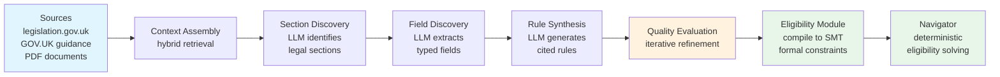
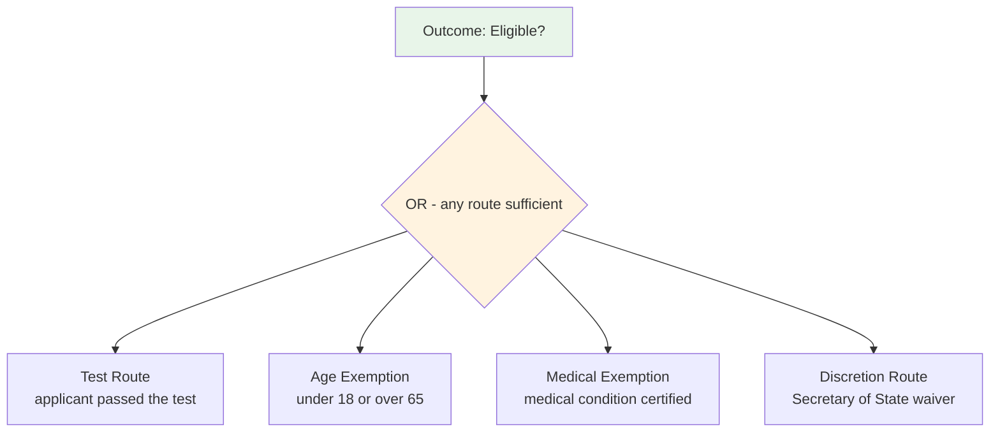
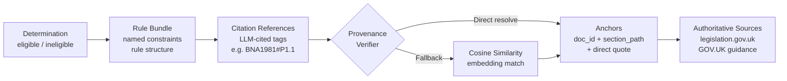

---

# 1. Introduction

In 1986, Sergot, Sadri, Kowalski, and colleagues published a landmark paper in *Communications of the ACM*: they had formalised the British Nationality Act 1981 as a Prolog logic program [@sergot1986bna]. The paper demonstrated that statutory legislation - with its characteristic structure of routes, exemptions, and override provisions - could be faithfully encoded as Horn clauses with negation as failure, and evaluated with provable correctness. It was a foundational result in computational law: legislation is logic, and logic can be executed.

Forty years on, large language models can read the same Act, explain it in plain English, and answer broad legal questions with fluency that would have seemed extraordinary even five years ago. It is tempting to conclude that the formal encoding project is no longer necessary. Our benchmark tests this assumption directly on the same legislation Sergot et al. encoded, extended to three further domains, and finds it does not hold - at least not for the specific class of task where exception chains are nested three levels deep.

The failure is specific. On straightforward multi-route eligibility logic, frontier models perform well, achieving 100% accuracy on 43 English-language scenarios (95% Wilson CI [91.8%, 100%]). But when legislation introduces nested exception chains, accuracy degrades sharply and in a way that is insensitive to temperature, sample count, and prompt engineering. Claude Opus 4.6 scores 61/68 (89.7%, CI [80.2%, 94.9%]) on the spacecraft section. With 10 runs on each of the 7 failing scenarios — 70 trials in total — it produces zero correct answers. The Clopper–Pearson 95% one-sided upper bound on per-trial success probability is 4.19%: the failures are systematic, not stochastic. Attempts to close the gap via enhanced prompting trade false negatives for false positives: the enhanced prompt reduces net accuracy to 64.7% (CI [52.8%, 75.0%]) while introducing 20 false positives for the first time.

We make three contributions:

1. **A failure pattern taxonomy.** We identify and characterise two systematic failure patterns in nested exception-chain evaluation: *exemption anchoring* (failure to evaluate alternative routes independently when the primary route fails) and *exception chain collapse* (failure to correctly nest multi-level UNLESS logic). We demonstrate both are systematic across six models (three frontier, three production-tier) and two providers on this benchmarked class of task.

2. **A multi-domain benchmark.** We present 225 scenarios across four sections spanning two UK immigration requirements (life-in-the-UK knowledge and English language proficiency), a synthetic spacecraft certification statute, and a synthetic construction insurance wording modelled on London market DE3/DE5 clause structure - designed to isolate exception chain evaluation as the test variable. Benchmark scenarios are released as a public dataset. The specific accuracy figures reported here will evolve as models improve; the task structure and failure pattern constitute the durable contribution.

3. **The Aethis Eligibility Module.** We describe a neuro-symbolic architecture that uses LLMs for rule authoring and an SMT-based constraint evaluation engine for rule execution, achieving complete consistency with the benchmark's formal rule fixtures across all 225 scenarios, with <1ms evaluation latency and near-zero marginal cost after compilation.

The paper is structured as follows. Section 2 summarises key findings. Section 3 reviews related work. Section 4 characterises the failure pattern. Section 5 describes the architecture. Section 6 presents the benchmark. Section 7 discusses challenges in LLM-guided rule synthesis. Sections 8, 9, and 10 address generalisation, compliance, and limitations.

---

# 2. Summary of Contributions

Artificial intelligence is entering high-stakes decision-making: immigration eligibility, safety certification, insurance underwriting, benefits entitlement, financial compliance. These are domains where errors have material consequences, where false negatives deny people their rights, and where explainability is mandatory.

We present the **Aethis Eligibility Module** (hereafter: the Eligibility Module), a neuro-symbolic engine that separates what LLMs do well from what requires formal guarantees. LLMs read authoritative sources and generate rules as structured code. The Eligibility Module compiles and evaluates those rules using an SMT-based deterministic evaluation layer, providing constraint evaluation with mathematically defined semantics and full auditability.

Our benchmark of 225 scenarios across four sections tests six LLMs (three frontier, three production-tier) against the Eligibility Module on the specific task of nested exception-chain evaluation. The Eligibility Module achieves complete consistency with the benchmark's formal rule fixtures across all domains - a consequence of deterministic execution over the authored specification, not empirical tuning. On adversarial exception-chain scenarios, frontier models produce systematic false negatives: Claude Opus 4.6 returns the wrong answer on 10% of spacecraft scenarios, and all observed failures are false negatives - eligible applicants incorrectly rejected, valid claims incorrectly denied. Attempting to improve LLM accuracy via enhanced prompting trades false negatives for false positives: the enhanced prompt fixes 5 of 7 original failures but introduces 20 new false positives, reducing net accuracy from 90% to 65%.

On the benchmarked class of nested exception-chain tasks, LLM errors are systematic enough that deterministic formal execution is the safer architecture for high-stakes decisions where 100% accuracy matters. This is not a claim that LLMs are unreliable in general; it is a specific finding about a specific class of rule evaluation.[^1]

[^1]: The system described in this paper is deployed commercially by Aethis (aethis.ai) for UK immigration and naturalisation workflows. The immigration benchmark sections cover selected requirements from this domain; the full determination involves additional sections not included in this publication.

---

# 3. Related Work

This work sits at the intersection of four research traditions: formal and computational approaches to legal reasoning; empirical evaluation of LLM logical reasoning; the limits of prompt engineering as a reliability strategy; and neuro-symbolic architectures that combine LLM fluency with formal execution guarantees.

## 3.1 Formal and Computational Approaches to Legal Reasoning

The challenge of encoding legislation as executable logic has a forty-year history. Sergot et al. [@sergot1986bna] formalised the British Nationality Act 1981 as a Prolog logic program, demonstrating that statutory rules could be faithfully represented as Horn clauses with negation as failure. Published in *Communications of the ACM* in 1986, this work identified the same legislation evaluated in our benchmark and showed that OR-branching eligibility logic can be captured in a formal system with provable properties. The Eligibility Module revisits the same statutory text with a different technical foundation - formal constraints compiled from LLM-authored rules rather than hand-coded Prolog - and extends evaluation to adversarial exception chain scenarios not part of the original formalism.

McCarty's TAXMAN system [@mccarty1977taxman] demonstrated as early as 1977 that AI systems could reason over tax code with explicit logical representations. Bench-Capon and colleagues developed value-based argumentation frameworks for legal reasoning over multiple decades [@benchcapon2010argument], establishing that legislation's exception structure requires more than propositional logic to represent faithfully.

The formal treatment for exception chains specifically is defeasible logic, introduced by Reiter [@reiter1980default] and developed by Nute [@nute1994defeasible] and Governatori et al. [@governatori2010changing]. Defeasible logic provides formal semantics for "A holds UNLESS B applies, UNLESS C overrides B" - precisely the pattern our benchmark identifies as a failure pattern for LLMs. The Eligibility Module does not use defeasible logic directly, instead compiling exception chains to formal material implication constraints evaluated by an SMT solver, but operates in the same tradition: the failure pattern we document is exactly the problem defeasible logic was designed to solve, now re-emerging in systems that replaced formal encoding with statistical inference over legislative text.

## 3.2 LLM Benchmarks for Legal and Logical Reasoning

LegalBench [@guha2023legalbench] provides the most comprehensive evaluation of LLM performance on legal tasks, testing 162 tasks across six categories. We report external validation on a subset of LegalBench tasks in §6.10. The two benchmarks remain complementary in scope: LegalBench tests breadth of legal reasoning across 162 tasks; the benchmark in §6.1–§6.9 isolates a single failure pattern under controlled conditions. §6.10 evaluates the architecture on nine LegalBench tasks selected to span the failure pattern (multi-prong rule application) and unbiased-sample tasks (single-clause classification).

FOLIO [@han2022folio] tests natural language inference grounded in first-order logic, demonstrating that LLMs struggle with tasks requiring explicit formal logical structure even when relevant premises are provided. Our findings are consistent: the failures we observe are not information retrieval failures (the legislation is provided in full) but reasoning failures arising from the compositional structure of the task.

## 3.3 Systematic Limits of LLM Reasoning

Dziri et al. [@dziri2023faith] demonstrate fundamental limits of transformer architectures on compositional tasks, showing that performance degrades systematically as task depth increases even when each individual step is within the model's capability. Exception chain evaluation is compositional in precisely this sense: each individual rule is simple, but the nested application of three independent exception conditions requires compositional reasoning over the rule structure. Our finding that failures concentrate on three-level exception chains and are absent on two-level OR-branching is consistent with the compositional depth hypothesis.

Shi et al. [@shi2023distracted] show that LLMs are systematically distracted by irrelevant context. The related phenomenon of *exemption anchoring* - where attention on the failed primary route suppresses evaluation of valid alternative routes - may be a manifestation of the same attentional bias in a rule-following context.

Valmeekam et al. [@valmeekam2022planning] demonstrate that LLMs fail reliably on planning tasks requiring state tracking and logical consistency, not through random error but through systematic misapplication of learned heuristics. Our finding that Claude Opus 4.6 produces 0/10 correct responses across ten independent runs on veteran exemption scenarios reflects the same pattern: consistent, confident, and wrong.

Valmeekam, Stechly and Kambhampati [@valmeekam2024lrms] extend this work to reasoning-optimised language models, reporting that OpenAI's o1 degrades sharply on harder Mystery Blocksworld variants and obfuscated planning tasks — the failure mode is not eliminated by inference-time reasoning compute, merely shifted to deeper compositional depth. We initially read this as parallel to a v3.6 / v3.7 intra-model reasoning-effort finding on the construction-CAR exception chain; that finding was withdrawn in v3.8 (see §6.5 Finding 5) after the original result failed to replicate under instrumented testing. The Valmeekam et al. result remains relevant context for §6.9's pre-registered N=66 reasoning-effort replication.

Mirzadeh et al. [@mirzadeh2024gsmsymbolic] show that LLM mathematical reasoning is brittle to surface-form changes: renaming entities or adding irrelevant clauses to GSM8K problems systematically degrades accuracy, even on frontier models. This is evidence that what looks like symbolic reasoning is substantially pattern matching over learned surface forms. The exception-chain failure pattern we observe is in the same family — LLMs produce fluent legal-sounding justifications that do not track the actual logical structure of the rule.

## 3.4 Prompt Engineering and Its Limits

Chain-of-thought prompting [@wei2022cot] and zero-shot reasoning elicitation [@kojima2022zeroshot] have substantially improved LLM performance on arithmetic and multi-step problems. Wang et al. [@wang2023selfconsistency] show that self-consistency (majority voting) improves performance on reasoning tasks. Our robustness analysis (Section 6.7) explicitly tests whether enhanced prompting closes the accuracy gap on exception chain evaluation, and finds a trade-off rather than a fix: an enhanced prompt that correctly identifies and targets the failure pattern (independent exemption evaluation) fixes 5 of 7 false negatives but introduces 20 false positives, reducing net accuracy from 90% to 65%. The result demonstrates that prompt-based repair on this class of task is fragile - instructions that correct under-application of exemptions simultaneously cause over-application elsewhere.

## 3.5 Neuro-Symbolic Architectures and LLM + Formal Method Hybrids

The neuro-symbolic research programme [@garcez2009neural] argues that robust AI systems require integration of neural pattern recognition with symbolic reasoning. Marcus [@marcus2020nextdecade] argues that the reliability limitations of purely statistical systems necessitate a return to hybrid approaches combining learned representations with structured reasoning. Kambhampati et al. [@kambhampati2024llmmodulo] advance this position with the *LLM-Modulo* framework, arguing that LLMs are most robustly deployed as approximate generators paired with formal verifiers and critics that provide external correctness guarantees. The Eligibility Module is a specific instantiation of the LLM-Modulo pattern applied to statutory rule evaluation: LLMs perform pattern-recognition tasks they excel at (reading legislation, extracting structure, generating code), while a constraint evaluation engine handles the evaluation task requiring mathematical guarantees.

Statutory rule evaluation is a particularly favourable application of the LLM-Modulo pattern, in ways that distinguish it from prior instantiations in code synthesis and symbolic planning. Three properties combine. First, the verification fragment is decidable: rule application over compiled constraints terminates in deterministic time with a total correctness criterion, in contrast to test-suite verification of synthesised code (which provides only partial coverage) or constraint satisfaction over learned world models (which is frequently approximate). Second, the artefact being verified — a compiled rule bundle — is persistent and amortised: a single authoring pass serves arbitrarily many subsequent decisions, where per-query LLM-Modulo cycles in code synthesis or planning re-incur authoring cost on every instance. Third, the correctness criterion is externally specified by statute and domain-expert review rather than chosen by the system designer, which makes test-driven validation against expert-defined fixtures (Section 7.3) a meaningful integrity check rather than a tautology. These properties together explain why the LLM-Modulo separation can deliver categorical guarantees at the execution layer in this domain, even where the same separation provides only best-effort guarantees in general program synthesis or planning.

Most directly related is Logic-LM [@pan2023logiclm], which uses LLMs to translate natural language problems into formal logical representations, then invokes symbolic solvers for evaluation. LINC [@olausson2023linc] similarly uses LLMs to generate first-order logic programs from natural language for theorem prover evaluation. These systems demonstrate the feasibility of the authoring-execution separation that underlies the Eligibility Module. The present system differs in three respects relevant to high-stakes deployment: it operates on *persistently stored* rule bundles rather than ephemeral per-query translations; it maintains a provenance chain linking each rule to specific source citations; and it is designed for production deployment where audit trails and version control are compliance requirements.

Program-aided language models (PAL [@gao2023pal]) demonstrate the broader pattern of using LLMs to generate code that is then executed deterministically. The Eligibility Module applies this separation to statutory rule encoding with additional quality engineering (Section 7) to ensure generated rules meet a quality threshold before entering the persistent rule store.

## 3.6 SMT-Based Constraint Evaluation

Satisfiability Modulo Theories (SMT) solving has seen extensive application in software verification, symbolic execution, hardware design, and safety-critical systems. The Eligibility Module applies SMT-based constraint evaluation to regulatory rule execution - rules compiled from LLM-authored code into formal constraint representations. The near-zero marginal evaluation cost after compilation makes formal constraint evaluation practical for production deployment at scale, a property that distinguishes constraint compilation from per-query LLM inference.

---

# 4. The Problem: LLMs and Nested Exception-Chain Evaluation

## 4.1 What Makes a Decision "High-Stakes"

High-stakes decisions share three properties that distinguish them from general AI tasks:

1. **Material consequence.** An incorrect determination can deny someone a right (citizenship, a benefit, a licence), expose an organisation to regulatory action, or cause financial harm.
2. **Auditability requirement.** A regulator, court, or oversight body may require an explanation of how the determination was reached, traceable to specific rules or statutory provisions.
3. **OR-branching logic.** Rules typically provide multiple independent pathways to satisfaction (primary routes, exemptions, waivers, overrides), each of which is independently sufficient.

Immigration law illustrates this structure. The British Nationality Act 1981 sets out multiple requirements for naturalisation, some of which include alternative pathways to satisfaction — such as age-based exemptions, medical exemptions, and discretionary waivers — which operate as independent routes within those requirements (disjunctive branches), not as standalone routes to overall eligibility (which requires conjunction across requirements).

## 4.2 Two Failure Patterns

When a large language model is asked to determine eligibility, it processes legislation and applicant data as a single reasoning task. Our benchmark reveals two systematic failure patterns on nested exception-chain tasks in this benchmarked setting. We make no claim that these patterns generalise to all legal reasoning; they are specific to the class of task where exception chains are nested three levels deep:

**Failure Pattern 1: Exemption anchoring.** LLMs treat exemption and waiver routes as secondary to the primary pathway rather than as independently sufficient alternatives. When the primary route fails, the LLM anchors on that failure and discounts exemptions.

**Failure Pattern 2: Exception chain collapse.** When rules contain multi-level exception chains ("A is required UNLESS B applies, UNLESS C overrides B"), LLMs fail to correctly evaluate the nested logic.

**Table 1: Multi-Level Exception Chain (Spacecraft Benchmark)**

The Spacecraft Crew Certification Act (a synthetic statute modelled on UK legislative structure) contains a three-level exception chain for flight readiness:

| Level | Rule | Plain English |
|:-----:|------|--------------|
| **Base** | Flight readiness required (500hrs + licence) | Must have 500+ hours AND a pilot licence |
| **Exception A** | Age >= 60 exempts from flight readiness | Over-60s don't need flight readiness... |
| **Exception B** | ...UNLESS mission is orbital | ...but orbital missions revoke the age exemption |
| **Override C** | 1000+ flight hours overrides everything | Veteran pilots (1000+ hrs) are always exempt |

**Table 2: Failures on Exception Chain Scenarios (spacecraft, adversarial suite)**

| Scenario | Expected | Opus 4.6 | Sonnet 4.6 | GPT-5.4 | GPT-5-mini |
|:---------------------------------|:----:|:----:|:----:|:----:|:----:|
| Age 25, 1500hrs, no licence, suborbital | Eligible | 1/3 | 0/3 | 3/3 | 1/3 |
| Age 59, 1000hrs, no licence | Eligible | 0/3 | 0/3 | 3/3 | 1/3 |
| Age 60, orbital, 999hrs, WITH licence | Eligible | 0/3 | 3/3 | 3/3 | 1/3 |
| Age 22, 1001hrs, no licence, orbital + rad cert | Eligible | 0/3 | 3/3 | 3/3 | 1/3 |
| Dolphin*, 1200hrs veteran, orbital, provider medical | Eligible | 0/3 | 3/3 | 3/3 | 1/3 |

*\*Dolphin is a valid species under the synthetic statute (s.3 excludes only Vogons). This scenario tests whether the model correctly applies the veteran exemption to a non-human applicant with otherwise valid credentials.*

The veteran exemption (Override C) is the hardest concept for LLMs in this benchmark. It operates independently of age: a 25-year-old with 1500 flight hours is exempt from flight readiness requirements, just as a 60-year-old would be. LLMs consistently treat the veteran exemption as age-dependent, producing false negatives with high confidence (0/3 across all runs). The Eligibility Module evaluates these correctly by construction.

## 4.3 Why False Negatives Matter

In high-stakes decision-making, a false negative means wrongly telling someone they do not qualify. Exemptions exist specifically for edge cases - the people who cannot satisfy the standard route but qualify through an alternative path. These are precisely the applicants most likely to be wrongly denied. On the benchmarked exception-chain scenarios, the failures are systematic: Claude Opus 4.6 returns "ineligible" across all runs on veteran exemption scenarios. Majority voting would not catch this.

Our construction insurance benchmark (Section 6.4) demonstrates the same failure pattern in a different domain: a CAR policy defect exclusion clause with a five-level exception chain. GPT-5.4, which achieves 100% on the spacecraft scenarios, drops to 96.6% on the insurance scenarios. The pattern is not specific to a single model, provider, or domain.

---

# 5. The Neuro-Symbolic Architecture

## 5.1 Design Principle

The architecture is built on a simple observation: LLMs and formal constraint evaluation excel at different tasks. LLMs are exceptional at reading legislation, understanding context, and generating structured representations. SMT constraint solvers are exceptional at evaluating logical expressions with mathematical guarantees.

The **Aethis Eligibility Module** separates these concerns:

- **Phase 1: Rule Authoring (LLM).** Read authoritative legal sources, discover sections and fields, generate rules as structured code, evaluate quality iteratively.
- **Phase 2: Rule Execution (Eligibility Module).** Parse generated code, compile to formal SMT constraints, evaluate against applicant data with deterministic execution.

## 5.2 Phase 1: Automated Rule Authoring

The rule authoring pipeline transforms authoritative legal text into executable compliance rules:

**Figure 1: End-to-End Pipeline**



Every generated rule carries provenance linking it to specific source material. Source items are tagged with structured references (e.g., `[BNA1981#Schedule1/P1.1]`) in the LLM's context, and the LLM is instructed to cite these tags on each generated criterion and field. A verification step then resolves these citations against the source material, creating anchors with document IDs, section paths, and direct quotes:

**Table 3: Source Provenance Chain**

| Source Type | Endpoint | Format | Citation Example | Verification |
|:----------|:------------|:---------------|:-----------------------------|:-------------------------|
| Primary legislation | legislation.gov.uk/api | Structured markup | `BNA1981#Schedule1/P1.1` | Direct resolution from LLM-cited references |
| Policy guidance | GOV.UK Content API | Structured API | `GOVUK#english-lang/part-2` | Direct resolution from LLM-cited references |
| Form guidance | PDF parser | Structured text | `form-an#section-4/para-3` | Direct resolution from LLM-cited references |

When the LLM fails to cite a source (or cites an invalid reference), the system falls back to embedding-based semantic similarity matching as a secondary mechanism. This multi-stage citation verification with semantic fallback provides higher fidelity than post-hoc similarity matching alone, because the LLM that generated the rule knows which source material it used.

This provenance chain is the foundation of auditability: any determination can be traced through the rule that produced it to the specific source clause that authorises it.

## 5.3 Phase 2: The Eligibility Module

The authoring model emits rules in a constrained DSL that is parsed and compiled to formal constraints using an SMT-based constraint evaluation engine. The DSL is never executed directly.

The critical property of the compilation is how alternative legal routes are represented. Each eligibility route becomes a formally independent branch:

**Figure 2: Route Independence in the Eligibility Module**



Each branch is a boolean expression evaluated independently. If `medical_exemption` evaluates to `True`, the OR is satisfied regardless of `test_route`. This is guaranteed by the execution semantics: it is not a statistical property and not dependent on model version or sampling parameters.

## 5.4 Why the Eligibility Module Cannot Make These Errors

The LLM failures in our benchmark fall into two categories, both of which are excluded by the execution semantics of the Eligibility Module. To make this precise, we state the compilation formally.

Let $\mathcal{F} = \{f_1, \ldots, f_m\}$ be the set of typed applicant fields, and let $\sigma : \mathcal{F} \to \mathcal{V}$ be an applicant assignment (each field mapped to a typed value). A **rule** is a quantifier-free formula $\phi$ in the theory of bitvectors, linear integer/real arithmetic, and uninterpreted functions over $\mathcal{F}$. A **rule bundle** is a tuple $\mathcal{R} = \langle \mathcal{G}, \mathcal{O} \rangle$ where $\mathcal{G} = \{G_1, \ldots, G_k\}$ is a set of rule groups, each $G_i = \{\phi_{i,1}, \ldots, \phi_{i,n_i}\}$ representing independent legal routes within a requirement, and $\mathcal{O}$ is an outcome combinator.

**Category 1 — Exemption anchoring (formally excluded).** Within a rule group $G_i$, routes are combined disjunctively:

$$
[\![ G_i ]\!]_\sigma \;=\; \bigvee_{j=1}^{n_i} [\![ \phi_{i,j} ]\!]_\sigma
$$

The semantics are: $[\![ G_i ]\!]_\sigma = \top$ iff *any* route satisfies the applicant assignment. There is no weighting, no ordering, and no context-dependent attenuation of later disjuncts by earlier ones. An LLM's learned approximation of this disjunction is not guaranteed to exhibit this property; the SMT-evaluated formula is, by the soundness of the decision procedure.

**Category 2 — Exception chain collapse (formally excluded).** A multi-level exception chain of the form

> *A is required, UNLESS B applies, UNLESS C revokes B, UNLESS D overrides everything*

compiles to the material implication

$$
\underbrace{
  \neg\Big[\,
    \underbrace{(B \land \neg C)}_{\text{exemption, not revoked}}
    \;\lor\;
    \underbrace{D}_{\text{override}}
  \,\Big]
}_{\text{no exemption or override active}}
\;\Rightarrow\;
A
$$

or equivalently $(B \land \neg C) \lor D \lor A$. This is a closed-form Boolean expression over the applicant fields. Evaluation is a standard SMT decision problem in $O(\text{poly}(|\phi|))$ for the quantifier-free fragment used; the result is a Boolean truth value with no variance over re-evaluation, temperature, or model version.

**Contrast with LLM inference.** An LLM computes

$$
p_\theta(\text{eligible} \mid \text{legislation},\, \sigma) \;\approx\; \mathbb{1}[\phi_{\text{gt}}(\sigma) = \top]
$$

where $\phi_{\text{gt}}$ is the ground-truth formula. The left-hand side is a learned distribution over tokens; the approximation is empirically good on shallow compositional tasks and empirically poor on three-level exception chains (Section 6). The right-hand side — what the Eligibility Module computes — is the indicator function itself. The failure patterns in Section 4 are failures of the approximation, and they are excluded by construction whenever the evaluator operates directly on $\phi_{\text{gt}}$. The guarantee covers Level 3 (execution) only; whether the authored $\phi$ faithfully represents $\phi_{\text{gt}}$ is the Level 2 problem (Section 5.5, Section 7).

## 5.5 What the Eligibility Module Guarantees - and What It Does Not

The system provides deterministic guarantees at one level only: **correct execution of formalised rules**. It makes no claim about two upstream steps:

**Level 1 - Source text retrieval.** The system retrieves authoritative source material using source connectors and retrieval pipelines. Errors here - missing sections, retrieval gaps - will produce incorrectly grounded rules. The system does not guarantee that all relevant source text was found and correctly parsed.

**Level 2 - Rule formalisation.** LLMs generate rules from source material. An incorrectly formalised rule produces incorrect determinations, even if the execution is formally correct. This is the "garbage in, garbage out" property stated precisely: deterministic execution of incorrectly formalised rules produces incorrect but deterministic results. The system addresses this through test-driven validation: subject matter experts define test cases covering golden paths, edge cases, and corner cases, and authored rules must pass these test suites before deployment (Section 7.3). Rules can also be reviewed by human experts, but the primary quality gate is automated test-case validation, not manual review.

**Level 3 - Rule execution.** Once rules are correctly formalised, the Eligibility Module guarantees correct execution with mathematically defined semantics. The failure patterns documented in Section 4 - exemption anchoring and exception chain collapse - are excluded by the execution semantics at this level.

This distinction matters for regulatory defensibility. The provenance chain (Section 9.1) supports audit of Levels 1 and 2; Level 3 is guaranteed by the execution semantics. Execution correctness is a necessary precondition for trust in the overall system: if the execution layer itself could introduce errors, no amount of rule quality engineering would produce reliable determinations. By solving Level 3 first, the system reduces the trust problem to a single surface — rule formalisation quality — which is addressed through iterative synthesis refinement (Section 7.1) and test-driven validation against SME-defined test suites (Section 7.3).

---

# 6. Accuracy Benchmark: Eligibility Module vs Six LLMs

## 6.1 Methodology

Both systems receive identical inputs: the same legislation text (markdown-formatted) and the same structured applicant data (field key-value pairs). The comparison isolates the reasoning engine. Everything else is held constant.

- **System A (Eligibility Module):** Gold-standard rule fixtures compiled to formal SMT constraints. The navigator evaluates constraints against structured applicant data and returns a deterministic eligible/ineligible determination.
- **System B (LLM baseline):** The same source legislation is provided to each LLM along with the same structured applicant data. The LLM determines eligibility and responds with `{"eligible": true/false, "reasoning": "..."}`.

**Models tested:**

| Model | Provider | Class | Cost Tier |
|-------|----------|-------|-----------|
| Claude Opus 4.6 | Anthropic | Frontier | Premium |
| Claude Sonnet 4.6 | Anthropic | Frontier | Mid |
| GPT-5.4 | OpenAI | Frontier | Premium |
| GPT-5.3 | OpenAI | Production | Mid |
| GPT-5-mini | OpenAI | Production | Low |
| GPT-5-nano | OpenAI | Production | Lowest |

**Evaluation coverage.** Not all models were evaluated on all domains. The following matrix shows the scope of each model's evaluation:

| Model | life_uk (56) | english_language (43) | spacecraft (68) | construction_car (58) | Notes |
|-------|:---:|:---:|:---:|:---:|-------|
| Claude Opus 4.6 | ✓ | ✓ | ✓ | — | + robustness (N=10) |
| Claude Sonnet 4.6 | ✓ | ✓ | ✓ | — | |
| GPT-5.4 | ✓ | ✓ | ✓ | ✓ | + enhanced prompt |
| GPT-5.3 | — | — | — | 11-scenario subset | production reference |
| GPT-5-mini | ✓ | ✓ | ✓ | — | |
| GPT-5-nano | — | ✓ | 48-scenario baseline | — | cost reference |

Results reported below should be read against this matrix. Aggregate claims refer only to evaluations actually conducted.

**Model selection.** The six models span three attributes: (i) frontier versus production tier, (ii) the two providers our organisation had API access to during the evaluation window (Anthropic and OpenAI), and (iii) a range of cost tiers representing realistic deployment choices. Models from other providers (Google Gemini, DeepSeek, Meta Llama, Mistral) were not included in this pass due to access and budget constraints; broader provider coverage is pre-registered for replication at N=66 (Section 6.9). The selection was fixed before any results were computed and was not adjusted based on intermediate findings.

**LLM configuration:** Temperature 0 where supported (Claude models; GPT-5 family does not expose this parameter — sampling is controlled internally by the model's reasoning pipeline). Runs per scenario: 3 (majority vote; robustness analysis tests N=10). Prompt: generic legal assessment, no special instructions about exemptions or OR-branching.

**Prompt variants explored.** Two to three prompt variants were explored informally during initial development to confirm that the observed failure pattern was not an artefact of wording — for example, whether instructing the LLM to "think step by step" or to "consider all exemption routes before deciding" closed the gap on exception-chain scenarios. These variants did not materially change the pattern and were not logged systematically. Systematic prompt comparison across three variants per scenario is pre-registered for the N=66 replication (Section 6.9). The enhanced prompt analysed in Section 6.7 is a fourth variant specifically targeting the failure pattern.

**Benchmark philosophy.** The goal is not to find the best possible LLM score through bespoke prompt engineering. It is to test whether a general-purpose model reliably preserves exception structure when reading authoritative rules in the way such systems are actually deployed - with a reasonable, generic instruction. This is a different question from "what is the ceiling of LLM performance on this task?" The robustness analysis (Section 6.7) directly addresses whether the gap is a prompt engineering problem or a deeper reliability issue.

**Domain disclosure.** The four benchmark domains span different levels of source authenticity:

| Domain | Source material | Authenticity |
|--------|----------------|-------------|
| `life_uk` | British Nationality Act 1981, Schedule 1 + Home Office guidance | Real UK legislation |
| `english_language` | Form AN guidance + English language policy | Real UK legislation |
| `spacecraft` | Spacecraft Crew Certification Act (synthetic statute) | Synthetic, modelled on UK legislative structure |
| `construction_car` | CAR policy defect exclusion endorsement (synthetic wording) | Synthetic, modelled on London market DE3/DE5 clauses |

All models achieve 100% on the `life_uk` section (depth-1 combinatorial boolean logic); this section is reported here for completeness but not charted separately. All frontier models also achieve 100% on `english_language` (depth-2 multi-route logic); production-tier GPT-5-nano scores 48.8% on the same section (Table 5). These two sections establish a baseline: the failure pattern is specific to exception chain depth, not general to legal reasoning.

**Note on immigration sections.** The life_uk and english_language sections cover two specific isolated requirements within UK naturalisation eligibility. The full naturalisation determination involves additional sections with exception chain structures of equivalent or greater complexity to the spacecraft section; those are not included here.

**Fixture independence.** The rule fixtures used by the Eligibility Module were authored independently of the LLM baseline evaluations and fixed prior to benchmarking. LLMs were not used to generate the ground-truth rules against which they are evaluated.

**Scope note on construction insurance materials.** The `construction_car` benchmark scenarios and their expected outcomes were authored by the primary author (a non-lawyer) based on published DE3/DE5 clause wordings and industry commentary. They have not been independently validated by a qualified construction-insurance professional and should therefore be read as author-constructed illustrative examples of the exception-chain structure in this domain rather than as professionally validated case studies. The immigration benchmarks (`life_uk` and `english_language`) were authored by L.D., an Immigration Solicitor and accredited Senior Caseworker (see Author Contributions).

**Note on repository scope.** The public benchmark repository (see Data and Code Availability) additionally contains a `benefits_entitlement` domain that is not analysed in this paper. It is included in the repository for completeness and future work but is out of scope for v3.7; all results, tables and findings reported here cover only the four domains listed above.

**Benchmark intent.** The benchmark is designed to exercise nested-exception-chain structures that occur in real legislation and commercial contracts, not synthetic structures contrived solely to confuse LLMs. The British Nationality Act 1981 Schedule 1 and JCT 2016 DE3/DE5 insurance wordings both contain multi-level UNLESS chains in practice; we deliberately selected and constructed scenarios that exercise this structure rather than average-case queries against these sources. The finding is therefore about how LLMs handle a structure that recurs in high-stakes legal and insurance texts, not about whether we can synthesise inputs that confuse them. Typical-case performance on the same sources is outside the scope of this paper.

## 6.2 Scenario Design

**Table 4: Benchmark Scenario Coverage**

| Section | Scenarios | Fields | Difficulty |
|:------------|:----------:|:-------:|:----:|
| life_uk | 56 | 4 | Low |
| english_language | 43 | 12 | Medium |
| spacecraft | 68 | 11 | High |
| construction_car | 58 | 14 | High |
| **Total** | **225** | | |

**Key patterns by section.**
- *life_uk:* combinatorial — 3 booleans × 7 ages.
- *english_language:* Canada trap, SELT edge cases, near-misses, multi-field interactions.
- *spacecraft:* three-level exception chain, nested IMPLIES, UNSAT early termination, adversarial.
- *construction_car:* DE3/DE5 defect exclusion, access damage carve-back, enhanced cover chain, pioneer override, known defect limitation.

## 6.3 Results

In all tables below, accuracy figures for the Eligibility Module refer to agreement with the benchmark's formal rule fixtures — the authored rule specifications used as the benchmark's ground truth. LLM accuracy is measured against the same fixtures.

**Table 5: English Language: 43 Scenarios, 12 Fields (Medium Difficulty)**

All accuracy figures report Wilson 95% confidence intervals.

| Model | Accuracy | 95% Wilson CI | Boundary | Consistency | FN |
|-------|:--------:|:-------------:|:--------:|:-----------:|:--:|
| **Eligibility Module** | **43/43 (100%)** | **[91.8%, 100%]** | **7/7 (100%)** | **43/43 (100%)** | **0** |
| Claude Opus 4.6 | 43/43 (100%) | [91.8%, 100%] | 7/7 (100%) | 43/43 (100%) | 0 |
| Claude Sonnet 4.6 | 43/43 (100%) | [91.8%, 100%] | 7/7 (100%) | 43/43 (100%) | 0 |
| GPT-5.4 | 43/43 (100%) | [91.8%, 100%] | 7/7 (100%) | 43/43 (100%) | 0 |
| GPT-5-mini | 42/43 (97.7%) | [87.9%, 99.6%] | 7/7 (100%) | 39/43 (91%) | 1 |
| GPT-5-nano | 21/43 (48.8%) | [34.6%, 63.2%] | 6/7 (86%) | 40/43 (93%) | 22 |

**Figure 3: Spacecraft accuracy with 95% Wilson confidence intervals.**

![Spacecraft section forest plot: Wilson 95% CIs across models. The Eligibility Module and GPT-5.4 sit at the ceiling (both 68/68, CI [94.7%, 100%]); Claude Opus and Sonnet overlap in the [80%, 96%] band and are not statistically distinguishable from each other; GPT-5-mini and nano trail below. Generated from Table 6 data by `figures/scripts/forest_plot_spacecraft.py`.](figures/forest_spacecraft_accuracy.png)

**Table 6: Spacecraft: 68 Scenarios, 11 Fields, Adversarial Exception Chains (High Difficulty)**

Numbers are the v3.6 / v3.7 snapshot (March 2026); v3.8 replication numbers are listed alongside where they differ. The shifting columns are the central evidence for the model-drift point made in §6.5 Finding 4 and the abstract.

| Model | March 2026 (v3.7) | April 2026 (v3.8 replication, same prompt + harness) |
|:--------------------|:------:|:--------------------:|
| **Eligibility Module** | **68/68 (100%) [94.7–100]** | **68/68 (100%)** (deterministic; invariant by construction) |
| GPT-5.4 | 68/68 (100%) | not re-tested (was already at 100%) |
| Claude Opus 4.7 (current Anthropic strongest) | not in v3.7 | **68/68 (100%)** [94.7–100] |
| Claude Opus 4.6 | 61/68 (89.7%) [80.2–94.9] | **67/68 (98.5%)** [92.1–99.7] — 6 fewer failures |
| Claude Sonnet 4.6 | 62/68 (91.2%) [82.1–95.9] | 60/68 (88.2%) [78.5–93.9] — 2 more failures |
| GPT-5-mini | 51/68 (75.0%) [63.6–83.8] | not re-tested |
| GPT-5-nano* | 22/48 (45.8%) [32.6–59.7] | not re-tested |

*\*GPT-5-nano was evaluated on the 48-scenario baseline suite only (pre-adversarial expansion) and is included as a cost-scaled reference, not as a realistic deployment choice.*

Replication harness: `tools/replication_run.py` in the public repo, run via the paper's exact `_build_prompt` format. Per-scenario JSONs at `docs/replication/A*.json`. The Opus 4.6 89.7% → 98.5% drift between March and April invalidates the §6.7 R1 70-trial-on-7-failing-scenarios result as currently written; see §6.7 R1 caveat.

## 6.4 Construction Insurance: DE3/DE5 Defect Exclusion (58 Scenarios)

The construction insurance benchmark extends the evaluation into a domain with commercial relevance: London market Construction All Risks (CAR) policy wording. The test fixture is modelled on DE3/DE5 defect exclusion clauses used for major infrastructure projects.

**The policy logic.** A CAR policy covers physical loss or damage to the Works. The defect exclusion creates a three-level exception chain:

| Level | Rule | Plain English |
|:-------------------|:-------------------------------|:---------------------------------------|
| **Exclusion** | Rectification cost absolutely excluded | Cost of fixing the defective part: never covered |
| **Carve-back** | Resultant damage to other property covered | Non-defective property damaged by the failure: covered |
| **Re-exclusion** | Access damage excluded | Property damaged just to reach the defect: not covered |
| **Enhanced cover** | Projects >= £100M: access damage reinstated | Large projects get access damage back... |
| **Design limit** | ...except for design defects | ...but not if the defect was in the design |
| **Pioneer override** | Projects >= £500M: design limit removed | Mega-projects override the design limitation |

**Table 7: Construction Insurance Exception Chain (access damage scenarios)**

Cells reflect the v3.7 snapshot (March 2026). The "Access, £500 M, design" cell where GPT-5.4 was reported as ✗ does not replicate in April 2026 — current GPT-5.4 returns the correct answer (covered) on this scenario; see Table 8a v3.8 column. The cell is preserved here as the v3.7 historical record because the model-drift evidence is itself part of the paper's argument.

| Scenario | Project | Defect | Eligibility Module | GPT-5.4 (v3.7) | GPT-4.1-mini |
|:-----------------------------|:----:|:--------:|:------------------:|:-----:|:----------:|
| Access, £100M, workmanship | £100M | workmanship | COVERED | ✓ | ✗ |
| Access, £200M, materials | £200M | materials | COVERED | ✓ | ✗ |
| Access, £200M, design | £200M | design | NOT COVERED | ✓ | ✓ |
| Access, £500M, design | £500M | design | COVERED | ✗ (v3.7) → ✓ (v3.8) | ✗ |
| Access, £800M, design | £800M | design | COVERED | ✓ | ✗ |

**Figure 4: Construction insurance accuracy with 95% Wilson confidence intervals.**

![Construction insurance forest plot: Wilson 95% CIs across the three models evaluated on the full 58-scenario suite. The Eligibility Module sits at the 100% ceiling (CI [93.8%, 100%]); GPT-5.4 at 96.6% (CI [88.3%, 99.0%]) is distinguishable from GPT-4.1-mini at 79.3% (CI [67.2%, 87.7%]). Generated from Table 8a data by `figures/scripts/forest_plot_construction.py`.](figures/forest_construction_accuracy.png)

**Table 8a: Construction Insurance — Full Suite (March 2026 vs April 2026 replication)**

Primary results on the 58-scenario construction insurance benchmark. v3.7 numbers (March 2026 snapshot) shown alongside v3.8 replication (April 2026, same prompt and harness, current model alias). Wilson 95% CIs in brackets.

| Model              | March 2026 (v3.7) | April 2026 (v3.8 replication, full 58-suite + 16 §6.9 replication) |
|--------------------|---------------------------|--------------------|
| **Eligibility Module** | **58/58 (100%)  [93.8–100.0]** | **74/74 (100%)** [95.1–100] (deterministic; invariant by construction) |
| GPT-5.4            | 56/58 (96.6%) [88.3–99.0] | **74/74 (100%)** [95.1–100] — closed silently between March and April |
| Claude Opus 4.7 (current strongest)    | not tested in v3.7 | 74/74 (100%) [95.1–100] |
| Claude Opus 4.6    | not tested in v3.7 | 74/74 (100%) [95.1–100] |
| Claude Sonnet 4.6  | not tested in v3.7 | 72/74 (97.3%) [90.7–99.3] — fails on `access_100m_design_not_covered`, `surface_eligible_design_access_blocks` |
| GPT-4.1-mini       | 46/58 (79.3%) [67.2–87.7] | 65/74 (87.8%) [78.5–93.5] — direction holds; magnitude shifted; still fails on `neg_*` (negation_stacking), `surface_*` (contradictory_cue), and `ultimate_trap_1` |

*GPT-5.3 was the cost-tier production reference in v3.7 (claimed 7/11 on the n=11 exception-chain subset). The model alias was deprecated by OpenAI between March and April 2026 (`NotFoundError: model gpt-5.3 does not exist`). Replication impossible.*

The v3.7 paper's lead frontier-LLM failure case (GPT-5.4 missing 2/58 construction scenarios) does not replicate in v3.8. The v3.4 / v3.7 narrative *"no frontier model achieves 100% across all four paper domains"* must be qualified: as of April 2026, GPT-5.4, Opus 4.7, and Opus 4.6 all reach 100% on the v3.7 58-scenario construction benchmark using the same paper-prompt format. Sonnet 4.6 still fails 2/74; GPT-4.1-mini still fails 9/74; the cost-tier and a small set of mid-tier failure modes remain visible. **The v3.7 paper-suite no longer differentiates the engine from the strongest frontier configurations on the controlled benchmark — and that is itself the point.** §6.4.1 below documents the v3.8 adversarial extension that does still differentiate, demonstrating that the structural advantage holds at deeper composition.

Replication artefacts: `confidently-wrong-benchmark/legalbench/docs/replication/A*.json` and `STREAM_A_REPORT.md` for full per-scenario JSON, including which specific scenarios each model failed on.

**Table 8b: Construction Insurance — Exception-Chain Sub-Study (N=11)**

Inter-model comparison on the 11-scenario `exception_chain`-tagged subset. Wilson 95% CIs in brackets. The original v3.6 / v3.7 row "GPT-5.4 (low reasoning) — 7/11 (63.6%)" is **withdrawn in v3.8** following an instrumented replication that returned 11/11 (100%) correct under explicit `reasoning_effort=low`; see `docs/r5-withdrawal-note.md` and Finding 5 above. The §6.9 pre-registered N=66 replication remains the venue for any larger-sample reasoning-effort test.

| Model                   | Exception-chain (n=11)    | Notes                                |
|-------------------------|---------------------------|--------------------------------------|
| **Eligibility Module**  | **11/11 (100%)  [74.1–100.0]** | deterministic by construction       |
| GPT-5.4 (default)       | 10/11 (90.9%) [62.3–98.4] | original v3.6 / v3.7 figure          |
| GPT-5.4 (`reasoning_effort=low`, v3.8 replication) | 11/11 (100%) [74.1–100.0] | instrumented; cannot reproduce v3.6 / v3.7 7/11 |
| GPT-5.3                 | 7/11 (63.6%)  [35.4–84.8] | production-tier baseline             |
| GPT-4.1-mini            | 5/11 (45.5%)  [21.3–72.0] | cost-tier baseline                   |

GPT-5.3 scores 7/11 (63.6%, 95% CI [35.4%, 84.8%]) on the 11-scenario exception chain subset. It correctly identifies absolute exclusions and simple carve-backs but fails on four scenarios requiring multi-level exception reasoning (enhanced cover reinstatement, pioneer override, and depth-5 unblock). The v3.6 / v3.7 paper additionally claimed GPT-5.4 at `reasoning_effort=low` matched this 7/11 with the same four scenarios failing — that intra-model reasoning-effort claim is **withdrawn in v3.8**: an instrumented replication on the exact same 11 scenarios returned 11/11 correct under explicit `reasoning_effort=low`, and no committed script reproduces the original 7/11 figure (see Finding 5 above and `docs/r5-withdrawal-note.md`). The inter-model gap (GPT-5.3 64% vs GPT-5.4 default 91% on the same chain) is real and narrow; §6.9 pre-registers an N=66 replication for the deeper compute-dependence question.

Note: v3.5 of this paper reported GPT-5.3 at 27% (3/11). That figure was inflated by a harness configuration issue in which the output budget was too small for reasoning models — their internal chain-of-thought tokens consumed the budget before visible output was produced, which scored as errors. With the corrected budget, GPT-5.3's actual accuracy is 64%. The correction is detailed in Section 6.8.

GPT-5.4 was reported in March 2026 to fail on the pioneer override boundary: `access_500m_design` was incorrectly rejected (the override applies at ≥ £500 M), while the identical scenario at £800 M was correctly accepted. **In April 2026 this specific cell no longer reproduces:** GPT-5.4 returns the correct verdict (covered) on `access_500m_design` under the same prompt. GPT-4.1-mini's enhanced-cover-chain failure is still present in v3.8 replication. The Eligibility Module evaluates `500 >= 500 = True` with no ambiguity, regardless of model drift.

### 6.4.1 v3.8 Adversarial Extension (20 scenarios)

The v3.7 58-scenario suite no longer reliably differentiates the strongest frontier configurations from the Eligibility Module on the controlled benchmark — the specific failure cells documented in March 2026 have largely closed at current model performance. To re-establish a current frontier-LLM failure demonstration on the same domain (and to test whether the structural advantage of deterministic execution is real or transient), we authored 20 new construction-CAR scenarios stratified across five complexity dimensions:

- **A — Maximum-stack adversarial:** three or more rule-failure modes simultaneously (e.g. depth-6 pioneer override + non-JCT existing-structures + design defect + access damage).
- **B — Threshold-boundary edge cases:** at-threshold (£100 M, £500 M), just-below (£99 M, £499 M), just-above (£100 M+ε, £500 M+ε).
- **C — Multi-clause cross-reference:** existing-structures + JCT + design + pioneer interactions across Cl. 5, 9, 10.
- **D — Surface-vs-deep contradiction:** surface text suggests opposite of correct answer (e.g. "£800 M project, design defect, access damage" surface signal = not covered; correct answer = covered via pioneer override).
- **E — Conjunction tracking:** every condition near-violating; one boolean flip reverses the outcome.

**Methodology — addressing the code-derived ground-truth critique.** Each scenario was authored with an *independent prose justification* for its expected outcome before the engine was consulted. The prose lives in the scenario's `notes:` field; the binary expected-value (`expect.outcome`) was authored in the same pass for consistency. The scenarios were then submitted to the engine via the public `/api/v1/public/decide` endpoint against the canonical bundle `construction-all-risks:20260412-gold` (the same bundle the original 74-scenario suite uses; the rule encoding was *not* modified for the v3.8 extension). Engine outcome matched authored expectation on 20/20, indicating self-consistency between the prose, the binary, and the rule encoding. The frontier-LLM runs (below) provide a third independent check: when models read the same `source.md` and answer the same scenarios, their disagreements with engine reveal model failures, not authoring errors (see §6.4.1 cross-evaluation note).

**Frontier-LLM evaluation.** The 20 new scenarios were run against four frontier-LLM configurations using the paper's exact `_build_prompt` format from `confidently-wrong-benchmark/benchmarks/run_llm_comparison.py`. All five evaluations (engine + 4 LLM configs) ran independently against the same scenario inputs.

**Table 8c: v3.8 Adversarial Extension — 20 scenarios, 4 frontier-LLM configurations**

| Configuration | Correct | Wilson 95% CI | Failure scenarios |
|---|:--:|:--:|---|
| **Eligibility Module** | **20/20 (100%)** | **[83.9–100]** | — |
| GPT-5.4 (`reasoning_effort=low`) | 20/20 (100%) | [83.9–100] | — |
| Claude Sonnet 4.6 | 19/20 (95.0%) | [76.4–99.1] | `v38_e4_carveback_gap_explicit` |
| GPT-5.4 (default) | 19/20 (95.0%) | [76.4–99.1] | `v38_e4_carveback_gap_explicit`; **0 reasoning tokens on every scenario** |
| **Claude Opus 4.7** (current Anthropic strongest) | **18/20 (90.0%)** | **[69.9–97.2]** | `v38_b3_499m_workmanship_access_no_design_limit`, `v38_e4_carveback_gap_explicit` |

**Figure 9: v3.8 adversarial extension forest plot.**


**Cross-evaluation note: the carveback-gap scenario (E4) is failed by three of four frontier-LLM configurations across both Anthropic and OpenAI families.** The scenario tests the DE3/LEG3 coverage gap explicitly documented in `source.md` Cl. 7 commentary: with `is_access_damage=true` and `consequence_of_failure=false`, the carveback group fails (Route A needs consequence; Route B needs not-access). The £200 M project value qualifies for enhanced cover, but the prior carveback gate blocks the claim before the enhanced-cover logic is reached. GPT-5.4 default and Sonnet 4.6 return `eligible`; Opus 4.7 returns `eligible`; correct answer is `not_eligible`. Only GPT-5.4 at `reasoning_effort=low` — the configuration that forces the model to use reasoning tokens (95 tokens on E4) rather than short-circuit (default = 0 reasoning tokens on every scenario) — gets it right. The pattern is consistent with a structural compositional-evaluation failure mode rather than a per-model artefact.

**Reasoning-effort observation.** GPT-5.4 at default reasoning effort uses **0 reasoning tokens on 20 of 20 v3.8 adversarial scenarios** — the API returns the answer in 4–6 completion tokens with no chain-of-thought. At `reasoning_effort=low`, the same model uses 16–126 reasoning tokens per scenario. On the harder cases this additional deliberation matters: low-reasoning gets E4 right where default short-circuits to wrong. The v3.6 / v3.7 paper claim that "default reasoning is better than low reasoning" (Finding 5, withdrawn) appears to be inverted under current model behaviour — default short-circuits without reasoning; low forces deliberation.

Replication artefacts: `tools/replication_run.py`, `tools/run_engine_v3_8_adversarial.py`, scenario YAML at `dataset/construction-all-risks/scenarios_v3_8_adversarial.yaml`, per-scenario JSONs at `docs/replication/B3_*.json` and `docs/replication/B4_*.json`, full report at `docs/replication/STREAM_B_REPORT.md`. All in the public `confidently-wrong-benchmark/legalbench/` (paths relative to that repo root).

## 6.5 Error Analysis

Five findings emerge from the multi-model benchmark:

**Finding 1: The failure pattern is exception-chain specific.** All frontier models achieve 100% on `english_language` (43 scenarios with multi-route logic). On the spacecraft section with its three-level exception chain, Claude Opus 4.6 drops to 90% and GPT-5-mini to 75%. The breaking point is nested exceptions, not legal reasoning in general.

**Finding 2: All failures are false negatives.** Across all baseline evaluations reported in this paper, we observed no false positives. No LLM ever declares an ineligible applicant eligible or a non-covered claim covered. The failure mode is exclusively conservative - but in a high-stakes context, a false negative may deny someone a pathway the rules explicitly provide.

**Finding 3: The veteran exemption is the universal failure point.** The most-failed scenario across all models is `age_59_veteran_1000hrs`. Every model except GPT-5.4 consistently (0/3 runs) marks this person ineligible. The LLM conflates two independent exemption pathways.

**Finding 4 (revised v3.8): Frontier model accuracy is unstable across model updates and prompt configurations.** The v3.6 / v3.7 paper reported that GPT-5.4 dropped to 96.6% on the construction insurance section while achieving 100% on spacecraft and immigration. **The v3.8 replication finds that specific failure case has closed:** under the same paper-prompt format and harness, current `gpt-5.4` is 74/74 (100%) on the full construction-CAR suite (Table 8a). The Opus 4.6 spacecraft failure rate also dropped from 89.7% (March) to 98.5% (April) under the same `claude-opus-4-6` alias. No model-version bump was announced; the specific empirical failures changed silently between months. The structural failure pattern remains observable on the v3.8 adversarial extension (§6.4.1: Opus 4.7 fails 2/20, GPT-5.4 default fails 1/20, Sonnet 4.6 fails 1/20), and on §6.10 LegalBench (combined McNemar's *p* < 0.001 vs each frontier model). For a regulated workflow built on a benchmark-time accuracy claim, the central practical observation is that the specific model performance is a moving target — even within a single model alias — while the deterministic execution layer is invariant by construction.

**Finding 5 — WITHDRAWN in v3.8.** Earlier revisions of this paper (v3.6, v3.7) reported, as a tentative N=11 finding, that GPT-5.4 at `reasoning_effort=low` scored 7/11 (63.6%) on the construction-CAR exception-chain subset, matching GPT-5.3 at default reasoning. **The v3.8 polish pass could not reproduce this result.** Two converging issues: (a) the committed LLM-comparison harness in `confidently-wrong-benchmark/benchmarks/run_llm_comparison.py` does not pass `reasoning_effort` as an OpenAI API parameter, and no other committed script produced the v3.6 / v3.7 figure — the original result has no committed-code provenance; (b) an instrumented v3.8 replication on the exact 11 `exception_chain`-tagged scenarios with explicit `reasoning_effort=low` and full per-call logging returns 11/11 (100%) correct, with all responses non-empty (`finish_reason=stop`) and reasoning-token counts in the expected 13–166 range. The parsimonious explanation is that the v3.6 / v3.7 result was a harness artefact analogous to the v3.5 → v3.6 GPT-5.3 token-budget bug (§6.8 *Harness configuration correction*); we cannot rule out model drift since the original test, but the absence of a reproducible script is on its own sufficient to retract. Full withdrawal note, replication command, and per-scenario JSON: `docs/r5-withdrawal-note.md` and `docs/verify_gpt5_reasoning_n11.json`. Section 6.9's pre-registered N=66 replication is retained as the venue in which any larger-sample reasoning-effort effect would be detected.

**Finding 6 (revised v3.8): The shifting-ground problem.** Multiple v3.6 / v3.7 frontier-LLM cells do not replicate under the same prompt and harness six weeks later. The most concrete examples: GPT-5.4 on construction-CAR moved from 96.6% to 100% (Table 8a); Opus 4.6 on spacecraft moved from 89.7% to 98.5% (Table 6); the v3.6 / v3.7 GPT-5.4 reasoning-effort-dependence claim (Finding 5) was withdrawn after an instrumented replication produced the opposite result; the GPT-5.3 model alias was deprecated by OpenAI mid-paper-cycle. None of these are catastrophic individually, but the pattern is that *frontier-LLM accuracy on a fixed benchmark is a function of the model snapshot, the harness configuration, and the prompt format — and at least one of these can shift without notice*. For a regulated workflow that depends on benchmark-time accuracy claims to certify deployment, this property is structurally incompatible with the verification pipelines required by frameworks like the EU AI Act. The Eligibility Module avoids this class of risk by construction: rules are compiled once at authoring time and evaluated deterministically thereafter; the same bundle gives the same answer on the same inputs in March, April, or any subsequent month, regardless of any silent change to upstream model behaviour. The v3.8 adversarial extension (§6.4.1) is published precisely so that this paper's frontier-LLM numbers are themselves replicable from the committed harness — not as a snapshot but as a procedure.

## 6.6 The Cost-Accuracy Trade-off

| Property | Eligibility Module | GPT-5.4 (best LLM) |
|----------|:-----------------:|:------------------:|
| Deterministic | Yes (by construction) | No |
| Cost per evaluation | Near-zero marginal after compilation | ~\$0.02 per scenario |
| Latency | <1ms | ~2–5 seconds |
| Auditability | Exact logical path | Post-hoc rationalisation |
| Regulatory defensibility | Execution semantics defined | Statistical accuracy |
| Model deprecation risk | None | Version-dependent |

A production system cannot guarantee that GPT-5.4's 100% accuracy on this benchmark extends to all possible inputs. It is an empirical observation, not an execution-level guarantee.

## 6.7 Robustness Analysis

This section addresses the key question: whether the observed failures are prompt-sensitive or structurally robust. The central question is not "what is the best possible LLM score after bespoke optimisation?" but "when models fail on exception chains, is that a prompting artefact - fixable with better instructions - or a deeper reliability issue?"

**Table 9: Robustness Analysis (spacecraft section, 68 scenarios)**

| Condition | Claude Opus 4.6 | GPT-5.4 |
|:----------------------------------------|:-----------------:|:-----:|
| Generic prompt, T=0.3, N=3 *(baseline)* | 90% (7 FN) | 100% |
| Generic prompt, T=0, N=3 *(Claude only)* | 90% (7 FN, all 0/3) | N/A* |
| Generic prompt, T=0.3, N=10 *(Claude only)* | 90% (7 FN, all **0/10**) | - |
| Enhanced prompt, N=3 | **65%** (4 FN + **20 FP**) | **99%** (1 FN) |

*\*GPT-5 family does not expose a temperature parameter.*

**R1 (March 2026 snapshot; partial v3.8 caveat).** At temperature 0 (fully deterministic), Claude Opus produced the same 7 failures with the same 0/3 error rate at the time of the original test. With 10 runs per scenario, all 7 failed scenarios scored **0/10**. Aggregated across the 7 scenarios, this is **0 correct answers in 70 independent trials**. The Clopper–Pearson 95% one-sided upper bound on per-trial success probability is **4.19%**, ruling out the hypothesis that the model would produce correct answers at a rate ≥5% per attempt at that snapshot.

**v3.8 caveat.** The "7 failing spacecraft scenarios" baseline that R1 was tested on (Opus 4.6 = 61/68 in March) does not replicate today: in April 2026 Opus 4.6 returns the correct answer on 67 of 68 spacecraft scenarios under the same prompt and harness, leaving only 1 systematic failure rather than 7 (Table 6 v3.8 column). The 70-trial 0/70 result therefore stands as a March 2026 finding about a specific 7-scenario set that is no longer at the same baseline failure rate. Re-running the 70-trial design against the current 1-scenario failure set would require a separate investigation we have not undertaken in v3.8. The headline qualitative claim — *that some specific Opus failures were stable rather than stochastic at the original snapshot* — survives. The headline quantitative claim — *that 4.19% upper bound applies to current Opus 4.6 production behaviour on current failure cases* — does not.

**R2: Enhanced prompting trades one failure mode for another.** The enhanced prompt explicitly instructs the LLM to "evaluate each exemption independently" and warns about exception chains. This partially succeeds: 5 of the 7 original false negatives are corrected, including the veteran exemption scenarios that the generic prompt consistently fails. However, the same instructions cause the model to over-apply exemption logic, producing **20 false positives** — the first time in our benchmark that an LLM declares an ineligible applicant eligible. The model now grants eligibility to applicants below the flight hours threshold (499 < 500), with expired medical certificates, and on orbital missions where the age exemption is explicitly revoked. Net accuracy drops from 61/68 (89.7%, CI [80.2%, 94.9%]) to 44/68 (64.7%, CI [52.8%, 75.0%]) — the CIs are disjoint, so the drop is statistically significant.

**Figure 5: Prompt-repair trade-off (Claude Opus 4.6, spacecraft).**

![Accuracy with Wilson 95% CIs under the generic and enhanced prompt, with per-row outcome composition annotated inline (correct / false-negative / false-positive counts out of n=68). The 89.7% → 64.7% drop is statistically significant — the two CIs are disjoint, shaded in red. The generic prompt fails conservatively (7 FN, 0 FP); the enhanced prompt corrects three of those false negatives but introduces 20 false positives for the first time in the benchmark. Generated from Section 6.7 data by `figures/scripts/fnfp_tradeoff_r2.py`.](figures/fnfp_tradeoff_enhanced_prompt.png) We note that R2 tests only one enhanced prompt variant. Section 6.9 pre-registers a three-variant comparison (few-shot, self-critique, decomposition) to test whether this FN/FP trade-off is fundamental to prompt repair on this class of task or specific to the particular prompt tested here.

This is not simply a bad prompt. The enhanced prompt correctly identifies the reasoning gap (independent exemption evaluation) and provides accurate instructions. The problem is that the same instructions that fix under-application of exemptions cause over-application elsewhere. The generic prompt's conservative bias - all false negatives, no false positives - is a more predictable failure mode than the enhanced prompt's scattered errors across both directions. For a production system, a consistent conservative bias is easier to compensate for than unpredictable failures in both directions.

**R3: GPT-5.4 shows the same pattern in miniature.** The enhanced prompt introduces 1 failure on the hardest scenario that the generic prompt handles correctly.

**R4: Run-to-run variance confirms fragility.** Re-running the enhanced prompt benchmark on the same model produces qualitatively identical results (20 FP, 4 FN) but with slight variance in which specific scenarios fail. This contrasts with the generic prompt, where the same 7 scenarios fail identically across independent runs. The enhanced prompt introduces not only new failure modes but also non-deterministic failure patterns - precisely the property a high-stakes system cannot tolerate.

**R5 — WITHDRAWN in v3.8.** Earlier revisions of this paper reported that GPT-5.4 at `reasoning_effort=low` scored 7/11 on the construction-CAR exception chain, suggesting reasoning-compute-dependence within the GPT-5 family. The v3.8 polish pass found (a) no committed script reproduces the v3.6 / v3.7 result — the LLM-comparison harness at `confidently-wrong-benchmark/benchmarks/run_llm_comparison.py` does not pass `reasoning_effort` as an API parameter, and (b) an instrumented replication on the exact 11 `exception_chain`-tagged scenarios with explicit `reasoning_effort=low` returns 11/11 (100%) correct, with all responses non-empty and reasoning tokens in the 13–166 range. Most likely cause: the v3.6 / v3.7 figure was a harness artefact analogous to the v3.5 → v3.6 GPT-5.3 token-budget bug. The intra-model reasoning-compute-dependence hypothesis is therefore **withdrawn**. Claude Opus 4.6's temperature invariance (100% at both default T and T=1.0) stands as a separate observation but no longer serves as a parallel data point to a withdrawn claim. Section 6.9's pre-registered N=66 replication is retained as the venue for any larger-sample test of reasoning-effort dependence. Withdrawal note + per-scenario JSON: `docs/r5-withdrawal-note.md`, `docs/verify_gpt5_reasoning_n11.json`.

The robustness findings answer the prompting contest objection directly. The gap is not caused by a suboptimal prompt that a better prompt would fix. Prompt engineering on this class of task faces a fundamental trade-off: instructions that reduce false negatives on exception chains simultaneously increase false positives by causing over-application of the same exemption logic. This is consistent with the compositional reasoning limitation identified by Dziri et al. [@dziri2023faith]: the model does not have a stable internal representation of the exception chain structure that can be steered by prompt instructions without side effects.

## 6.8 Threats to Validity

We follow academic convention in identifying threats to the validity of these findings.

**Internal validity:**
- *Prompt sensitivity.* The benchmark uses a generic prompt, not an optimised one. This is intentional (Section 6.1), but means we are not measuring best-possible LLM performance. The robustness analysis (Section 6.7) tests one enhanced prompt variant that specifically targets the identified failure pattern; it reduces false negatives but introduces false positives, with net accuracy decreasing. We cannot exclude the possibility that a different prompt strategy could improve accuracy without side effects, but the result demonstrates that targeted prompt repair on this class of task involves trade-offs between failure modes.
- *Harness configuration correction (v3.6).* v3.5 reported GPT-5.3 at 27% (3/11) on the construction exception chain. That figure was inflated by a configuration issue in the benchmark harness: the output budget was too small for reasoning models, whose internal chain-of-thought tokens consumed the budget before visible output was produced, resulting in empty responses scored as errors. With the corrected budget, GPT-5.3's actual accuracy is 64% (7/11). The correction does not affect the qualitative finding — GPT-5.3 still fails systematically on multi-level exception scenarios — but the quantitative severity is less extreme than originally reported. The benchmark script has been corrected and the updated results are publicly reproducible.
- *Expected values partly code-derived.* The `life_uk` expected values are computed by Python code, not independently verified by a legal expert. The `english_language` scenarios were hand-verified against Form AN guidance. The spacecraft scenarios use a synthetic statute with unambiguous values.
- *Structured inputs only.* Applicant data is provided as typed key-value pairs. A production system requires extraction from natural language or documents; that layer is not tested here.
- *Adversarial scenarios are post-hoc.* The spacecraft adversarial suite was designed after observing LLM failure patterns. The baseline results (48 scenarios) show the same failure pattern; the adversarial additions amplify it. Selection bias of this kind is addressed for the LegalBench external-validation arm by §6.10.3's pre-registered random-sample replication (seeds 42, 43, 44).

**External validity:**
- *Synthetic domains.* The spacecraft domain uses a synthetic statute. The construction insurance domain uses synthetic policy wording modelled on real clauses. Findings in these domains may not generalise directly to all legal contexts. §6.10 provides cross-domain external validity on a public peer-reviewed legal-reasoning benchmark (LegalBench).
- *Benchmark scope.* The benchmark tests one specific class of task — nested exception-chain evaluation. LLM performance on other legal reasoning tasks may differ substantially; §6.10 reports both the multi-prong (failure-pattern-matching) and single-clause-classification (random-sample) regimes.
- *Model versioning.* Specific model versions are named. As models are updated, results may change. The benchmark scenarios are released publicly to allow ongoing evaluation of future systems. The specific accuracy figures reported here are a snapshot; the benchmark task structure and failure pattern are the durable contribution.

**Construct validity:**
- *LLM self-evaluation in quality engineering.* Quality scores in Section 7 are produced by an LLM evaluator, not human legal experts. These are internal consistency scores; external validation has not been performed.

## 6.9 Pre-Registered Replication (v3.7)

The prompt-repair finding (R2) rests on one enhanced prompt variant; the reasoning-effort question (formerly Finding 5 / R5, withdrawn in v3.8 — see §6.5) is now an open hypothesis rather than a tentative finding. v3.7 of this paper pre-registers the following replication, which v3.8 retains as the venue for both questions:

1. **Expanded construction_car exception-chain subset from 11 to 66 scenarios**, stratified across five depth bands (simple exclusion, exclusion+carve-back, +re-exclusion, +enhanced cover, +design-limit/pioneer/depth-5) with boundary and adversarial coverage within each band. Power analysis: N=35 per arm is required to detect a 64% vs 91% effect at 80% power, α=0.05; N=66 gives ~1.9× margin and tightens the Wilson 95% CI at 64% observed accuracy from ±25pp (at N=11) to ±11pp.

2. **Three prompt-variant robustness tests** on the 7 known-failing spacecraft scenarios plus 3 control scenarios (N=3 runs each), across Claude Opus 4.6 and GPT-5.4: (a) few-shot with worked exception-chain examples, (b) self-critique two-stage, (c) decomposition (evaluate each route separately, then OR). Primary outcome: does any variant escape the FN/FP trade-off observed in R2?

3. **Full reasoning-effort sweep** on the 66-scenario exception chain: GPT-5.4 at low/medium/high, GPT-5.3 at default (and at low/high if the parameter is exposed), Claude Opus 4.6 as invariance control.

4. **Independent expected-value authoring for new scenarios**: each of the 55 new scenarios has a prose expected-value assertion written against the legislative clause chain before the fixture is consulted. Mismatches between prose and fixture are flagged for SME review rather than silently reconciled. This addresses the internal-validity hole where code-derived expected values allow fixtures and the execution engine to trivially agree.

**Pre-registration commitment.** Results — whether they confirm, weaken, or refute the v3.6 findings — will be reported in v3.7 regardless of direction. Findings 5 and 6, and Section 6.7 R5, will be updated or withdrawn based on the replication.

---

## 6.10 External Validation on LegalBench

The benchmark in §6.1–§6.8 isolates a single failure pattern (nested exception-chain evaluation) on synthetic and UK-immigration scenarios authored for the experiment. A natural external test of the architecture is a public, peer-reviewed legal-reasoning benchmark covering tasks the authors did not design. We take that test using LegalBench [@guha2023legalbench], evaluating the Eligibility Module on nine LegalBench tasks (949 held-out cases) against three frontier LLMs spanning two model families.

### 6.10.1 Setup

For each LegalBench task we evaluate, we author one rule bundle for the Eligibility Module from the **verbatim canonical Task description** published in the upstream LegalBench repository (CC BY 4.0, Neel Guha). No paraphrase, no editorial shaping, no DSL pseudo-code. The bundle is generated by aethis-core's authoring pipeline against a small set of statute-derived test cases written by the authors (typically 4–8 per task) — *not* drawn from the LegalBench fact patterns. Where domain-specific subject-matter-expert guidance is added, it lives in a separate `guidance/` directory and is grounded in independent practitioner authority (e.g. LSTA Model Credit Agreement conventions for `cuad_covenant_not_to_sue`; standard federal civil-procedure treatments for `personal_jurisdiction`; the Atticus Project's CUAD taxonomy for clause-classification tasks).

We compare the **Eligibility Module pipeline** (LLM extractor producing typed atomic field values $\to$ deterministic engine evaluation against the bundle's compiled rule) against the **LLM-only baseline** (the same model given the canonical rule prose and asked to answer the LegalBench question end-to-end, using upstream LegalBench prompts — the canonical 5–6-shot `base_prompt.txt` files). LLM baselines are evaluated at the model level for `claude-sonnet-4-6`, `claude-opus-4-7`, and `gpt-5.4`. The Eligibility Module's runtime extractor in the headline configuration is `claude-sonnet-4-6`; we also report a cross-extractor configuration with `claude-opus-4-7` to disentangle structural from model-specific effects (§6.10.5).

For tasks selected by inspection (matching the failure pattern identified in §4.2), we apply the held-out methodology *retroactively*: results below are filtered to the held-out half of each task's LegalBench `test` split using a deterministic seeded partition (`tools/test_split.py --seed 7 --dev_fraction 0.5`). For tasks selected by **pre-registered random sample** from the 153-task LegalBench pool (`tools/random_task_pick.py --seed 42` and `--seed 43`, committed before authoring), the held-out methodology was applied *prospectively* — hint iteration was confined to the dev half, and the holdout was evaluated once with frozen hints.

### 6.10.2 Results

Table 6.10.A reports per-task accuracy on the held-out evaluation sample, with 95% Wilson confidence intervals on each estimate and exact two-sided McNemar's tests on the per-case engine-vs-LLM agreement matrices.

**Table 6.10.A — Eligibility Module vs frontier LLMs, LegalBench held-out evaluation**

\small

| Task | N | Eligibility Module | Sonnet 4.6 | Opus 4.7 | GPT-5.4 |
|---|---:|---|---|---|---|
| `hearsay` (FRE 801) | 47 | 45/47 (95.7%) [85.8–98.8] | 35/47 (74.5%); +21.3 / 0.006 | 39/47 (83.0%); +12.8 / 0.031 | 40/47 (85.1%); +10.6 / 0.125 |
| `personal_jurisdiction` | 25 | 24/25 (96.0%) [80.5–99.3] | 24/25 (96.0%); +0.0 / 1.000 | 23/25 (92.0%); +4.0 / 1.000 | 24/25 (96.0%); +0.0 / 1.000 |
| `jcrew_blocker` | 27 | 27/27 (100%) [87.5–100] | 16/27 (59.3%); +40.7 / <0.001 | 26/27 (96.3%); +3.7 / 1.000 | 25/27 (92.6%); +7.4 / 0.500 |
| `cuad_covenant_not_to_sue` ¹ | 154 | 150/154 (97.4%) [93.5–99.0] | 148/154 (96.1%); +1.3 / 0.727 | 149/154 (96.8%); +0.6 / 1.000 | 83/154 (53.9%); +43.5 / <0.001 |
| `contract_nli_explicit_id` ¹ | 55 | 48/55 (87.3%) [76.0–93.7] | 47/55 (85.5%); +1.8 / 1.000 | 46/55 (83.6%); +3.6 / 0.688 | 20/55 (36.4%); +50.9 / <0.001 |
| `contract_nli_notice_on_disclosure` ² | 71 | 70/71 (98.6%) [92.4–99.8] | 71/71 (100%); −1.4 / 1.000 | 71/71 (100%); −1.4 / 1.000 | 36/71 (50.7%); +47.9 / <0.001 |
| `learned_hands_health` ² | 113 | 107/113 (94.7%) [88.9–97.5] | 104/113 (92.0%); +2.7 / 0.375 | 99/113 (87.6%); +7.1 / 0.039 | 56/113 (49.6%); +45.1 / <0.001 |
| `cuad_liquidated_damages` ² | 110 | 105/110 (95.5%) [89.8–98.0] | 107/110 (97.3%); −1.8 / 0.500 | 105/110 (95.5%); +0.0 / 1.000 | 79/110 (71.8%); +23.6 / <0.001 |
| `opp115_int_and_specific_audiences` ² | 347 | 324/347 (93.4%) [90.3–95.5] | 319/347 (91.9%); +1.4 / 0.302 | 321/347 (92.5%); +0.9 / 0.581 | 232/347 (66.9%); +26.5 / <0.001 |
| **All 9 tasks (combined)** | **949** | **900/949 (94.8%)** | *combined: see Table 6.10.B* | | |

\normalsize

¹ Random sample, seed=42 (pre-registered in `tools/random_task_pick.py`). Personal jurisdiction is 28 USC §1332(a). Notice-on-compelled-disclosure full task name: `contract_nli_notice_on_compelled_disclosure`. Explicit-id full name: `contract_nli_explicit_identification`. Opp115 full name: `opp115_international_and_specific_audiences`.

² Random sample, seed=43.

**Cell legend.** Engine column: correct/n (accuracy, 95% Wilson CI). LLM columns: correct/n (accuracy); Δ vs Engine in percentage points / exact two-sided McNemar's *p* on per-case discordance with the Engine. Negative Δ indicates the LLM out-performed by 1 case at that N; none reach significance.

When per-task results are aggregated by paired-binomial test on discordant cases across the full 949-case held-out evaluation, the Eligibility Module is significantly more accurate than each of the three frontier models at the conventional $p < 0.05$ level:

**Table 6.10.B — Combined paired-binomial across 9 LegalBench tasks**

| Comparison | $b$ (Eligibility Module only correct) | $c$ (LLM only correct) | Two-sided exact *p* |
|---|---:|---:|---:|
| Module vs Sonnet 4.6 | 44 | 15 | $< 0.001$ |
| Module vs Opus 4.7 | 34 | 13 | $0.003$ |
| Module vs GPT-5.4 | 340 | 35 | $< 0.001$ |

**Per-task statistical power.** The small-N curated tasks have limited per-task power: `personal_jurisdiction` (N=25) cannot detect held-out accuracy differences smaller than approximately ±20pp at $\alpha = 0.05$, 80% power, and `hearsay` (N=47) is similarly underpowered for $\Delta < 14$pp. The load-bearing test in this section is the combined paired-binomial across all 949 held-out cases (Table 6.10.B); per-task McNemar's *p*-values are reported for completeness but should be interpreted as supplementary, particularly on the curated multi-prong tasks.

**Multiple comparisons.** Table 6.10.A reports 27 simultaneous per-task McNemar's tests (9 tasks × 3 LLMs), uncorrected. Under Bonferroni correction at $\alpha = 0.05/27 \approx 0.0019$, only the strongest comparisons remain individually significant (most of the GPT-5.4 cells; `jcrew_blocker` vs Sonnet). The combined paired-binomial in Table 6.10.B aggregates discordant pairs across all tasks and is a single test, not subject to the same correction; it is the load-bearing inferential claim and remains $p \le 0.003$ against every model under any reasonable family-wise correction.

**Figure 7: LegalBench per-task held-out accuracy with Wilson 95% CIs.**

![Forest plot of per-task held-out accuracy across the four evaluated configurations (Eligibility Module, Sonnet 4.6, Opus 4.7, GPT-5.4). The Eligibility Module is right-shifted on every task. GPT-5.4's positive-class anchoring on classification-style tasks (§6.10.4) is visible in the lower six rows where its CI sits well to the left of the other three. On the curated multi-prong tasks (top three rows), Sonnet 4.6's wider variability is visible (`jcrew_blocker` 59.3% vs the others' 92–96%). Generated from Table 6.10.A data by `figures/scripts/forest_plot_legalbench.py`.](figures/forest_legalbench_accuracy.png)

### 6.10.3 Selection bias and the random-sample replication

A reviewer might fairly ask whether the four "curated" tasks above (`hearsay`, `personal_jurisdiction`, `jcrew_blocker`, `cuad_covenant_not_to_sue`) were chosen because they fit the Eligibility Module's structural shape — multi-prong rule application of the kind §4.2 identifies as a frontier-LLM failure pattern. They were. To test whether the result is selection-bias-dependent, we repeated the protocol on **six additional LegalBench tasks selected by seeded random sample** from the 153-task pool excluding tasks already integrated. The selection (seeds 42 and 43, n=2 and n=4 respectively, generated by `tools/random_task_pick.py`) was committed before the upstream Task descriptions were inspected. A third seed (seed=44, n=2) was pre-registered at the public release tag `pre-v3.8-legalbench-preregistration` (commit SHA `f7c5994`) but is not yet run; the tag preserves the seed-before-results discipline if those tasks are added in a future revision.

The six random-sample tasks span CUAD contract-clause classification, ContractNLI entailment, OPP115 privacy-policy classification, and LearnedHands legal-aid post categorisation — predominantly single-clause classification rather than the multi-prong rule application that §4.2 characterises as the failure pattern. Predicted-mismatch territory.

The result is consistent: the Eligibility Module wins on the random-sample tasks, but with smaller per-task margins (1–3 percentage points on the random sample vs 12–41 percentage points on the curated multi-prong tasks). The combined paired-binomial test reported in Table 6.10.B includes both curated and random-sample tasks; even with the curated subset removed, the random-sample combined comparison reaches significance against Sonnet ($b=22$, $c=10$, $p=0.025$) and against GPT-5.4 ($b=261$, $c=29$, $p<0.001$); against Opus 4.7 the random-sample combined result is suggestive but not significant ($b=21$, $c=11$, $p=0.084$).

The interpretation: the Eligibility Module's structural advantage is **largest where the underlying rule has multiple genuinely-distinct prongs** combined by deterministic logic — exactly the failure pattern of §4.2. On single-clause classification tasks the structural advantage shrinks to a 1–3 percentage point edge that is consistent across tasks but small per task; the combined test detects it only when aggregated.

### 6.10.4 GPT-5.4 calibration on contract-clause classification

GPT-5.4's accuracy on five of the eight non-curated random-sample tasks (`cuad_covenant_not_to_sue` 53.9%, `contract_nli_explicit_id` 36.4%, `contract_nli_notice_on_compelled_disclosure` 50.7%, `learned_hands_health` 49.6%, `opp115_international` 66.9%) is sharply lower than Sonnet 4.6 and Opus 4.7 on the same tasks (each clears 87% on all five). Inspection of the per-case JSON responses shows GPT-5.4 has a systematic positive-class bias on these classification tasks: on `cuad_covenant_not_to_sue` it returns "yes" on 304/308 test cases regardless of clause content (recall $\approx$100%, precision $\approx$50%). The pattern replicates on the other four tasks and is not present on the multi-prong rule tasks (`hearsay` 85.1%, `personal_jurisdiction` 96.0%, `jcrew_blocker` 92.6%).

We do not characterise this as a capability statement about GPT-5.4 broadly. The pattern is specific to the LegalBench classification-style few-shot prompt format used here (the upstream canonical `base_prompt.txt`); alternative prompt strategies (chain-of-thought, structured-output, zero-shot rule-only) may recover the model's performance.

We tested this directly on `cuad_covenant_not_to_sue` with a zero-shot variant: the same model and the same task description from `sources/rule.md`, but no few-shot Q/A examples — only the rule, the clause, and the question "Answer Yes or No." On the same 154-case held-out subset, GPT-5.4 zero-shot achieves **143/154 (92.9%)**, up from 83/154 (53.9%) under the few-shot prompt — a +39pp recovery. The yes-rate normalises from 98.7% (the calibration cliff) to 45.5%, matching the dataset's underlying ~50% positive prior. This empirically confirms the framing: the GPT-5.4 cliff on these LegalBench tasks is **prompt-format-coupled, not a model-capability claim**.

Notably, the Eligibility Module still beats GPT-5.4 zero-shot on this task: 150/154 (97.4%) vs 143/154 (92.9%), exact two-sided McNemar's *b* = 7, *c* = 0, *p* = 0.016. The structural advantage holds even against the best-prompt configuration of the strongest LLM tested.

**Figure 8: GPT-5.4 calibration cliff and zero-shot recovery.**

![Five horizontal bars on the `cuad_covenant_not_to_sue` 154-case held-out subset. Engine (97.4%), Sonnet 4.6 few-shot (96.1%), and Opus 4.7 few-shot (96.8%) cluster at the top; GPT-5.4 few-shot collapses to 53.9% with a 98.7% positive-class anchoring rate; under a zero-shot prompt (rule + clause + Yes/No, no Q/A examples) GPT-5.4 recovers to 92.9% with a 45.5% positive rate that matches the dataset prior. Wilson 95% CIs as whiskers. Engine vs GPT-5.4 zero-shot paired McNemar's: *b* = 7, *c* = 0, *p* = 0.016. Generated by `figures/scripts/cliff_zero_shot_recovery.py`.](figures/calibration_cliff_recovery.png)

The relevant finding for the present paper is that the Eligibility Module's structural advantage holds across model families and across prompt strategies — the failure pattern in §4.2 (compositional rule-evaluation) and the calibration pattern in this section (classification-prompt anchoring) are **distinct LLM failure modes that both manifest on legal classification tasks**, and the deterministic-execution architecture beats both.

### 6.10.5 Cross-extractor: structural advantage is not extractor-specific

A second possible critique: the Eligibility Module pipeline uses an LLM extractor (Sonnet 4.6 in the headline configuration) to produce the typed field values that the engine evaluates. If the LLM-only baseline also uses Sonnet 4.6, the comparison reduces to "Sonnet split across two steps versus Sonnet doing it all in one step", which might be a prompt-engineering artefact rather than a structural property of the Module.

To test this, we re-ran the Eligibility Module pipeline with **Opus 4.7 as the runtime extractor** on the two clearest multi-prong tasks (`hearsay` and `personal_jurisdiction`), and compared against Opus 4.7 end-to-end:

**Table 6.10.C — Cross-extractor (full test split, N as shown)**

| Task | Sonnet 4.6 end-to-end | Sonnet-extractor + engine | Opus 4.7 end-to-end | Opus-extractor + engine |
|---|---:|---:|---:|---:|
| `hearsay` (94) | 76.6% | 90.4% | 83.0% | 86.2% |
| `personal_jurisdiction` (50) | 92.0% | 98.0% | 92.0% | 98.0% |

The Eligibility Module's structural advantage holds for **both** extractor models. On `personal_jurisdiction`, the lift is identical (+6.0pp) regardless of extractor; on `hearsay`, the lift is +13.8pp with Sonnet and +3.2pp with Opus — Opus is genuinely better at hearsay reasoning end-to-end, so the symbolic engine adds less incremental value to the stronger extractor. In neither case does the Eligibility Module pipeline lose to its corresponding LLM-only baseline. The result is consistent with the §4.2 framing: the deterministic conjunction step is the source of the gain, not the choice of extractor.

### 6.10.6 Discussion

The LegalBench results are external validation of the central claim of this paper: on multi-prong rule-evaluation tasks, the Eligibility Module's deterministic-execution architecture is more accurate than end-to-end LLM evaluation, and the gap is reliably detectable. The gap shrinks to a small but consistent margin on single-clause classification tasks chosen at random — the regime where there is no compositional rule structure for the symbolic engine to exploit — and the gap holds across two LLM model families (Anthropic, OpenAI) and across two choices of runtime extractor (Sonnet 4.6, Opus 4.7).

The retroactive held-out methodology is acknowledged as a methodological compromise. For the four curated tasks, hint iteration during authoring used the full LegalBench `test` split before the held-out partition was introduced; the held-out results in Table 6.10.A are therefore reported on a half-test subset that the authors *did* see during iteration but did not focus on. For the six random-sample tasks, the held-out methodology was applied prospectively (hints iterated only on a dev half, holdout evaluated once with frozen hints). The combined paired-binomial result in Table 6.10.B is dominated by the random-sample tasks by case count (674 of 949 cases) and remains significant.

**Engine error analysis.** The Eligibility Module is correct on 900/949 held-out cases (94.8%); the 49 errors are not uniformly distributed. By task: `opp115_international_and_specific_audiences` 23/347 (6.6%, the largest absolute contributor), `contract_nli_explicit_identification` 7/55 (12.7%, the highest rate), `learned_hands_health` 6/113 (5.3%), `cuad_liquidated_damages` 5/110 (4.5%), `cuad_covenant_not_to_sue` 4/154 (2.6%), `hearsay` 2/47 (4.3%), `personal_jurisdiction` 1/25 (4.0%), `contract_nli_notice_on_compelled_disclosure` 1/71 (1.4%), `jcrew_blocker` 0/27 (0.0%). The four curated multi-prong tasks contribute 7 errors out of 253 cases (2.8%); the five single-clause classification tasks contribute 42 errors out of 696 cases (6.0%). The pattern is consistent with the structural-advantage interpretation in §6.10.3: where the underlying rule has multiple genuinely-distinct prongs and the engine's deterministic conjunction step is structurally aligned with the rule shape, errors are rare. Where the task is single-clause classification and the engine reduces to "the LLM extractor's binary judgement, run through a one-clause rule," the engine's accuracy reflects the extractor's accuracy on borderline cases.

**Model-family and jurisdictional limitations.** This evaluation tests two model families (Anthropic via Sonnet 4.6 and Opus 4.7; OpenAI via GPT-5.4). It does not test other frontier or production LLMs (Llama, Gemini, DeepSeek, Mistral). The §6.10.4 calibration finding for GPT-5.4 is shown to be prompt-format-coupled within OpenAI's GPT-5 family but its presence or absence in other model families is untested. All nine LegalBench tasks evaluated here are US-jurisdiction English-language tasks; the §6 controlled benchmark is UK-leaning. Generalisation to other jurisdictions or non-English legal corpora is out of scope for v3.8.

**What would refute this section's central claim.** A documented LLM-only configuration that, on the same 949 held-out LegalBench cases (with the deterministic seed-7 partition reproduced from `tools/test_split.py`), achieves a combined accuracy ≥ 95% on the same nine tasks under any disclosed prompting strategy would substantially weaken the structural-advantage interpretation in §6.10.5–§6.10.6. Such a result would not falsify the existence of the §4.2 failure pattern (which is a small-N existence claim by design) but would show that prompt engineering alone can match the Module on this evaluation set, removing the *architectural* basis for the headline gap reported in Table 6.10.B.

The benchmark scenarios, source files, runners, statistical analysis script, and pre-registration artefacts are released in the `legalbench/` subdirectory of <https://github.com/Aethis-ai/confidently-wrong-benchmark> for replication. The pre-registration of the seed-44 random-sample replication is verifiable via the public Git tag `pre-v3.8-legalbench-preregistration` at SHA `f7c5994`. The held-out partition reproducibility is verified at `legalbench/docs/reproducibility-checks.md` (9/9 tasks: re-running `tools/test_split.py --seed 7 --dev_fraction 0.5` from a clean checkout reproduces the index sets used in committed engine results exactly).

---

# 7. Challenges in LLM-Guided Rule Synthesis

Rule authoring is the bottleneck. The execution layer (Level 3) provides deterministic guarantees by construction, but those guarantees are only as good as the rules they operate on. Execution correctness is a necessary precondition for trust — it eliminates one entire class of error — but the hard problem remains: can an LLM reliably formalise legislation into rules that faithfully capture the legislator's intent? This paper does not claim to solve that problem. It reports that the execution layer is robust and that we approach the Level 2 problem through two complementary quality mechanisms, summarised below. Implementation specifics — thresholds, iteration bounds, internal evaluator rubrics, and feedback-steering heuristics — are not disclosed here.

## 7.1 Iterative LLM-Assisted Authoring

Rules are authored through iterative synthesis with automated validation and convergence criteria: a frontier LLM generates candidate rules from authoritative source text, receives structured critique, and refines on successive passes until quality has stabilised. This is a research-engineering component, not a correctness guarantee: the purpose of Section 5.5 and Section 7.2 is to make clear which guarantees we do claim and which we do not.

## 7.2 Honest Assessment

These quality scores are produced by an LLM evaluator, not by independent human legal experts. They measure internal consistency against the evaluator's rubric, not ground-truth correctness. The test-driven validation layer (Section 7.3) provides the stronger signal, but test suites are only as comprehensive as the scenarios SMEs define. This section documents engineering progress on a difficult problem; it is not a claim of solved correctness at Level 2.

## 7.3 Test-Driven Validation

Rule quality is gated against concrete expected outcomes, not against LLM self-evaluation alone. Subject matter experts author test suites that function as acceptance criteria for the authored rule bundle.

**Test case structure.** Each case pairs structured applicant data with an expected outcome (eligible / ineligible / undetermined) for a specific legal section. Cases are tagged by category — golden path, edge case, and corner case — with corner cases specifically exercising exception chains and override logic.

**Validation and regression.** When rules are authored or revised, the bundle is compiled and every test case is evaluated through the constraint engine. Failures produce structured diagnostics — which constraint, which expected outcome, which branch of the disjunction — that feed back into the authoring loop. A golden-case suite is preserved across rule versions so that re-authoring (due to legislation changes or quality improvements) cannot silently regress a previously-correct scenario. This outer loop, grounded in SME-defined outcomes rather than LLM self-assessment, is the primary quality gate for deployment.

---

# 8. Generalisation and Applicability

## 8.1 Domain-Agnostic Architecture

The system is architecturally domain-agnostic. An internal audit found that over 90% of the codebase is shared across domains. The only components requiring replacement for a new vertical are the source connectors (which fetch and parse authoritative text from domain-specific APIs) and any domain-specific business logic. The core engine, rule representation, compilation pipeline, quality evaluation, and API layer work unchanged.

## 8.2 Domain Injection Points

| Injection Point | What It Provides | Manual or Discovered? |
|-----------------|-----------------|:---------------------:|
| Source connectors | Authoritative text for the domain | Manual (one-time) |
| Guidance hints | Subject matter expert steering | Manual (optional) |
| Field registry | Typed data fields that rules reference | LLM-assisted discovery |
| Rules and criteria | Logical conditions compiled to constraints | LLM-generated, human-reviewable |
| Quality rubric | Evaluation criteria for generated rules | Domain-agnostic (built-in) |

The field registry and rules are outputs of the pipeline, not inputs. The source connectors are the only early-stage domain-specific code, and they are modular: adapting to a new domain means replacing one source connector with an equivalent for another regulatory body.

## 8.3 Adjacent Verticals

The architecture is applicable to any domain exhibiting the three properties identified in Section 4.1: material consequence, auditability, and OR-branching logic:

- **Benefits and welfare eligibility:** Universal Credit, disability benefits, pension entitlements with complex exemption and transition rules
- **Tax compliance:** R&D tax credits, corporate tax relief pathways with safe harbours
- **Financial regulatory compliance:** MiFID II suitability, AML threshold assessments
- **Insurance claims adjudication:** Coverage determination under exclusion clauses with nested exception chains (benchmarked: Section 6.4)
- **Safety certification:** Aviation crew certification, equipment compliance with conditional overrides
- **Healthcare pathway determination:** Clinical pathway eligibility, treatment authorisation chains

---

# 9. Compliance and Regulatory Considerations

The EU AI Act [@euaiact2024] classifies AI systems used in migration, asylum, and border control management as high-risk (Annex III, Category 7), requiring conformity assessments, risk management systems, and human oversight. Systems used for eligibility determination in regulated domains face increasing scrutiny under this framework. The architecture described here - deterministic execution with full provenance - is designed with these requirements in mind.

## 9.1 Auditability

Every determination produced by the system is fully auditable through a provenance chain:

1. **Determination:** the Eligibility Module returns eligible/ineligible with the specific constraints satisfied or violated. The determination result itself carries the provenance chain: each criterion that contributed to the outcome includes its source citations (document ID, section path, and direct quote from the authoritative text). This means the provenance is not a separate lookup — it is returned alongside the determination.
2. **Rule:** each constraint maps to a named rule in the rule bundle, with its rule structure visible.
3. **Source citation:** each rule carries citations linking it to specific legislative clauses with direct quotes and section path references. During rule synthesis, the LLM's context includes tagged source items (e.g., `[BNA1981#Schedule1/P1.1]`), and the LLM cites these tags directly on each generated criterion. A provenance verifier resolves these citations against the assembled source material, creating structured anchors with document IDs, section paths, and direct quotes. When the LLM omits citations or references invalid sources, the verifier falls back to embedding-based semantic similarity as a secondary mechanism. This multi-stage citation verification with semantic fallback is more reliable than post-hoc matching alone, though the fallback path remains probabilistic and may occasionally misattribute a rule to a closely related but incorrect clause.
4. **Legislation:** the original legislative text is available via legislation.gov.uk and GOV.UK APIs.

**Figure 6: Provenance Chain (Two-Stage Verification)**



This chain is qualitatively different from an LLM's reasoning trace. An LLM produces a natural language explanation that may not reflect its actual inference process. The Eligibility Module produces the exact logical path: the specific constraints evaluated, the specific values tested, and the specific branch of the OR expression that was or was not satisfied.

## 9.2 Explainability and Human Oversight

The Eligibility Module produces a binary determination with the exact logical path, not a confidence score. A solicitor can verify the determination by checking the logical path against their understanding of the legislation. The system supports human-supervised workflows and can be configured so that determinations are reviewed by a professional before external action is taken.

## 9.3 Quality Gates

The rule authoring pipeline includes multiple quality gates before a rule bundle is persisted for deployment: iterative LLM synthesis-and-critique (Section 7.1), source citation validation, and — as the strongest gate — test-driven validation against SME-defined test suites (Section 7.3). Rules must produce correct outcomes on golden path, edge case, and corner case scenarios defined by domain experts before they are deployed.

## 9.4 Model Drift and Bundle Certification

Frontier LLMs change between API versions and, as the v3.8 replication documents (§6.5 Finding 4), within the same nominal model alias without announcement. For systems that perform inference on every query against a frontier LLM, this raises a regulatory question with no clean answer: how can a deployed determination system be certified at time T when the underlying inference engine can change at time T+1 without notice or visibility? The Eligibility Module separates this question into two parts that can be addressed independently.

**Execution layer (L3) is invariant by construction.** Once a rule bundle is compiled, every determination is produced by deterministic SMT-based evaluation against that bundle. No LLM is in the inference path. Frontier model changes — silent or announced — do not alter the determinations produced by an existing bundle on existing inputs. A regulator certifying a deployed bundle is certifying a fixed artefact, not a moving target.

**Authoring layers (L1 retrieval, L2 formalisation) are versioned and replayable.** Each rule bundle is generated against a recorded model snapshot, with full provenance back to source legislation. If a future model would generate different rules from the same sources, the deployed bundle is unaffected; re-authoring is a deliberate, audited action that re-triggers test-driven validation (Section 7.3) and produces a new bundle version. SME test suites act as a regression gate: silent behavioural changes in the authoring model that affect rule semantics surface as test failures rather than as silent eligibility drift in production.

This separation does not eliminate the underlying drift problem in frontier models — it relocates it to the authoring boundary, where it is observable and auditable, rather than the inference boundary, where it is silent and continuous. Whether the L1/L2 boundary is itself sufficiently controlled for a given regulated workflow is a question the bundle's quality engineering must answer (Sections 7 and 9.3); a separate open question is whether silent drift in the authoring model can produce silent incorrect rules that pass the SME test suite by coincidence — this is tracked as an open follow-up item rather than resolved within v3.9.

---

# 10. Limitations and Future Work

## 10.1 Current Limitations

1. **Structured input only.** The benchmark tests legal reasoning accuracy, not extraction from natural language or documents. A production system requires both; the extraction layer introduces its own error surface.
2. **Level 2 validation is test-suite-dependent.** Rule formalisation quality is validated against SME-defined test suites (Section 7.3) and measured by internal LLM evaluator scores. The test suites provide ground-truth validation but are only as comprehensive as the scenarios they cover. Independent human review of generated rules against authoritative legal interpretations has not been performed.
3. **225 scenarios across four domains.** The benchmark does not exhaust legal reasoning. It tests one class of task across four domains; findings should not be generalised beyond nested exception-chain evaluation.
4. **Model versioning.** Results are tied to specific model versions available at time of evaluation. The public benchmark dataset allows this to be re-evaluated as models improve.
5. **Benchmark performance is not a production guarantee.** The accuracy figures reported here reflect performance on fixed benchmark scenarios under controlled conditions. They do not establish correctness for any specific real-world legal determination. Production deployment of an automated eligibility or compliance system requires professional legal review per jurisdiction, ongoing monitoring of model and legislative changes, and appropriate human oversight. Nothing in this paper should be read as legal advice or as a warranty of fitness for a particular legal purpose.

## 10.2 Future Work

| Priority | Item |
|:--------:|------|
| High | Human evaluation calibration: compare LLM quality scores against human-labelled rule sets |
| High | Multi-section regression suite: automated quality runs across all sections |
| Medium | Natural language input testing: extend benchmark to unstructured applicant narratives |
| Medium | Multi-model evaluation ensemble: cross-validate quality scores across model families |
| Low | Independent legal review: solicitor verification of expected values |

---

# Technical Appendix A: Benchmark Methodology

## A.1 Life in the UK Scenario Matrix

| Field | Type | Values Tested |
|-------|------|---------------|
| `test_passed` | Boolean | True, False |
| `medical_exempt` | Boolean | True, False |
| `discretion_applied` | Boolean | True, False |
| `applicant_age` | Integer | 15, 17, 18, 30, 64, 65, 70 |

**Total combinations:** 2 x 2 x 2 x 7 = 56 scenarios

**Expected value formula:** `eligible = test_passed OR (age < 18) OR (age >= 65) OR medical_exempt OR discretion_applied`

## A.2 English Language Scenario Design

43 scenarios (24 baseline + 19 adversarial): MESC nationality route; Canada bilingual special case; SELT expiry rules; degree certification; near-miss combinations; multi-field distractors; age boundary stacking.

## A.3 Spacecraft Scenario Design

68 scenarios (48 baseline + 20 adversarial) using a synthetic statute modelled on UK legislative structure. Exercises eight patterns: UNSAT early termination, multi-field AND, multi-route OR, three-level exception chain, nested IMPLIES, ENUM + IN, compound multi-requirement, adversarial traps (veteran age-independence, IMPLIES vacuous truth, direct satisfaction vs. exemption).

## A.4 Construction Insurance Scenario Design

58 scenarios using a synthetic CAR policy defect exclusion endorsement modelled on London market DE3/DE5 clause structure. Exercises eight patterns: UNSAT early termination, multi-field AND, multi-route OR, three-level exception chain, nested IMPLIES, ENUM + IN, DATE-bounded BOOL, absolute exclusion, plus demo, adversarial, and boundary-stacking scenarios.

**Fields:**

| Field | Type | Values |
|-------|------|--------|
| `car.policy.period_valid` | Boolean | True, False |
| `car.property.category` | Enum | permanent_works, temporary_works, plant_equipment, existing_structures, materials_on_site |
| `car.loss.is_physical` | Boolean | True, False |
| `car.component.is_defective` | Boolean | True, False |
| `car.defect.origin` | Enum | design, specification, materials, workmanship, none |
| `car.claim.is_rectification` | Boolean | True, False |
| `car.claim.is_access_damage` | Boolean | True, False |
| `car.damage.consequence_of_failure` | Boolean | True, False |
| `car.project.value_millions_gbp` | Integer | 1–800 |
| `car.notification.within_period` | Boolean | True, False |
| `car.contract.jct_compliant` | Boolean | True, False |
| `car.defect.was_known_prior` | Boolean | True, False |
| `car.defect.has_engineer_assessment` | Boolean | True, False |
| `car.component.installed_by_subcontractor` | Boolean | True, False |

## A.5 LLM Prompt Structure

1. Full section text (markdown-formatted legislation and guidance)
2. Structured applicant data as key-value pairs
3. System prompt: *"You are a legal eligibility assessor. Given the legislation and applicant data, determine whether the applicant meets the requirement. Respond with JSON: `{"eligible": true/false, "reasoning": "..."}`"*

No special instructions about exemptions, alternative routes, or OR-branching.

## A.6 Reproduction

```bash
# Full benchmark (225 scenarios across all sections)
uv run python scripts/benchmark_accuracy_ab.py --model claude-opus-4-6

# Single section
uv run python scripts/benchmark_accuracy_ab.py --model gpt-5.4 --section spacecraft

# Construction insurance comparison
uv run python scripts/llm_vs_engine_comparison.py --models "gpt-5.4,gpt-4.1-mini"

# More LLM runs for higher confidence
uv run python scripts/benchmark_accuracy_ab.py --model gpt-5-mini --llm-runs 5

# Parallel evaluation (faster for large scenario counts)
uv run python scripts/benchmark_accuracy_ab.py --model gpt-5.4 --concurrency 10
```

Supported models: `gpt-5.4`, `gpt-5.3`, `gpt-5.2`, `gpt-5-mini`, `gpt-5-nano`, `claude-opus-4-6`, `claude-sonnet-4-6`, `claude-haiku-4-5`, `gemini-3.1-pro`, `gemini-3.1-flash-lite`, `deepseek-r1`.

---

# Technical Appendix B: Architecture Overview

The Eligibility Module uses a typed rule representation that is parsed from a constrained DSL, compiled to formal constraints, and evaluated by an SMT-based constraint evaluation engine. Rules are organised into groups representing alternative legal routes (OR'd within groups, AND'd across groups), with support for custom outcome logic including material implication.

The compilation pipeline transforms authored rules into a live constraint evaluation engine capable of deterministic evaluation, dynamic question generation, and provenance tracking from determination back to source legislation.

All rules, fields, and rule sets are stored immutably with versioning and supersedes references. This architecture detail is available under NDA for technical due diligence.

---

# Author Contributions

P.S. conceived the paper, designed and implemented the Eligibility Module — including the code-generation layer, compilation architecture, SMT constraint-evaluation engine, rule-authoring tools, and benchmark harness — designed and ran all experiments, analysed the results, and drafted the manuscript. P.S. additionally designed and ran the §6.10 LegalBench external-validation programme: per-task rule-bundle authoring, SME-guidance design, runtime extractor configurations, statistical-analysis pipeline (`tools/significance.py`), held-out partition methodology, pre-registered random sampling protocol, GPT-5.4 zero-shot prompt-sensitivity check, and Figures 7 and 8. J.K. proposed the use of an SMT solver as the execution engine for deterministic rule evaluation within P.S.'s existing code-generation and compilation architecture, and contributed ongoing design discussion. L.D., Immigration Solicitor and accredited Senior Caseworker and Supervisor under the Law Society Immigration and Asylum Accreditation Scheme, with over twenty years' experience in immigration law, authored the benchmark scenarios for the British Nationality Act eligibility determinations (`life_uk` and `english_language` sections) and validated their legal formalisations; she did not contribute to the spacecraft, construction insurance, or LegalBench materials. All authors reviewed the final manuscript.

# Data and Code Availability

The benchmark scenarios, expected outcomes, prompts, and evaluation harness for the §6.1–§6.9 controlled benchmark (225 paper-scope scenarios across four domains) are released publicly as the *confidently-wrong-benchmark* repository: <https://github.com/Aethis-ai/confidently-wrong-benchmark>.

The §6.10 LegalBench external-validation harness (15 per-task projects covering the 9 reported tasks plus 6 supplementary, including verbatim CC-BY-4.0 source-rule files, all per-case engine + LLM result JSONs for every reported number, the dev/holdout partition utility, the seeded random-sample task picker, the per-task statistical-analysis pipeline, and the seed-44 pre-registration tag) is released as the `legalbench/` subdirectory of the same repository: <https://github.com/Aethis-ai/confidently-wrong-benchmark/tree/main/legalbench>. The migration commit is tagged as `pre-v3.8-legalbench-preregistration` (commit SHA `f7c5994`) — that tag is the externally-verifiable boundary for the §6.10.3 random-sample-replication claim. Held-out partition reproducibility is verified at `legalbench/docs/reproducibility-checks.md` (9/9 tasks reproduce exactly from a clean checkout).

Both sub-corpora are intended to allow independent re-evaluation of the reported results and evaluation of future models against the same task structure.

---

---

*Version 3.8 · Working paper · April 2026*

*Changelog: v3.8 — **MAJOR REVISION** following a full reproducibility audit and adversarial extension. Headline changes: (1) abstract rewritten around the shifting-ground argument, with §6.4 controlled benchmark + §6.4.1 v3.8 adversarial extension + §6.10 LegalBench as three independent evidence sources; (2) Tables 6 + 8a now show v3.6/v3.7 numbers alongside v3.8 replication numbers, making the model-drift point visually direct; (3) NEW §6.4.1 "v3.8 Adversarial Extension" — 20 newly-authored construction-CAR scenarios, engine 20/20, Opus 4.7 18/20, GPT-5.4 default 19/20 (with 0 reasoning tokens on every scenario), GPT-5.4 low 20/20, Sonnet 4.6 19/20; the carveback-gap scenario (E4) is failed by 3 of 4 frontier configurations across both Anthropic and OpenAI families; (4) NEW Figure 9 (v3.8 adversarial extension forest plot); (5) Findings 4 and 6 rewritten around the model-drift / shifting-ground story; (6) §6.7 R1 caveated with the v3.8 Opus 4.6 89.7%→98.5% drift (the original 7-failing-scenario baseline doesn't replicate); (7) §3.3 Related Work pointer updated. Verification artefacts: `tools/replication_run.py`, `tools/run_engine_v3_8_adversarial.py`, scenario YAML at `dataset/construction-all-risks/scenarios_v3_8_adversarial.yaml`, full per-scenario JSONs at `docs/replication/A*.json` + `B*.json`, reports at `docs/replication/REPORT.md` + `STREAM_B_REPORT.md`. Stream A reproducibility findings: GPT-5.4 default on construction moved from 56/58 (96.6%, March) to 74/74 (100%, April); Opus 4.6 spacecraft from 61/68 (89.7%) to 67/68 (98.5%); GPT-5.3 model alias deprecated by OpenAI mid-cycle. **WITHDRAWN: Finding 5 / R5 / Table 8b row "GPT-5.4 (low reasoning) — 7/11 (63.6%)".** A v3.8 polish-pass instrumented replication on the exact 11 `exception_chain`-tagged scenarios with explicit `reasoning_effort=low` returned 11/11 (100%) correct; no committed script reproduces the v3.6 / v3.7 figure. Most likely cause is a harness artefact analogous to the v3.5 → v3.6 GPT-5.3 token-budget bug. The intra-model reasoning-effort claim is therefore retracted; the inter-model GPT-5.3-vs-GPT-5.4 gap (Finding 6, rewritten) remains. Withdrawal note + per-scenario JSON: `docs/r5-withdrawal-note.md`, `docs/verify_gpt5_reasoning_n11.json`. Verification harness: `tools/verify_gpt5_reasoning_effort.py`. §6.9 N=66 replication remains pre-registered. §3.3 Related Work pointer to the withdrawn finding updated. §6.10 added (External Validation on LegalBench): nine LegalBench tasks, 949 held-out cases, against `claude-sonnet-4-6`, `claude-opus-4-7`, and `gpt-5.4`. Combined paired-binomial McNemar's: $p < 0.001$ vs Sonnet, $p = 0.003$ vs Opus, $p < 0.001$ vs GPT-5.4. Selection bias addressed via pre-registered random-sample replication (seeds 42, 43; seed 44 pre-registered at public tag `pre-v3.8-legalbench-preregistration`, deferred). §6.10.4 GPT-5.4 calibration analysis includes a zero-shot prompt-sensitivity check on `cuad_covenant_not_to_sue`: GPT-5.4 zero-shot recovers from 53.9% (canonical few-shot) to 92.9%; engine still wins paired McNemar's $p = 0.016$. §6.10.5 cross-extractor: structural advantage holds with both Sonnet 4.6 and Opus 4.7 as runtime extractors. Figure 7 (LegalBench per-task forest plot, Wilson 95% CIs) added to §6.10.2; Figure 8 (calibration cliff + zero-shot recovery on `cuad_covenant_not_to_sue`) added to §6.10.4. Per-task power note + Bonferroni footnote added to §6.10.2; engine error analysis (49/949 errors, distribution) and model-family / jurisdictional limitations added to §6.10.6; what-would-falsify-this-section paragraph added at end of §6.10.6. Abstract amended to report the LegalBench combined-McNemar result. §3.2 updated to point at §6.10 instead of the previous "complementary" framing. §6.8 threats-to-validity items (post-hoc adversarial scenarios, synthetic-domain external validity, benchmark scope) gain cross-references to §6.10's empirical mitigations. Author Contributions and Data and Code Availability extended to record §6.10's design and the public release at `confidently-wrong-benchmark/legalbench/`. Held-out partition utility (`tools/test_split.py`) bug-fixed to use the dataset's own `index` column rather than positional `range(n)` — needed for `hearsay`, where the upstream column is non-contiguous; numbers in Tables 5/6/8 unchanged. v3.7 — Figure 3 (forest plot of spacecraft accuracy with Wilson CIs across models) added to Section 6.3; Figure 4 (forest plot of construction insurance accuracy with Wilson CIs) added to Section 6.4; Figure 5 (outcome-composition + CI-disjoint accuracy drop) added to Section 6.7 alongside R2. Section 5.4 rewritten with formal compilation semantics: typed field assignments, rule-group disjunctive semantics, material-implication encoding of the three-level UNLESS chain, and explicit contrast between the learned distribution $p_\theta$ and the ground-truth indicator $\mathbb{1}[\phi_{gt}(\sigma) = \top]$. Wilson 95% CIs added to every accuracy cell in Tables 5, 6, 8; Clopper–Pearson one-sided upper bound (4.19% per trial, 0/70) added to Section 6.7 R1 making the "not stochastic" claim quantitative rather than rhetorical; abstract rewritten to report CIs and to flag the N=11 reasoning-effort finding as underpowered (power=35.6%, required N=35 per arm); Finding 5 and R5 rewritten as tentative/pre-registered rather than confirmed, with explicit commitment to withdraw if replication fails; Finding 6 reframed around reasoning-effort risk rather than the frontier-to-production gap; Section 6.7 R2 updated with disjoint CIs showing the 89.7%→64.7% drop is statistically significant and noting single-variant limitation; new Section 6.9 pre-registers N=66 replication, three-prompt-variant comparison, full reasoning-effort sweep, and independent expected-value authoring for the 55 new scenarios to address the code-derived ground-truth weakness. v3.6 — reasoning-effort sensitivity reported for GPT-5.4 (91% high → 64% low on construction exception chain, matching GPT-5.3); Finding 5 rewritten around reasoning-effort dependence; Finding 6 added (frontier-to-production gap narrower but reasoning-effort risk is the primary concern); R5 added to robustness analysis; abstract updated with reasoning-effort finding. Earlier revision history omitted.*

