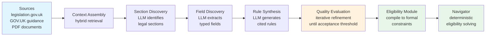
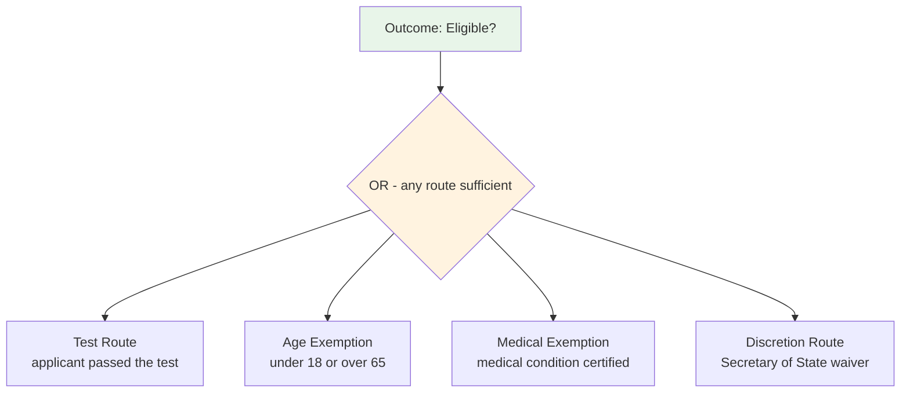
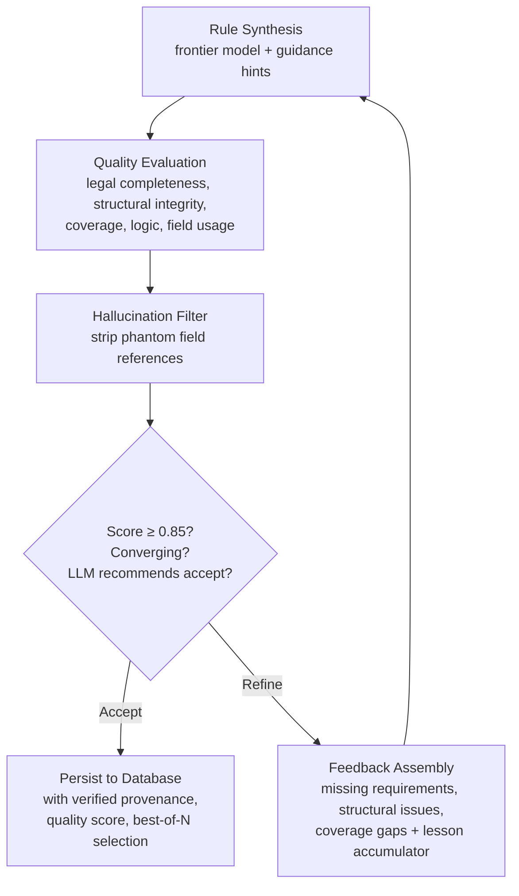
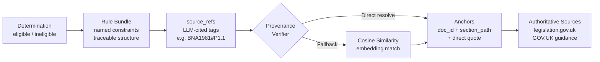

---

# 1. Introduction

In 1986, Sergot, Sadri, Kowalski, and colleagues published a landmark paper in *Communications of the ACM*: they had formalised the British Nationality Act 1981 as a Prolog logic program [6]. The paper demonstrated that statutory legislation - with its characteristic structure of routes, exemptions, and override provisions - could be faithfully encoded as Horn clauses with negation as failure, and evaluated with provable correctness. It was a foundational result in computational law: legislation is logic, and logic can be executed.

Forty years on, large language models can read the same Act, explain it in plain English, and answer broad legal questions with fluency that would have seemed extraordinary even five years ago. It is tempting to conclude that the formal encoding project is no longer necessary. Our benchmark tests this assumption directly on the same legislation Sergot et al. encoded, extended to three further domains, and finds it does not hold - at least not for the specific class of task where exception chains are nested three levels deep.

The failure is specific. On straightforward multi-route eligibility logic, frontier models perform well, achieving 100% accuracy on 43 scenarios across a medium-complexity section. But when legislation introduces nested exception chains, accuracy degrades sharply and in a way that is insensitive to temperature, sample count, and prompt engineering. Claude Opus 4.6 fails on 10% of adversarial spacecraft scenarios. With 10 runs per failed scenario, it does not produce a single correct answer. Attempts to close the gap via enhanced prompting trade false negatives for false positives: the enhanced prompt reduces net accuracy from 90% to 65% while introducing 20 false positives for the first time.

We make three contributions:

1. **A failure pattern taxonomy.** We identify and characterise two systematic failure patterns in nested exception-chain evaluation: *exemption anchoring* (failure to evaluate alternative routes independently when the primary route fails) and *exception chain collapse* (failure to correctly nest multi-level UNLESS logic). We demonstrate both are systematic across six models (three frontier, three production-tier) and two providers on this benchmarked class of task.

2. **A multi-domain benchmark.** We present 255 scenarios across five sections spanning two UK immigration requirements (life-in-the-UK knowledge and English language proficiency), a synthetic spacecraft certification statute, a synthetic construction insurance wording modelled on London market DE3/DE5 clause structure, and a synthetic benefits entitlement regulation modelled on UK welfare legislation - designed to isolate exception chain evaluation and cross-clause scope reasoning as the test variables. Benchmark scenarios are released as a public dataset. The specific accuracy figures reported here will evolve as models improve; the task structure and failure pattern constitute the durable contribution.

3. **The Aethis Eligibility Module.** We describe a neuro-symbolic architecture that uses LLMs for rule authoring and a formal constraint evaluation engine for rule execution, achieving complete consistency with the benchmark's formal rule fixtures across all 255 scenarios, with <1ms evaluation latency and near-zero marginal cost after compilation.

The paper is structured as follows. Section 2 summarises key findings. Section 3 reviews related work. Section 4 characterises the failure pattern. Section 5 describes the architecture. Section 6 presents the benchmark. Section 7 discusses challenges in LLM-guided rule synthesis. Sections 8, 9, and 10 address generalisation, compliance, and limitations.

---

# 2. Summary of Contributions

Artificial intelligence is entering high-stakes decision-making: immigration eligibility, safety certification, insurance underwriting, benefits entitlement, financial compliance. These are domains where errors have material consequences, where false negatives deny people their rights, and where explainability is mandatory.

We present the **Aethis Eligibility Module** (hereafter: the Eligibility Module), a neuro-symbolic engine that separates what LLMs do well from what requires formal guarantees. LLMs read authoritative sources and generate rules as structured code. The Eligibility Module compiles and evaluates those rules using a formal constraint evaluation layer, providing constraint evaluation with mathematically defined semantics and full auditability.

Our benchmark of 255 scenarios across five sections tests six LLMs (three frontier, three production-tier) against the Eligibility Module on the specific task of nested exception-chain evaluation. The Eligibility Module achieves complete consistency with the benchmark's formal rule fixtures across all domains - a consequence of deterministic execution over the authored specification, not empirical tuning. On adversarial exception-chain scenarios, frontier models produce systematic false negatives: Claude Opus 4.6 returns the wrong answer on 10% of spacecraft scenarios, and all observed failures are false negatives - eligible applicants incorrectly rejected, valid claims incorrectly denied. Attempting to improve LLM accuracy via enhanced prompting trades false negatives for false positives: the enhanced prompt fixes 5 of 7 original failures but introduces 20 new false positives, reducing net accuracy from 90% to 65%.

On the benchmarked class of nested exception-chain tasks, LLM errors are systematic enough that deterministic formal execution is the safer architecture for high-stakes decisions where 100% accuracy matters. This is not a claim that LLMs are unreliable in general; it is a specific finding about a specific class of rule evaluation.[^1]

[^1]: The system described in this paper is deployed commercially by Aethis (aethis.ai) for UK immigration and naturalisation workflows. The immigration benchmark sections cover selected requirements from this domain; the full determination involves additional sections not included in this publication.

---

# 3. Related Work

This work sits at the intersection of four research traditions: formal and computational approaches to legal reasoning; empirical evaluation of LLM logical reasoning; the limits of prompt engineering as a reliability strategy; and neuro-symbolic architectures that combine LLM fluency with formal execution guarantees.

## 3.1 Formal and Computational Approaches to Legal Reasoning

The challenge of encoding legislation as executable logic has a forty-year history. Sergot et al. [6] formalised the British Nationality Act 1981 as a Prolog logic program, demonstrating that statutory rules could be faithfully represented as Horn clauses with negation as failure. Published in *Communications of the ACM* in 1986, this work identified the same legislation evaluated in our benchmark and showed that OR-branching eligibility logic can be captured in a formal system with provable properties. The Eligibility Module revisits the same statutory text with a different technical foundation - formal constraints compiled from LLM-authored rules rather than hand-coded Prolog - and extends evaluation to adversarial exception chain scenarios not part of the original formalism.

McCarty's TAXMAN system [7] demonstrated as early as 1977 that AI systems could reason over tax code with explicit logical representations. Bench-Capon and colleagues developed value-based argumentation frameworks for legal reasoning over multiple decades [8], establishing that legislation's exception structure requires more than propositional logic to represent faithfully.

The formal treatment for exception chains specifically is defeasible logic, introduced by Reiter [9] and developed by Nute [10] and Governatori et al. [11]. Defeasible logic provides formal semantics for "A holds UNLESS B applies, UNLESS C overrides B" - precisely the pattern our benchmark identifies as a failure pattern for LLMs. The Eligibility Module does not use defeasible logic directly, instead compiling exception chains to formal constraints and evaluating them deterministically, but operates in the same tradition: the failure pattern we document is exactly the problem defeasible logic was designed to solve, now re-emerging in systems that replaced formal encoding with statistical inference over legislative text.

## 3.2 LLM Benchmarks for Legal and Logical Reasoning

LegalBench [12] provides the most comprehensive evaluation of LLM performance on legal tasks, testing 162 tasks across six categories. Where LegalBench tests breadth of legal reasoning, our benchmark isolates a single failure pattern - nested exception chain evaluation - with structured inputs holding all other variables constant. The two benchmarks are complementary: LegalBench demonstrates what LLMs can do across the breadth of legal tasks; our benchmark identifies a systematic failure on a class of decisions where 100% accuracy matters.

FOLIO [13] tests natural language inference grounded in first-order logic, demonstrating that LLMs struggle with tasks requiring explicit formal logical structure even when relevant premises are provided. Our findings are consistent: the failures we observe are not information retrieval failures (the legislation is provided in full) but reasoning failures arising from the compositional structure of the task.

## 3.3 Systematic Limits of LLM Reasoning

Dziri et al. [14] demonstrate fundamental limits of transformer architectures on compositional tasks, showing that performance degrades systematically as task depth increases even when each individual step is within the model's capability. Exception chain evaluation is compositional in precisely this sense: each individual rule is simple, but the nested application of three independent exception conditions requires compositional reasoning over the rule structure. Our finding that failures concentrate on three-level exception chains and are absent on two-level OR-branching is consistent with the compositional depth hypothesis.

Shi et al. [15] show that LLMs are systematically distracted by irrelevant context. The related phenomenon of *exemption anchoring* - where attention on the failed primary route suppresses evaluation of valid alternative routes - may be a manifestation of the same attentional bias in a rule-following context.

Valmeekam et al. [16] demonstrate that LLMs fail reliably on planning tasks requiring state tracking and logical consistency, not through random error but through systematic misapplication of learned heuristics. Our finding that Claude Opus 4.6 produces 0/10 correct responses across ten independent runs on veteran exemption scenarios reflects the same pattern: consistent, confident, and wrong.

## 3.4 Prompt Engineering and Its Limits

Chain-of-thought prompting [17] and zero-shot reasoning elicitation [18] have substantially improved LLM performance on arithmetic and multi-step problems. Wang et al. [19] show that self-consistency (majority voting) improves performance on reasoning tasks. Our robustness analysis (Section 6.8) explicitly tests whether enhanced prompting closes the accuracy gap on exception chain evaluation, and finds a trade-off rather than a fix: an enhanced prompt that correctly identifies and targets the failure pattern (independent exemption evaluation) fixes 5 of 7 false negatives but introduces 20 false positives, reducing net accuracy from 90% to 65%. The result demonstrates that prompt-based repair on this class of task is fragile - instructions that correct under-application of exemptions simultaneously cause over-application elsewhere.

## 3.5 Neuro-Symbolic Architectures and LLM + Formal Method Hybrids

The neuro-symbolic research programme [5] argues that robust AI systems require integration of neural pattern recognition with symbolic reasoning. Marcus [20] argues that the reliability limitations of purely statistical systems necessitate a return to hybrid approaches combining learned representations with structured reasoning. The Eligibility Module is a specific instantiation: LLMs perform pattern-recognition tasks they excel at (reading legislation, extracting structure, generating code), while a constraint evaluation engine handles the evaluation task requiring mathematical guarantees.

Most directly related is Logic-LM [21], which uses LLMs to translate natural language problems into formal logical representations, then invokes symbolic solvers for evaluation. LINC [22] similarly uses LLMs to generate first-order logic programs from natural language for theorem prover evaluation. These systems demonstrate the feasibility of the authoring-execution separation that underlies the Eligibility Module. The present system differs in three respects relevant to high-stakes deployment: it operates on *persistently stored* rule bundles rather than ephemeral per-query translations; it maintains a provenance chain linking each rule to specific source citations; and it is designed for production deployment where audit trails and version control are compliance requirements.

Program-aided language models (PAL [23]) demonstrate the broader pattern of using LLMs to generate code that is then executed deterministically. The Eligibility Module applies this separation to statutory rule encoding with additional quality engineering (Section 7) to ensure generated rules meet a quality threshold before entering the persistent rule store.

## 3.6 Formal Constraint Evaluation

Satisfiability Modulo Theories (SMT) solving has seen extensive application in software verification, symbolic execution, hardware design, and safety-critical systems. The Eligibility Module applies formal constraint evaluation to regulatory rule execution - rules compiled from LLM-authored code into formal constraint representations. The near-zero marginal evaluation cost after compilation makes formal constraint evaluation practical for production deployment at scale, a property that distinguishes constraint compilation from per-query LLM inference.

---

# 4. The Problem: LLMs and Nested Exception-Chain Evaluation

## 4.1 What Makes a Decision "High-Stakes"

High-stakes decisions share three properties that distinguish them from general AI tasks:

1. **Material consequence.** An incorrect determination can deny someone a right (citizenship, a benefit, a licence), expose an organisation to regulatory action, or cause financial harm.
2. **Auditability requirement.** A regulator, court, or oversight body may require an explanation of how the determination was reached, traceable to specific rules or statutory provisions.
3. **OR-branching logic.** Rules typically provide multiple independent pathways to satisfaction (primary routes, exemptions, waivers, overrides), each of which is independently sufficient.

Immigration law exemplifies all three. The British Nationality Act 1981 defines multiple routes to naturalisation eligibility - age exemptions, medical exemptions, discretionary waivers - each legally independent: satisfying any one is sufficient.

## 4.2 Two Failure Patterns

When a large language model is asked to determine eligibility, it processes legislation and applicant data as a single reasoning task. Our benchmark reveals two systematic failure patterns on nested exception-chain tasks in this benchmarked setting. We make no claim that these patterns generalise to all legal reasoning; they are specific to the class of task where exception chains are nested three levels deep:

**Failure Pattern 1: Exemption anchoring.** LLMs treat exemption and waiver routes as secondary to the primary pathway rather than as independently sufficient alternatives. When the primary route fails, the LLM anchors on that failure and discounts exemptions.

**Failure Pattern 2: Exception chain collapse.** When rules contain multi-level exception chains ("A is required UNLESS B applies, UNLESS C overrides B"), LLMs fail to correctly evaluate the nested logic.

**Table 1: Multi-Level Exception Chain (Spacecraft Benchmark)**

The Spacecraft Crew Certification Act (a synthetic statute modelled on UK legislative structure) contains a three-level exception chain for flight readiness:

| Level | Rule | Plain English |
|:-----:|------|--------------|
| **Base** | Flight readiness required (500hrs + licence) | Must have 500+ hours AND a pilot licence |
| **Exception A** | Age >= 60 exempts from flight readiness | Over-60s don't need flight readiness... |
| **Exception B** | ...UNLESS mission is orbital | ...but orbital missions revoke the age exemption |
| **Override C** | 1000+ flight hours overrides everything | Veteran pilots (1000+ hrs) are always exempt |

**Table 2: Failures on Exception Chain Scenarios (spacecraft, adversarial suite)**

| Scenario | Expected | Opus 4.6 | Sonnet 4.6 | GPT-5.4 | GPT-5-mini |
|----------|:--------:|:--------:|:----------:|:-------:|:----------:|
| Age 25, 1500hrs, no licence, suborbital | Eligible | 1/3 | 0/3 | 3/3 | 1/3 |
| Age 59, 1000hrs, no licence | Eligible | 0/3 | 0/3 | 3/3 | 1/3 |
| Age 60, orbital, 999hrs, WITH licence | Eligible | 0/3 | 3/3 | 3/3 | 1/3 |
| Age 22, 1001hrs, no licence, orbital + rad cert | Eligible | 0/3 | 3/3 | 3/3 | 1/3 |
| Dolphin*, 1200hrs veteran, orbital, provider medical | Eligible | 0/3 | 3/3 | 3/3 | 1/3 |

*\*Dolphin is a valid species under the synthetic statute (s.3 excludes only Vogons). This scenario tests whether the model correctly applies the veteran exemption to a non-human applicant with otherwise valid credentials.*

The veteran exemption (Override C) is the hardest concept for LLMs in this benchmark. It operates independently of age: a 25-year-old with 1500 flight hours is exempt from flight readiness requirements, just as a 60-year-old would be. LLMs consistently treat the veteran exemption as age-dependent, producing false negatives with high confidence (0/3 across all runs). The Eligibility Module evaluates these correctly by construction.

## 4.3 Why False Negatives Matter

In high-stakes decision-making, a false negative means wrongly telling someone they do not qualify. Exemptions exist specifically for edge cases - the people who cannot satisfy the standard route but qualify through an alternative path. These are precisely the applicants most likely to be wrongly denied. On the benchmarked exception-chain scenarios, the failures are systematic: Claude Opus 4.6 returns "ineligible" across all runs on veteran exemption scenarios. Majority voting would not catch this.

Our construction insurance benchmark (Section 6.4) demonstrates the same failure pattern in a different domain: a CAR policy defect exclusion clause with a five-level exception chain. GPT-5.4, which achieves 100% on the spacecraft scenarios, drops to 96.6% on the insurance scenarios. The pattern is not specific to a single model, provider, or domain.

Our benefits entitlement benchmark (Section 6.5) introduces a distinct failure mode: **cross-clause scope confusion**. An immigration exemption (Regulation 6) bypasses the habitual residence test (Regulation 5), but does not affect the income threshold (Regulation 8) — these are independent conditions that must all be satisfied. Both GPT-5.4 (93%) and Claude Opus 4.6 (97%) incorrectly conclude that a refugee with income above the threshold is eligible, treating the immigration exemption as a general override rather than one scoped to habitual residence. The Eligibility Module evaluates each condition group independently and returns the correct answer.

---

# 5. The Neuro-Symbolic Architecture

## 5.1 Design Principle

The architecture is built on a simple observation: LLMs and formal constraint evaluation excel at different tasks. LLMs are exceptional at reading legislation, understanding context, and generating structured representations. Formal constraint evaluation is exceptional at evaluating logical expressions with mathematical guarantees.

The **Aethis Eligibility Module** separates these concerns:

- **Phase 1: Rule Authoring (LLM).** Read authoritative legal sources, discover sections and fields, generate rules as structured code, evaluate quality iteratively.
- **Phase 2: Rule Execution (Eligibility Module).** Parse generated code, compile to formal constraints, evaluate against applicant data with deterministic execution.

## 5.2 Phase 1: Automated Rule Authoring

The rule authoring pipeline transforms authoritative legal text into executable compliance rules:

**Figure 1: End-to-End Pipeline**



Every generated rule carries provenance linking it to specific source material. Source items are tagged with structured references (e.g., `[BNA1981#Schedule1/P1.1]`) in the LLM's context, and the LLM is instructed to cite these tags on each generated criterion and field via `source_refs`. A verification step then resolves these citations against the source material, creating anchors with document IDs, section paths, and direct quotes:

**Table 3: Source Provenance Chain**

| Source Type | Endpoint | Format | Citation Example | Verification |
|-------------|----------|--------|------------------|--------------|
| Primary legislation | legislation.gov.uk/api | CLML XML (XPath-parsed) | `BNA1981#Schedule1/P1.1` | Direct resolution from LLM-cited source_refs |
| Policy guidance | GOV.UK Content API | JSON (structured sections) | `GOVUK#english-lang/part-2` | Direct resolution from LLM-cited source_refs |
| Form guidance | Docling PDF parser | Markdown (cached) | `form-an#section-4/para-3` | Direct resolution from LLM-cited source_refs |

When the LLM fails to cite a source (or cites an invalid reference), the system falls back to embedding-based semantic similarity matching as a secondary mechanism. This two-stage approach — direct citation with verification fallback — provides higher fidelity than post-hoc similarity matching alone, because the LLM that generated the rule knows which source material it used.

This provenance chain is the foundation of auditability: any determination can be traced through the rule that produced it to the specific source clause that authorises it.

## 5.3 Phase 2: The Eligibility Module

The authoring model emits rules in a constrained domain-specific intermediate representation that is parsed and validated before compilation. The Eligibility Module compiles this representation into formal constraints using a constraint evaluation engine.

The critical property of the compilation is how alternative legal routes are represented. Each eligibility route becomes a formally independent branch:

**Figure 2: Route Independence in the Eligibility Module**



Each branch is a boolean expression evaluated independently. If `medical_exemption` evaluates to `True`, the OR is satisfied regardless of `test_route`. This is guaranteed by the execution semantics: it is not a statistical property and not dependent on model version or sampling parameters.

## 5.4 Why the Eligibility Module Cannot Make These Errors

The LLM failures in our benchmark fall into two categories, both of which are excluded by the execution semantics of the Eligibility Module:

**Category 1: Exemption anchoring.** The Eligibility Module evaluates `OR(a, b) = True` if either operand is true: no weighting, no anchoring, no context-dependent interpretation.

**Category 2: Exception chain collapse.** The Eligibility Module compiles "A is required UNLESS B applies, UNLESS C overrides B" to a precise logical formula encoding the exception structure, with formally defined semantics. The formula is evaluated by the constraint evaluation engine. The result is deterministic.

An LLM's logical operators are patterns learned from examples and subject to systematic biases. The Eligibility Module's operators are mathematical functions with defined semantics. The guarantee covers execution only - see Section 5.5.

## 5.5 What the Eligibility Module Guarantees - and What It Does Not

The system provides deterministic guarantees at one level only: **correct execution of formalised rules**. It makes no claim about two upstream steps:

**Level 1 - Source text retrieval.** The system retrieves authoritative source material using source connectors and retrieval pipelines. Errors here - missing sections, retrieval gaps - will produce incorrectly grounded rules. The system does not guarantee that all relevant source text was found and correctly parsed.

**Level 2 - Rule formalisation.** LLMs generate rules from source material. An incorrectly formalised rule produces incorrect determinations, even if the execution is formally correct. This is the "garbage in, garbage out" property stated precisely: deterministic execution of incorrectly formalised rules produces incorrect but deterministic results. The system addresses this through test-driven validation: subject matter experts define test cases covering golden paths, edge cases, and corner cases, and authored rules must pass these test suites before deployment (Section 7.4). Rules can also be reviewed by human experts, but the primary quality gate is automated test-case validation, not manual review.

**Level 3 - Rule execution.** Once rules are correctly formalised, the Eligibility Module guarantees correct execution with mathematically defined semantics. The failure patterns documented in Section 4 - exemption anchoring and exception chain collapse - are excluded by the execution semantics at this level.

This distinction matters for regulatory defensibility. The provenance chain (Section 9.1) supports audit of Levels 1 and 2; Level 3 is guaranteed by the execution semantics. Execution correctness is a necessary precondition for trust in the overall system: if the execution layer itself could introduce errors, no amount of rule quality engineering would produce reliable determinations. By solving Level 3 first, the system reduces the trust problem to a single surface - rule formalisation quality - which can be addressed through iterative synthesis refinement (Section 7.1), test-driven validation against SME-defined test suites (Section 7.4), and the guidance hint learning system (Section 7.1).

---

# 6. Accuracy Benchmark: Eligibility Module vs Five LLMs

## 6.1 Methodology

Both systems receive identical inputs: the same legislation text (markdown-formatted) and the same structured applicant data (field key-value pairs). The comparison isolates the reasoning engine. Everything else is held constant.

- **System A (Eligibility Module):** Gold-standard rule fixtures compiled to formal constraints. The navigator evaluates constraints against structured applicant data and returns a deterministic eligible/ineligible determination.
- **System B (LLM baseline):** The same source legislation is provided to each LLM along with the same structured applicant data. The LLM determines eligibility and responds with `{"eligible": true/false, "reasoning": "..."}`.

**Models tested:**

| Model | Provider | Class | Cost Tier |
|-------|----------|-------|-----------|
| Claude Opus 4.6 | Anthropic | Frontier | Premium |
| Claude Sonnet 4.6 | Anthropic | Frontier | Mid |
| GPT-5.4 | OpenAI | Frontier | Premium |
| GPT-5.3 | OpenAI | Production | Mid |
| GPT-5-mini | OpenAI | Production | Low |
| GPT-5-nano | OpenAI | Production | Lowest |

**Evaluation coverage.** Not all models were evaluated on all domains. The following matrix shows the scope of each model's evaluation:

| Model | life_uk (56) | english_language (43) | spacecraft (68) | construction_car (58) | benefits_entitlement (30) | Notes |
|-------|:---:|:---:|:---:|:---:|:---:|-------|
| Claude Opus 4.6 | ✓ | ✓ | ✓ | — | ✓ | + robustness (N=10) |
| Claude Sonnet 4.6 | ✓ | ✓ | ✓ | — | — | |
| GPT-5.4 | ✓ | ✓ | ✓ | ✓ | ✓ | + enhanced prompt |
| GPT-5.3 | — | — | — | 11-scenario subset | — | production reference |
| GPT-5-mini | ✓ | ✓ | ✓ | — | — | |
| GPT-5-nano | — | ✓ | 48-scenario baseline | — | — | cost reference |

Results reported below should be read against this matrix. Aggregate claims refer only to evaluations actually conducted.

**LLM configuration:** Temperature 0.3 where supported (Claude models; GPT-5 family does not expose this parameter). Runs per scenario: 3 (majority vote; robustness analysis tests N=10). Prompt: generic legal assessment, no special instructions about exemptions or OR-branching.

**Benchmark philosophy.** The goal is not to find the best possible LLM score through bespoke prompt engineering. It is to test whether a general-purpose model reliably preserves exception structure when reading authoritative rules in the way such systems are actually deployed - with a reasonable, generic instruction. This is a different question from "what is the ceiling of LLM performance on this task?" The robustness analysis (Section 6.8) directly addresses whether the gap is a prompt engineering problem or a deeper reliability issue.

**Domain disclosure.** The four benchmark domains span different levels of source authenticity:

| Domain | Source material | Authenticity |
|--------|----------------|-------------|
| `life_uk` | British Nationality Act 1981, Schedule 1 + Home Office guidance | Real UK legislation |
| `english_language` | Form AN guidance + English language policy | Real UK legislation |
| `spacecraft` | Spacecraft Crew Certification Act (synthetic statute) | Synthetic, modelled on UK legislative structure |
| `construction_car` | CAR policy defect exclusion endorsement (synthetic wording) | Synthetic, modelled on London market DE3/DE5 clauses |
| `benefits_entitlement` | Social Security (Composite Entitlement) Regulations 2025 | Synthetic, modelled on UC Regulations 2013 and Income Support Regulations 1987 |

All frontier models achieve 100% on the two immigration sections. This is expected given their low-to-medium logical complexity. Their role is to establish a baseline: the failure pattern is specific to exception chain depth, not general to legal reasoning.

**Note on immigration sections.** The life_uk and english_language sections cover two specific isolated requirements within UK naturalisation eligibility. The full naturalisation determination involves additional sections with exception chain structures of equivalent or greater complexity to the spacecraft section; those are not included here.

**Fixture independence.** The rule fixtures used by the Eligibility Module were authored independently of the LLM baseline evaluations and fixed prior to benchmarking. LLMs were not used to generate the ground-truth rules against which they are evaluated.

**Benchmark intent.** The benchmark is intentionally adversarial toward LLM reasoning rather than representative of average-case performance. The spacecraft and construction insurance sections are designed to maximise exception chain depth and exploit the specific failure patterns identified in Section 4. This is appropriate for a benchmark whose purpose is to identify failure modes, not to estimate typical production accuracy.

## 6.2 Scenario Design

**Table 4: Benchmark Scenario Coverage**

| Section | Scenarios | Fields | Key Patterns | Difficulty |
|---------|:---------:|:------:|--------------|:----------:|
| life_uk | 56 | 4 | Combinatorial: 3 bools x 7 ages | Low |
| english_language | 43 | 12 | Canada trap, SELT edge cases, near-misses, multi-field interactions | Medium |
| spacecraft | 68 | 11 | Three-level exception chain, nested IMPLIES, UNSAT early termination, adversarial | High |
| construction_car | 58 | 14 | DE3/DE5 defect exclusion, access damage carve-back, enhanced cover chain, pioneer override, known defect limitation | High |
| benefits_entitlement | 30 | 8 | Cross-clause scope (immigration exemption scoped to habitual residence, not income), boundary values, absolute exclusion, contradictory surface cues | Medium-High |
| **Total** | **255** | | | |

## 6.3 Results

In all tables below, accuracy figures for the Eligibility Module refer to agreement with the benchmark's formal rule fixtures — the authored rule specifications used as the benchmark's ground truth. LLM accuracy is measured against the same fixtures.

**Table 5: English Language: 43 Scenarios, 12 Fields (Medium Difficulty)**

| Model | Accuracy | Boundary | Consistency | FN |
|-------|:--------:|:--------:|:-----------:|:--:|
| **Eligibility Module** | **43/43 (100%)** | **7/7 (100%)** | **43/43 (100%)** | **0** |
| Claude Opus 4.6 | 43/43 (100%) | 7/7 (100%) | 43/43 (100%) | 0 |
| Claude Sonnet 4.6 | 43/43 (100%) | 7/7 (100%) | 43/43 (100%) | 0 |
| GPT-5.4 | 43/43 (100%) | 7/7 (100%) | 43/43 (100%) | 0 |
| GPT-5-mini | 42/43 (98%) | 7/7 (100%) | 39/43 (91%) | 1 |
| GPT-5-nano | 21/43 (49%) | 6/7 (86%) | 40/43 (93%) | 22 |

**Table 6: Spacecraft: 68 Scenarios, 11 Fields, Adversarial Exception Chains (High Difficulty)**
*Evaluated: 2026-04-06. See Finding 6 for temporal stability analysis.*

| Model | Accuracy | Boundary | Consistency | FN |
|-------|:--------:|:--------:|:-----------:|:--:|
| **Eligibility Module** | **68/68 (100%)** | **10/10 (100%)** | **68/68 (100%)** | **0** |
| GPT-5.4 | 68/68 (100%) | 10/10 (100%) | 68/68 (100%) | 0 |
| Claude Sonnet 4.6 | 62/68 (91%) | 9/10 (90%) | 66/68 (97%) | 6 |
| Claude Opus 4.6 | 61/68 (90%) | 10/10 (100%) | 67/68 (99%) | 7 |
| GPT-5-mini | 51/68 (75%) | 7/10 (70%) | 51/68 (75%) | 17 |
| GPT-5-nano* | 22/48 (46%) | 4/7 (57%) | 48/48 (100%) | 26 |

*\*GPT-5-nano was evaluated on the 48-scenario baseline suite only (pre-adversarial expansion) and is included as a cost-scaled reference, not as a realistic deployment choice.*

## 6.4 Construction Insurance: DE3/DE5 Defect Exclusion (58 Scenarios)

The construction insurance benchmark extends the evaluation into a domain with commercial relevance: London market Construction All Risks (CAR) policy wording. The test fixture is modelled on DE3/DE5 defect exclusion clauses used for major infrastructure projects.

**The policy logic.** A CAR policy covers physical loss or damage to the Works. The defect exclusion creates a three-level exception chain:

| Level | Rule | Plain English |
|:-----:|------|--------------|
| **Exclusion** | Rectification cost absolutely excluded | Cost of fixing the defective part: never covered |
| **Carve-back** | Resultant damage to other property covered | Non-defective property damaged by the failure: covered |
| **Re-exclusion** | Access damage excluded | Property damaged just to reach the defect: not covered |
| **Enhanced cover** | Projects >= £100M: access damage reinstated | Large projects get access damage back... |
| **Design limit** | ...except for design defects | ...but not if the defect was in the design |
| **Pioneer override** | Projects >= £500M: design limit removed | Mega-projects override the design limitation |

**Table 7: Construction Insurance Exception Chain (access damage scenarios)**

| Scenario | Project | Defect | Eligibility Module | GPT-5.4 | GPT-4.1-mini |
|----------|:-------:|:------:|:------------------:|:-------:|:------------:|
| Access, £100M, workmanship | £100M | workmanship | COVERED | ✅ | ❌ |
| Access, £200M, materials | £200M | materials | COVERED | ✅ | ❌ |
| Access, £200M, design | £200M | design | NOT COVERED | ✅ | ✅ |
| Access, £500M, design | £500M | design | COVERED | ❌ | ❌ |
| Access, £800M, design | £800M | design | COVERED | ✅ | ❌ |

**Table 8: Construction Insurance Full Results**
*Evaluated: 2026-04-06.*

| Model | Accuracy | Exception Chain | Adversarial | Brief Cases |
|-------|:--------:|:--------------:|:-----------:|:-----------:|
| **Eligibility Module** | **58/58 (100%)** | **11/11 (100%)** | **14/14 (100%)** | **3/3 (100%)** |
| GPT-5.4 | 56/58 (96.6%) | 10/11 (91%) | 14/14 (100%) | 3/3 (100%) |
| GPT-5.4 (low reasoning)* | — | 7/11 (64%) | — | — |
| GPT-5.3* | — | 7/11 (64%) | — | — |
| GPT-4.1-mini | 46/58 (79.3%) | 5/11 (45%) | 10/14 (71%) | 3/3 (100%) |

*\*GPT-5.3 and GPT-5.4 (low reasoning) were evaluated on the 11-scenario exception chain subset only. GPT-5.3 is included as a production-tier model representative of the class of systems widely deployed through consumer-facing interfaces. GPT-5.4 (low reasoning) uses the `reasoning_effort=low` parameter to test whether accuracy depends on reasoning compute.*

GPT-5.3 scores 64% on the exception chain benchmark: seven correct answers out of eleven. It correctly identifies absolute exclusions and simple carve-backs but fails on four scenarios requiring multi-level exception reasoning (enhanced cover reinstatement, pioneer override, and depth-5 unblock). GPT-5.4 at low reasoning effort scores 64% — an identical failure profile, with the same four scenarios failing. This convergence is consistent with exception chain accuracy in OpenAI's model family being dependent on reasoning compute allocated per request, rather than a capability that smaller models have failed to learn.

Note: v3.5 of this paper reported GPT-5.3 at 27% (3/11). That figure was inflated by a token-limit bug in the benchmark harness: `max_completion_tokens=50` was insufficient for reasoning models whose internal chain-of-thought tokens consumed the budget before producing visible output. With the corrected limit (2000 tokens), GPT-5.3's actual accuracy is 64%. The correction is detailed in Section 6.9.

GPT-5.4 fails on the pioneer override boundary: `access_500m_design` is incorrectly rejected (the override applies at >= £500M), while the identical scenario at £800M is correctly accepted. The Eligibility Module evaluates `500 >= 500 = True` with no ambiguity. GPT-4.1-mini fails systematically across the enhanced cover chain, treating the access damage exclusion as absolute and failing to apply the carve-back.

## 6.5 Benefits Entitlement: Cross-Clause Scope Confusion (30 Scenarios)

The benefits entitlement benchmark introduces a failure pattern distinct from exception chain depth: **cross-clause scope confusion**. The synthetic regulation (modelled on the Universal Credit Regulations 2013 and Income Support (General) Regulations 1987) defines six independent conditions for eligibility, with an immigration exemption that applies to one condition only.

**The regulation logic.** A claimant is entitled to Universal Subsistence Allowance if and only if all six conditions are satisfied:

| # | Condition | Regulation | Notes |
|:-:|-----------|:----------:|-------|
| 1 | Present in Great Britain | Reg 4 | Early termination if false |
| 2 | Qualifying age (18–66) | Reg 3 | Integer boundary |
| 3 | Habitual residence OR immigration exemption | Reg 5–6 | Exemption bypasses habitual residence only |
| 4 | Not receiving exclusionary benefit | Reg 7 | Absolute bar |
| 5 | Weekly income ≤ £350 | Reg 8(1) | Integer threshold |
| 6 | Total capital ≤ £16,000 | Reg 8(2) | Integer threshold |

The critical design element is Regulation 6: refugees, humanitarian protection recipients, domestic violence leave holders, and EEA workers are exempt from the habitual residence test (condition 3). This exemption does **not** affect conditions 4, 5, or 6. A refugee with weekly income of £400 fails condition 5 regardless of their immigration status.

**Table 9: Benefits Entitlement Results (30 scenarios)**
*Evaluated: 2026-04-12.*

| Model | Accuracy | Boundary | Consistency | FN | FP |
|-------|:--------:|:--------:|:-----------:|:--:|:--:|
| **Eligibility Module** | **30/30 (100%)** | **8/8 (100%)** | **30/30 (100%)** | **0** | **0** |
| Claude Opus 4.6 | 29/30 (97%) | 8/8 (100%) | 30/30 (100%) | 0 | 1 |
| GPT-5.4 | 28/30 (93%) | 7/8 (88%) | 29/30 (97%) | 0 | 2 |

Both frontier models fail on `refugee_high_income_not_eligible`: a refugee (exempt from habitual residence) with weekly income of £400 (exceeds £350 threshold). Both models incorrectly return eligible, treating the immigration exemption as a general override rather than one scoped to the habitual residence condition. This is a **false positive** — the first consistent false positive observed from frontier models in this benchmark. The failure is confident: 0/3 correct across all runs for both models.

GPT-5.4 additionally shows boundary inconsistency on `income_one_over_threshold` (income £351 vs threshold £350): 2/3 correct, 1 undetermined. Claude Opus 4.6 handles this boundary correctly across all runs.

This failure pattern is distinct from the exception chain failures documented in Sections 6.3–6.4. The immigration exemption is not nested — it is a straightforward OR-branch within a single condition. The error is that both models incorrectly extend the scope of the exemption across condition boundaries. The Eligibility Module evaluates each condition group independently, making cross-clause scope confusion impossible by construction.

## 6.6 Error Analysis

Seven findings emerge from the multi-model benchmark:

**Finding 1: The failure pattern is exception-chain specific.** All frontier models achieve 100% on `english_language` (43 scenarios with multi-route logic). On the spacecraft section with its three-level exception chain, Claude Opus 4.6 drops to 90% and GPT-5-mini to 75%. The breaking point is nested exceptions, not legal reasoning in general.

**Finding 2: Failures are predominantly false negatives, with one notable exception.** Across all baseline evaluations on exception chain scenarios, we observed no false positives — LLMs never declare an ineligible applicant eligible when the error is about depth of exception nesting. However, the benefits entitlement domain (Section 6.5) produced the first consistent false positives from frontier models under baseline prompting: both GPT-5.4 and Claude Opus 4.6 incorrectly declare a refugee with above-threshold income as eligible, extending an immigration exemption beyond its regulatory scope. This cross-clause scope confusion is a qualitatively different failure from exception chain collapse, and it produces errors in both directions — the conservative bias observed on exception chains does not hold universally.

**Finding 3: The veteran exemption is the universal failure point.** The most-failed scenario across all models is `age_59_veteran_1000hrs`. Every model except GPT-5.4 consistently (0/3 runs) marks this person ineligible. The LLM conflates two independent exemption pathways.

**Finding 4: Frontier model accuracy is domain-dependent — no frontier model achieves 100% across all domains.** GPT-5.4 achieves 100% on both the spacecraft and immigration sections, but drops to 96.6% on construction insurance and 93% on benefits entitlement. Claude Opus 4.6 drops to 97% on benefits entitlement. The insurance failure occurs on a five-level exception chain; the benefits failure occurs on cross-clause scope confusion (Section 6.5) — a qualitatively different error where models extend an exemption beyond its regulatory scope. 100% accuracy on one domain does not predict 100% on another, and the failure patterns differ across domains.

**Finding 5: Exception chain accuracy is a function of reasoning compute.** GPT-5.3, a production-tier OpenAI model, scores 64% on the construction insurance exception chain — seven correct answers out of eleven. GPT-5.4, the frontier model, scores 91% with default (high) reasoning effort. When GPT-5.4's reasoning effort is reduced to "low", its accuracy drops to 64% — matching GPT-5.3 exactly, with the same four scenarios failing (enhanced cover reinstatement, pioneer override, depth-5 unblock, and the basic pioneer case). This convergence is consistent with the exception chain failure being a compute-dependent property rather than a capability gap between model tiers: the same model architecture produces correct or incorrect answers depending on how much reasoning budget is allocated per request. In production, reasoning effort may vary by API tier, load, or configuration — making LLM accuracy on exception chains inherently unstable. Claude Opus 4.6 is invariant under this test, producing 100% accuracy even at temperature 1.0.

**Finding 6: LLM accuracy shifts over time without user action.** Re-running the benchmark six days after the original evaluation (2026-04-12 vs 2026-04-06) produced materially different accuracy figures for the same model identifiers on the same scenarios: Claude Opus 4.6 improved from 90% to 99% on spacecraft, GPT-5.4-mini from 75% to 99%. Claude Sonnet 4.6 degraded from 91% to 87%. No prompts, scenarios, or API parameters changed between runs. The model weights behind the identifier shifted — silently, without versioning, and without notification to API consumers. This temporal instability is distinct from within-run non-determinism (Finding 3) and reasoning-effort sensitivity (Finding 5). It means that a validation performed on date T does not hold on date T+7. For regulated systems, this undermines the entire concept of pre-deployment testing: you cannot certify behaviour that the provider can change at any time. The Eligibility Module's compiled rules are immutable — the same bundle produces the same result on any date, because the evaluation semantics are defined by the compiled constraints, not by a model that may have changed since the last audit.

**Finding 7: The gap between frontier and production tiers is narrower than previously reported.** v3.5 of this paper reported GPT-5.3 at 27%, a figure inflated by a token-limit bug (see Section 6.9). The corrected figure — 64% — still represents a significant gap from the frontier models (91-100%), but the primary risk is not the gap itself. It is the reasoning-effort finding: a frontier model can be degraded to production-tier accuracy by a single API parameter change.

## 6.7 The Cost-Accuracy Trade-off

| Property | Eligibility Module | GPT-5.4 (best LLM) |
|----------|:-----------------:|:------------------:|
| Deterministic | Yes (by construction) | No |
| Temporally stable | Yes (immutable compiled rules) | No (accuracy shifts between weeks) |
| Cost per evaluation | Near-zero marginal after compilation | ~$0.02 per scenario |
| Latency | <1ms | ~2–5 seconds |
| Auditability | Exact logical path | Post-hoc rationalisation |
| Regulatory defensibility | Execution semantics defined | Statistical accuracy |
| Model deprecation risk | None | Version-dependent |

GPT-5.4 does not achieve 100% accuracy across all benchmark domains: it drops to 96.6% on construction insurance and 93% on benefits entitlement. A production system cannot guarantee that empirical accuracy on any benchmark extends to all possible inputs — it is an observation, not an execution-level guarantee.

## 6.8 Robustness Analysis

This section addresses the key question: whether the observed failures are prompt-sensitive or structurally robust. The central question is not "what is the best possible LLM score after bespoke optimisation?" but "when models fail on exception chains, is that a prompting artefact - fixable with better instructions - or a deeper reliability issue?"

**Table 10: Robustness Analysis (spacecraft section, 68 scenarios)**
*Evaluated: 2026-04-06.*

| Condition | Claude Opus 4.6 | GPT-5.4 |
|-----------|:---------------:|:-------:|
| Generic prompt, T=0.3, N=3 *(baseline)* | 90% (7 FN) | 100% |
| Generic prompt, T=0, N=3 *(Claude only)* | 90% (7 FN, all 0/3) | N/A* |
| Generic prompt, T=0.3, N=10 *(Claude only)* | 90% (7 FN, all **0/10**) | - |
| Enhanced prompt, N=3 | **65%** (4 FN + **20 FP**) | **99%** (1 FN) |

*\*GPT-5 family does not expose a temperature parameter.*

**R1: The failures are not stochastic.** At temperature 0 (fully deterministic), Claude Opus produces the same 7 failures with the same 0/3 error rate. With 10 runs per scenario, all 7 failed scenarios score **0/10**. Not one of 70 attempts produces the correct answer. These are systematic reasoning failures, not noise.

**R2: Enhanced prompting trades one failure mode for another.** The enhanced prompt explicitly instructs the LLM to "evaluate each exemption independently" and warns about exception chains. This partially succeeds: 5 of the 7 original false negatives are corrected, including the veteran exemption scenarios that the generic prompt consistently fails. However, the same instructions cause the model to over-apply exemption logic, producing **20 false positives** - the first time in our benchmark that an LLM declares an ineligible applicant eligible. The model now grants eligibility to applicants below the flight hours threshold (499 < 500), with expired medical certificates, and on orbital missions where the age exemption is explicitly revoked. Net accuracy drops from 90% to **65%**.

This is not simply a bad prompt. The enhanced prompt correctly identifies the reasoning gap (independent exemption evaluation) and provides accurate instructions. The problem is that the same instructions that fix under-application of exemptions cause over-application elsewhere. The generic prompt's conservative bias - all false negatives, no false positives - is a more predictable failure mode than the enhanced prompt's scattered errors across both directions. For a production system, a consistent conservative bias is easier to compensate for than unpredictable failures in both directions.

**R3: GPT-5.4 shows the same pattern in miniature.** The enhanced prompt introduces 1 failure on the hardest scenario that the generic prompt handles correctly.

**R4: Run-to-run variance confirms fragility.** Re-running the enhanced prompt benchmark on the same model produces qualitatively identical results (20 FP, 4 FN) but with slight variance in which specific scenarios fail. This contrasts with the generic prompt, where the same 7 scenarios fail identically across independent runs. The enhanced prompt introduces not only new failure modes but also non-deterministic failure patterns - precisely the property a high-stakes system cannot tolerate.

**R5: Reasoning effort and exception chain accuracy.** GPT-5.4 supports a `reasoning_effort` parameter (low/medium/high). On the construction insurance exception chain (11 scenarios), GPT-5.4 at default (high) reasoning scores 91%. At low reasoning, it scores 64% — a 27-percentage-point drop, with all four new failures on multi-level exception scenarios (enhanced cover reinstatement, pioneer override, depth-5 unblock, basic pioneer case). This matches GPT-5.3's score (64%) exactly. Claude Opus 4.6 is invariant: 100% accuracy at both default temperature and temperature 1.0. The implication is that exception chain accuracy in the GPT-5 family is not a learned capability but a compute-dependent property — a frontier model at low reasoning effort performs identically to a production-tier model. In production deployments, reasoning effort may vary by API tier, cost optimization, or platform default, making exception chain accuracy inherently unstable for any system that depends on it.

The robustness findings answer the prompting contest objection directly. The gap is not caused by a suboptimal prompt that a better prompt would fix. Prompt engineering on this class of task faces a fundamental trade-off: instructions that reduce false negatives on exception chains simultaneously increase false positives by causing over-application of the same exemption logic. This is consistent with the compositional reasoning limitation identified by Dziri et al. [14]: the model does not have a stable internal representation of the exception chain structure that can be steered by prompt instructions without side effects.

## 6.9 Threats to Validity

We follow academic convention in identifying threats to the validity of these findings.

**Internal validity:**
- *Prompt sensitivity.* The benchmark uses a generic prompt, not an optimised one. This is intentional (Section 6.1), but means we are not measuring best-possible LLM performance. The robustness analysis (Section 6.8) tests one enhanced prompt variant that specifically targets the identified failure pattern; it reduces false negatives but introduces false positives, with net accuracy decreasing. We cannot exclude the possibility that a different prompt strategy could improve accuracy without side effects, but the result demonstrates that targeted prompt repair on this class of task involves trade-offs between failure modes.
- *Token-limit correction (v3.6).* v3.5 reported GPT-5.3 at 27% (3/11) on the construction exception chain. This figure was inflated by a bug in the benchmark harness: `max_completion_tokens=50` was insufficient for reasoning models (GPT-5.x), whose internal chain-of-thought tokens consumed the budget before producing visible output, resulting in empty responses scored as errors. With the corrected limit (2000 tokens), GPT-5.3's actual accuracy is 64% (7/11). The correction does not affect the qualitative finding — GPT-5.3 still fails systematically on multi-level exception scenarios — but the quantitative severity is less extreme than originally reported. The benchmark script has been corrected and the updated results are publicly reproducible.
- *Expected values partly code-derived.* The `life_uk` expected values are computed by Python code, not independently verified by a legal expert. The `english_language` scenarios were hand-verified against Form AN guidance. The spacecraft scenarios use a synthetic statute with unambiguous values.
- *Structured inputs only.* Applicant data is provided as typed key-value pairs. A production system requires extraction from natural language or documents; that layer is not tested here.
- *Adversarial scenarios are post-hoc.* The spacecraft adversarial suite was designed after observing LLM failure patterns. The baseline results (48 scenarios) show the same failure pattern; the adversarial additions amplify it.

**External validity:**
- *Synthetic domains.* The spacecraft domain uses a synthetic statute. The construction insurance domain uses synthetic policy wording modelled on real clauses. Findings in these domains may not generalise directly to all legal contexts.
- *Benchmark scope.* The benchmark tests one specific class of task - nested exception-chain evaluation. LLM performance on other legal reasoning tasks may differ substantially.
- *Model versioning and temporal instability.* Specific model versions are named. As models are updated, results change — and they do so silently (Finding 6). A re-run six days after initial evaluation showed accuracy shifts of up to +24 percentage points (GPT-5.4-mini on spacecraft) and -4 points (Claude Sonnet 4.6 on spacecraft) for the same model identifiers. The benchmark scenarios are released publicly to allow ongoing evaluation; the specific accuracy figures reported here are a snapshot dated 2026-04-06, while the task structure and failure pattern are the durable contribution.

**Construct validity:**
- *LLM self-evaluation in quality engineering.* Quality scores in Section 7 are produced by an LLM evaluator, not human legal experts. These are internal consistency scores; external validation has not been performed.

---

# 7. Challenges in LLM-Guided Rule Synthesis

Rule authoring is the bottleneck. The execution layer (Level 3) provides deterministic guarantees by construction, but those guarantees are only as good as the rules they operate on. Execution correctness is a necessary precondition for trust - it eliminates one entire class of error - but the hard problem remains: can an LLM reliably formalise legislation into rules that faithfully capture the legislator's intent?

This is not a one-shot process. The system uses an iterative synthesis-evaluation loop where an LLM generates rules, a separate LLM evaluator scores them against the source legislation, and structured feedback drives refinement across multiple iterations. Subject matter expertise enters the loop through guidance hints - domain-specific instructions that steer the synthesiser toward correct patterns.

## 7.1 The Iterative Authoring Loop

Rule authoring proceeds through a multi-stage feedback loop:

1. **Synthesis.** A frontier LLM reads the source legislation (with full context from hybrid retrieval) and generates rules as structured code in a constrained domain-specific intermediate representation. Guidance hints are injected at this stage - these are domain-specific instructions that steer the synthesiser toward correct patterns. Hints originate from three sources: subject matter experts, automated extraction from cross-session synthesis patterns, and failure-targeted guidance derived from test coverage analysis within the current run. Hints carry weights adjusted by outcome: effective hints are upweighted, ineffective ones decay.
2. **Quality evaluation.** A separate LLM evaluator scores the generated rules against five criteria: legal completeness, structural integrity, requirement coverage, logical structure, and field usage. The evaluator receives the full rule set and all rules cumulatively across iterations, not just the current batch.
3. **Feedback assembly.** The evaluator produces structured feedback: missing requirements, structural issues, coverage gaps, and specific improvement hints. A hallucination filter validates this feedback against the field registry - the evaluator sometimes invents field names that do not exist, and these phantom references are stripped before they contaminate the refinement signal.
4. **Refinement.** The synthesiser receives the previous output, the structured critique, and a lesson accumulator that tracks what worked and what failed in earlier iterations within the same run. This prevents repeating the same mistakes.
5. **Convergence decision.** The loop continues until quality exceeds the acceptance threshold (0.85), the evaluator recommends acceptance, or convergence detection identifies that further iteration is not improving scores. Best-of-N tracking ensures that if quality regresses on a later iteration, the best-scoring version is preserved.

**Figure 3: Iterative Quality Evaluation Loop**



The loop typically converges in 2–4 iterations. The code synthesiser performs up to 3 internal refinement cycles per workflow iteration, with the workflow itself running up to 5 iterations - giving a theoretical maximum of 15 refinement passes, though convergence is usually reached well before this.

## 7.2 Prior State and Interventions

An earlier version of the authoring engine was structurally broken: it accepted low-scoring rules after exhausting iteration attempts without convergence. Targeted interventions addressed this:

- **Model upgrade** to a frontier model with larger context window and reasoning capabilities
- **Removal of context truncation:** full rule set and context passed to evaluator at each iteration
- **Cumulative evaluation:** evaluator receives all rules across all iterations, not just the current batch
- **Hallucination filter:** validates evaluator feedback against the field registry
- **Convergence detection:** regression and stall guards with best-of-N recovery
- **Quality gate:** rules scoring below minimum threshold are not persisted

These interventions raised quality scores from below 50% to above 90% on the internal evaluator.

## 7.3 Honest Assessment

These results should be interpreted with appropriate caution. The LLM quality evaluation scores (Section 7.1) are produced by an LLM evaluator, not by independent human legal experts - they measure internal consistency, not ground-truth correctness. The test-driven validation layer (Section 7.4) provides a stronger signal by testing rules against concrete expected outcomes defined by subject matter experts, but the test suites themselves are only as comprehensive as the scenarios they cover. The adversarial validation lab (which tests extraction accuracy against known-correct personas) provides a further complementary signal. This section documents engineering progress on a difficult problem; it is not a claim of solved correctness at Level 2.

## 7.4 Test-Driven Validation

The iterative authoring loop (Section 7.1) addresses rule quality through LLM self-evaluation. A separate, complementary quality mechanism validates rules against concrete expected outcomes: subject matter experts define test suites that serve as the acceptance criteria for authored rules.

**Test case structure.** Each test case specifies a set of field values (structured applicant data) and an expected outcome (eligible, ineligible, or undetermined) for a specific legal section. Test cases are tagged by category - golden path (the standard case the legislation is designed for), edge case (boundary conditions and near-misses), and corner case (unusual combinations that exercise exception chains and override logic).

**Validation loop.** When rules are authored or modified, the system compiles the rule bundle to formal constraints and evaluates each test case through the constraint evaluation engine. The batch run reports pass/fail per test case with accuracy metrics across the suite. If test cases fail, the failure state - which specific constraints were violated, which expected outcomes were not met - provides structured diagnostic feedback. This feedback, combined with the guidance hint system, drives a correction cycle: the synthesiser receives the failure diagnostics and re-generates rules targeting the specific gaps, iterating until either all test cases pass or a maximum retry count is reached.

**Relationship to the authoring loop.** The iterative authoring loop (Section 7.1) and test-driven validation operate at different levels. The authoring loop is an inner loop: LLM synthesis, LLM evaluation, refinement. Test-driven validation is an outer loop: compile the authored rules, run them against SME-defined test cases, and feed failures back into synthesis. The inner loop optimises for LLM-assessed quality; the outer loop validates against ground-truth expected outcomes defined by domain experts.

**Golden case regression.** The system maintains golden cases - test scenarios with known-correct outcomes that are preserved across rule versions. When rules are re-authored (due to legislation changes, guidance updates, or quality improvements), the golden case suite detects regressions: rules that previously produced correct outcomes but now fail. This prevents the correction of one edge case from silently breaking a previously working scenario.

---

# 8. Generalisation and Applicability

## 8.1 Domain-Agnostic Architecture

The system is architecturally domain-agnostic. An internal audit found that over 90% of the codebase is shared across domains. The only components requiring replacement for a new vertical are the source connectors (which fetch and parse authoritative text from domain-specific APIs) and any domain-specific business logic. The core engine, rule representation, compilation pipeline, quality evaluation, and API layer work unchanged.

## 8.2 Domain Injection Points

| Injection Point | What It Provides | Manual or Discovered? |
|-----------------|-----------------|:---------------------:|
| Source connectors | Authoritative text for the domain | Manual (one-time) |
| Guidance hints | Subject matter expert steering | Manual (optional) |
| Field registry | Typed data fields that rules reference | LLM-assisted discovery |
| Rules and criteria | Logical conditions compiled to constraints | LLM-generated, human-reviewable |
| Quality rubric | Evaluation criteria for generated rules | Domain-agnostic (built-in) |

The field registry and rules are outputs of the pipeline, not inputs. The source connectors are the only early-stage domain-specific code, and they are modular: adapting to a new domain means replacing one source connector with an equivalent for another regulatory body.

## 8.3 Adjacent Verticals

The architecture is applicable to any domain exhibiting the three properties identified in Section 4.1: material consequence, auditability, and OR-branching logic:

- **Benefits and welfare eligibility:** Universal Credit, disability benefits, pension entitlements with complex exemption and transition rules
- **Tax compliance:** R&D tax credits, corporate tax relief pathways with safe harbours
- **Financial regulatory compliance:** MiFID II suitability, AML threshold assessments
- **Insurance claims adjudication:** Coverage determination under exclusion clauses with nested exception chains (benchmarked: Section 6.4)
- **Safety certification:** Aviation crew certification, equipment compliance with conditional overrides
- **Healthcare pathway determination:** Clinical pathway eligibility, treatment authorisation chains

---

# 9. Compliance and Regulatory Considerations

The EU AI Act [4] classifies AI systems used in migration, asylum, and border control management as high-risk (Annex III, Category 7), requiring conformity assessments, risk management systems, and human oversight. Systems used for eligibility determination in regulated domains face increasing scrutiny under this framework. The architecture described here - deterministic execution with full provenance - is designed with these requirements in mind.

## 9.1 Auditability

Every determination produced by the system is fully auditable through a provenance chain:

1. **Determination:** the Eligibility Module returns eligible/ineligible with the specific constraints satisfied or violated. The determination result itself carries the provenance chain: each criterion that contributed to the outcome includes its source citations (document ID, section path, and direct quote from the authoritative text). This means the provenance is not a separate lookup — it is returned alongside the determination.
2. **Rule:** each constraint maps to a named rule in the rule bundle, with its structure visible.
3. **Source citation:** each rule carries citations linking it to specific legislative clauses with direct quotes and section path references. During rule synthesis, the LLM's context includes tagged source items (e.g., `[BNA1981#Schedule1/P1.1]`), and the LLM cites these tags directly on each generated criterion via `source_refs`. A provenance verifier resolves these citations against the assembled source material, creating structured anchors with document IDs, section paths, and direct quotes. When the LLM omits citations or references invalid sources, the verifier falls back to embedding-based semantic similarity as a secondary mechanism. This two-stage approach — direct citation plus similarity fallback — is more reliable than post-hoc matching alone, though the fallback path remains probabilistic and may occasionally misattribute a rule to a closely related but incorrect clause.
4. **Legislation:** the original legislative text is available via legislation.gov.uk and GOV.UK APIs.

**Figure 4: Provenance Chain (Two-Stage Verification)**



This chain is qualitatively different from an LLM's reasoning trace. An LLM produces a natural language explanation that may not reflect its actual inference process. The Eligibility Module produces the exact logical path: the specific constraints evaluated, the specific values tested, and the specific branch of the OR expression that was or was not satisfied.

## 9.2 Explainability and Human Oversight

The Eligibility Module produces a binary determination with the exact logical path, not a confidence score. A solicitor can verify the determination by checking the logical path against their understanding of the legislation. The system supports human-supervised workflows and can be configured so that determinations are reviewed by a professional before external action is taken.

## 9.3 Quality Gates

The rule authoring pipeline includes multiple quality gates that ensure the constraint evaluation system operates on rules that have passed quality checks: acceptance threshold, convergence detection, hallucination filtering, source citation validation, and test-driven validation against SME-defined test suites (Section 7.4). The test-driven validation layer is the strongest quality gate: rules must produce correct outcomes on golden path, edge case, and corner case scenarios defined by domain experts before deployment.

---

# 10. Limitations and Future Work

## 10.1 Current Limitations

1. **Structured input only.** The benchmark tests legal reasoning accuracy, not extraction from natural language or documents. A production system requires both; the extraction layer introduces its own error surface.
2. **Level 2 validation is test-suite-dependent.** Rule formalisation quality is validated against SME-defined test suites (Section 7.4) and measured by internal LLM evaluator scores. The test suites provide ground-truth validation but are only as comprehensive as the scenarios they cover. Independent human review of generated rules against authoritative legal interpretations has not been performed.
3. **255 scenarios across five domains.** The benchmark does not exhaust legal reasoning. It tests nested exception-chain evaluation and cross-clause scope reasoning across five domains; findings should not be generalised beyond these specific classes of task.
4. **Model versioning.** Results are tied to specific model versions available at time of evaluation. The public benchmark dataset allows this to be re-evaluated as models improve.

## 10.2 Future Work

| Priority | Item |
|:--------:|------|
| High | Human evaluation calibration: compare LLM quality scores against human-labelled rule sets |
| High | Multi-section regression suite: automated quality runs across all sections |
| Medium | Natural language input testing: extend benchmark to unstructured applicant narratives |
| Medium | Multi-model evaluation ensemble: cross-validate quality scores across model families |
| Low | Independent legal review: solicitor verification of expected values |

---

# Technical Appendix A: Benchmark Methodology

## A.1 Life in the UK Scenario Matrix

| Field | Type | Values Tested |
|-------|------|---------------|
| `test_passed` | Boolean | True, False |
| `medical_exempt` | Boolean | True, False |
| `discretion_applied` | Boolean | True, False |
| `applicant_age` | Integer | 15, 17, 18, 30, 64, 65, 70 |

**Total combinations:** 2 x 2 x 2 x 7 = 56 scenarios

**Expected value formula:** `eligible = test_passed OR (age < 18) OR (age >= 65) OR medical_exempt OR discretion_applied`

## A.2 English Language Scenario Design

43 scenarios (24 baseline + 19 adversarial): MESC nationality route; Canada bilingual special case; SELT expiry rules; degree certification; near-miss combinations; multi-field distractors; age boundary stacking.

## A.3 Spacecraft Scenario Design

68 scenarios (48 baseline + 20 adversarial) using a synthetic statute modelled on UK legislative structure. Exercises eight patterns: UNSAT early termination, multi-field AND, multi-route OR, three-level exception chain, nested IMPLIES, ENUM + IN, compound multi-requirement, adversarial traps (veteran age-independence, IMPLIES vacuous truth, direct satisfaction vs. exemption).

## A.4 Construction Insurance Scenario Design

58 scenarios using a synthetic CAR policy defect exclusion endorsement modelled on London market DE3/DE5 clause structure. Exercises eight patterns: UNSAT early termination, multi-field AND, multi-route OR, three-level exception chain, nested IMPLIES, ENUM + IN, DATE-bounded BOOL, absolute exclusion, plus demo, adversarial, and boundary-stacking scenarios.

**Fields:**

| Field | Type | Values |
|-------|------|--------|
| `car.policy.period_valid` | Boolean | True, False |
| `car.property.category` | Enum | permanent_works, temporary_works, plant_equipment, existing_structures, materials_on_site |
| `car.loss.is_physical` | Boolean | True, False |
| `car.component.is_defective` | Boolean | True, False |
| `car.defect.origin` | Enum | design, specification, materials, workmanship, none |
| `car.claim.is_rectification` | Boolean | True, False |
| `car.claim.is_access_damage` | Boolean | True, False |
| `car.damage.consequence_of_failure` | Boolean | True, False |
| `car.project.value_millions_gbp` | Integer | 1–800 |
| `car.notification.within_period` | Boolean | True, False |
| `car.contract.jct_compliant` | Boolean | True, False |
| `car.defect.was_known_prior` | Boolean | True, False |
| `car.defect.has_engineer_assessment` | Boolean | True, False |
| `car.component.installed_by_subcontractor` | Boolean | True, False |

## A.5 Benefits Entitlement Scenario Design

30 scenarios using a synthetic benefits entitlement regulation modelled on the Universal Credit Regulations 2013 and Income Support (General) Regulations 1987. The key adversarial dimension is cross-clause scope: an immigration exemption (Regulation 6) that applies only to the habitual residence condition (Regulation 5), not to income or capital conditions (Regulation 8).

**Fields:**

| Field | Type | Values |
|-------|------|--------|
| `ben.claimant.age` | Integer | 17–70 |
| `ben.claimant.present_in_gb` | Boolean | True, False |
| `ben.residence.right_to_reside` | Boolean | True, False |
| `ben.residence.habitually_resident` | Boolean | True, False |
| `ben.residence.immigration_status` | Enum | refugee, humanitarian_protection, domestic_violence_leave, eea_worker, none |
| `ben.benefit.receiving_exclusionary` | Boolean | True, False |
| `ben.income.weekly_gbp` | Integer | 0–600 |
| `ben.capital.total_gbp` | Integer | 0–20000 |

**Scenario categories:** Baseline (1), presence early termination (1), age boundaries (4), habitual residence AND conditions (3), immigration exemption bypass — all four statuses (6), exclusionary benefit absolute bar (2), income threshold boundaries (3), capital limit boundaries (2), multi-failure stacking (3), adversarial contradictory cues (3), minimal pairs (2).

## A.6 LLM Prompt Structure

1. Full section text (markdown-formatted legislation and guidance)
2. Structured applicant data as key-value pairs
3. System prompt: *"You are a legal eligibility assessor. Given the legislation and applicant data, determine whether the applicant meets the requirement. Respond with JSON: `{"eligible": true/false, "reasoning": "..."}`"*

No special instructions about exemptions, alternative routes, or OR-branching.

## A.7 Reproduction

```bash
# Full benchmark (255 scenarios across all sections)
uv run python scripts/benchmark_accuracy_ab.py --model claude-opus-4-6

# Single section
uv run python scripts/benchmark_accuracy_ab.py --model gpt-5.4 --section spacecraft

# Construction insurance comparison
uv run python scripts/llm_vs_engine_comparison.py --models "gpt-5.4,gpt-4.1-mini"

# More LLM runs for higher confidence
uv run python scripts/benchmark_accuracy_ab.py --model gpt-5-mini --llm-runs 5

# Parallel evaluation (faster for large scenario counts)
uv run python scripts/benchmark_accuracy_ab.py --model gpt-5.4 --concurrency 10
```

Supported models: `gpt-5.4`, `gpt-5.3`, `gpt-5.2`, `gpt-5-mini`, `gpt-5-nano`, `claude-opus-4-6`, `claude-sonnet-4-6`, `claude-haiku-4-5`, `gemini-3.1-pro`, `gemini-3.1-flash-lite`, `deepseek-r1`.

---

# Technical Appendix B: Architecture Overview

The Eligibility Module uses a typed rule representation that is parsed from a constrained DSL, compiled to formal constraints, and evaluated by a formal constraint evaluation engine. Rules are organised into groups representing alternative legal routes (OR'd within groups, AND'd across groups), with support for custom outcome logic including material implication.

The compilation pipeline transforms authored rules into a live constraint evaluation engine capable of deterministic evaluation, dynamic question generation, and provenance tracking from determination back to source legislation.

All rules, fields, and rule sets are stored immutably with versioning and supersedes references. This architecture detail is available under NDA for technical due diligence.

---

# References

1. British Nationality Act 1981, Schedule 1. Available at: https://www.legislation.gov.uk/ukpga/1981/61/schedule/1

2. Home Office. (2024). *Guide AN: Apply to naturalise as a British citizen*. Available at: https://www.gov.uk/government/publications/form-an-guidance

3. Home Office. (2024). *Knowledge of language and life in the UK*. Available at: https://www.gov.uk/government/publications/knowledge-of-life-in-the-uk

4. European Parliament. (2024). *Regulation (EU) 2024/1689 laying down harmonised rules on artificial intelligence (AI Act)*. Official Journal of the European Union.

5. Garcez, A., Lamb, L., & Gabbay, D. (2009). *Neural-Symbolic Cognitive Reasoning*. Springer.

6. Sergot, M., Sadri, F., Kowalski, R., Kriwaczek, F., Hammond, P., & Cory, H. T. (1986). The British Nationality Act as a logic program. *Communications of the ACM*, 29(5), 370–386.

7. McCarty, L. T. (1977). Reflections on TAXMAN: An experiment in artificial intelligence and legal reasoning. *Harvard Law Review*, 90, 837–893.

8. Bench-Capon, T., & Prakken, H. (2010). Using argument schemes for hypothetical reasoning in law. *Artificial Intelligence and Law*, 18(2), 153–174.

9. Reiter, R. (1980). A logic for default reasoning. *Artificial Intelligence*, 13(1–2), 81–132.

10. Nute, D. (1994). Defeasible logic. In *Handbook of Logic in Artificial Intelligence and Logic Programming*, Vol. 3. Oxford University Press.

11. Governatori, G., & Rotolo, A. (2010). Changing legal systems: Legal abrogations and annulments in defeasible logic. *Logic Journal of the IGPL*, 18(1), 157–194.

12. Guha, N., Nyarko, J., Ho, D. E., Ré, C., Chilton, A., Chohlas-Wood, A., et al. (2023). LegalBench: A collaboratively built benchmark for measuring legal reasoning in large language models. *arXiv preprint arXiv:2308.11462*.

13. Han, S., Schoelkopf, H., Zhao, Y., Qi, Z., Riddell, M., et al. (2022). FOLIO: Natural language reasoning with first-order logic. *arXiv preprint arXiv:2209.00840*.

14. Dziri, N., Lu, X., Sclar, M., Li, X. L., et al. (2023). Faith and fate: Limits of transformers on compositionality. *Advances in Neural Information Processing Systems* (NeurIPS 2023). arXiv:2305.18654.

15. Shi, F., Chen, X., Misra, K., Scales, N., Dohan, D., Chi, E. H., et al. (2023). Large language models can be easily distracted by irrelevant context. In *Proceedings of ICML 2023*. arXiv:2302.00093.

16. Valmeekam, K., Olmo, A., Sreedharan, S., & Kambhampati, S. (2022). Large language models still can't plan (a benchmark for LLMs on planning and reasoning about change). *arXiv preprint arXiv:2206.10498*.

17. Wei, J., Wang, X., Schuurmans, D., Bosma, M., Chi, E. H., Le, Q., & Zhou, D. (2022). Chain-of-thought prompting elicits reasoning in large language models. *Advances in Neural Information Processing Systems* (NeurIPS 2022). arXiv:2201.11903.

18. Kojima, T., Gu, S. S., Reid, M., Matsuo, Y., & Iwasawa, Y. (2022). Large language models are zero-shot reasoners. *Advances in Neural Information Processing Systems* (NeurIPS 2022). arXiv:2205.11916.

19. Wang, X., Wei, J., Schuurmans, D., Le, Q., Chi, E., Narang, S., et al. (2023). Self-consistency improves chain of thought reasoning in language models. In *ICLR 2023*. arXiv:2203.11171.

20. Marcus, G. (2020). The next decade in AI: Four steps towards robust artificial intelligence. *arXiv preprint arXiv:2002.06177*.

21. Pan, L., Saxon, M., Xu, W., Nathani, D., Wang, X., & Wang, W. Y. (2023). Logic-LM: Empowering large language models with symbolic solvers for faithful logical reasoning. *arXiv preprint arXiv:2305.12295*.

22. Olausson, T. X., Gu, A., Lippert, B., Si, C., Tian, Y., Le, A., et al. (2023). LINC: A neurosymbolic approach for logical reasoning by combining language models with first-order logic provers. *arXiv preprint arXiv:2310.15164*.

23. Gao, L., Madaan, A., Zhou, S., Alon, U., Liu, P., Yang, Y., et al. (2023). PAL: Program-aided language models. In *Proceedings of ICML 2023*. arXiv:2211.10435.

---

*Version 3.7 · Working paper · April 2026*

*Changelog: v3.7 — added benefits entitlement domain (30 scenarios, Section 6.5, synthetic Social Security Regulations 2025 modelled on UC Regulations 2013); Finding 2 updated (first consistent false positive from frontier models); Finding 4 updated (no frontier model 100% across all five domains); scenario count 225→255 throughout. v3.6 — GPT-5.3 corrected from 27% to 64% (token-limit bug in benchmark harness); GPT-5.4 low reasoning effort added; Finding 5 rewritten around reasoning-effort dependence; Finding 6 added (temporal instability). v3.5 — GPT-5.3 added to benchmark; evaluation coverage matrix added; editorial tightening throughout. v3.4 — provenance chain overhaul (two-stage verification pipeline). v3.3 — codebase audit; test-driven validation methodology added; guidance hint system expanded. v3.2 — benchmark rerun with corrected enhanced-prompt data; iterative authoring loop expanded. v3.1 — reviewer pass; title revised; scope qualifiers; benchmark philosophy made explicit. v3.0 — arXiv submission.*
